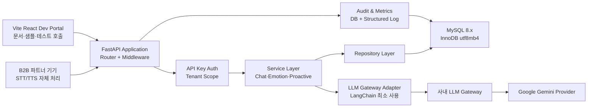

# MVP 개발목표 적절성 종합 검토 보고서

문서명: MVP-개발목표-적절성-종합-검토(난이도-가능성-효율성)-보고서  
검토일: 2026-04-21  
검토 대상: `SRS_v02._gpt.md`, `plans/SRS_v02_fastapi_mvp_conversion_plan.md`  
검토 관점: 개발 난이도, 구현 가능성, 개발 속도, 외부 연동 적합성, 기술 스택 리스크, 운영 비용 효율성

> 파일명 처리 주의: 요청 파일명에 포함된 `/` 문자는 macOS/Unix 파일명에 사용할 수 없으므로 `난이도-가능성-효율성` 형태로 치환하였다.

---

## 1. Executive Summary

현재 `SRS_v02._gpt.md`는 요구사항 추적성, API 목록, 데이터 모델, 다이어그램, NFR를 갖춘 상위 SRS로는 유용하다. 그러나 MVP 개발 목표 관점에서는 여전히 범위와 NFR가 무겁다.

시스템 및 비용 효율성 관점에서 보면, 추가 조정이 필요하다. 특히 아래 항목은 MVP에서 강하게 축소하거나 재정의해야 한다.

| 조정 필요 항목 | 현재 상태 | MVP 권장 상태 | 우선순위 |
|---|---|---|---|
| Phase B 기능 | 센서, 응급 Webhook, 리포트가 SRS 본문에서 상당한 비중을 차지함 | 요구사항 추적성만 유지하고 구현은 Post-MVP로 분리 | High |
| API Gateway/MSA 표현 | API Gateway, 개별 서비스, 시계열 저장소 표현이 남아 있음 | 단일 FastAPI 애플리케이션 내부 모듈 구조로 축소 | High |
| p95 800ms | LLM 전체 응답까지 포함하는 것처럼 해석될 위험 | 비LLM 서버 처리, LLM 첫 응답 시작, LLM 전체 완료 시간을 분리 | High |
| 10,000대 동시 활성 기기 | MVP 수용 기준처럼 보임 | 성장 목표 또는 Post-MVP 부하 검증 목표로 이동 | High |
| RBAC/암호화/감사 로그 | 운영 등급 요구로 작성됨 | API Key 기반 테넌트 인증, 최소 감사 로그, DB/전송 암호화부터 구현 | Medium |
| 개발자 포털 | 별도 포털 구현 가능성 포함 | FastAPI `/docs`, `/openapi.json`, 샘플 요청 중심으로 시작 | Medium |
| LLM 비용 통제 | 비용 산정 기준은 있으나 토큰 예산이 없음 | 요청당 토큰 상한, 모델 티어 라우팅, 월 예산 알림 추가 | High |

종합 점수는 다음과 같다.

| 평가 항목 | 현재 SRS 기준 | FastAPI MVP 조정 후 예상 |
|---|---:|---:|
| 개발 속도 적합성 | 5/10 | 8/10 |
| 외부 연동 적합성 | 7/10 | 8.5/10 |
| 기술 스택 단순성 | 5.5/10 | 8/10 |
| 운영 비용 효율성 | 5/10 | 8/10 |
| 완전 바이브코딩 적합성 | 4/10 | 6.5/10 |
| AI 생성물 개선형 개발 적합성 | 8/10 | 9/10 |

결론적으로, 현재 SRS를 그대로 구현 대상으로 삼기보다 `SRS_v03_fastapi_mvp.md`에서 MVP 범위를 다시 잘라야 한다. 핵심 사용자 가치는 `chat/reply`, `analyze/emotion`, `schedule/proactive`, 개발자 문서, API Key 인증, 대화/기억/감정 저장, PII 마스킹, 감사 로그, 기본 지표 수집까지로 충분히 검증 가능하다.

---

## 2. 검토 전제

### 2.1 사용자가 의도한 MVP 기술 방향

| 영역 | 권장 방향 |
|---|---|
| 프론트엔드 | Vite 기반 React.js |
| 백엔드 | Python 3.11+ / FastAPI |
| API 계약 | REST / OpenAPI 3.x |
| 데이터베이스 | MySQL 8.x, InnoDB, utf8mb4 |
| ORM/마이그레이션 | SQLAlchemy 또는 SQLModel + Alembic |
| LLM 오케스트레이션 | FastAPI 내부 모듈 + LangChain 최소 사용 |
| LLM 호출 | 사내 LLM Gateway 경유, 기본 Provider Google Gemini |
| 배포 | MVP는 단일 백엔드 애플리케이션, MSA/gRPC는 Post-MVP |

### 2.2 MVP 성공 기준

MVP는 “플랫폼 전체 완성”이 아니라 다음 가설 검증에 집중해야 한다.

| 검증 가설 | MVP에서 확인할 것 |
|---|---|
| B2B 파트너가 쉽게 붙을 수 있는가 | OpenAPI 문서, API Key, 샘플 요청으로 1일 내 연동 가능 여부 |
| 어르신 대화 가치가 있는가 | 존댓말 응답, 기억 참조, 정서적 반응, 의료 가드레일 |
| 감정/위험 분석이 쓸모 있는가 | 외로움, 우울 위험, 통증 호소, 위험 키워드 반환 |
| 선제 발화가 가치 있는가 | 기상, 식사, 복약 컨텍스트에서 개인화 메시지 생성 |
| 비용 구조가 감당 가능한가 | 사용자당 LLM 호출 비용과 인프라 고정비가 예측 가능한지 |

---

## 3. 개발 속도 관점 검토

### 3.1 현재 SRS의 개발 속도 저해 요인

| 저해 요인 | 설명 | 영향 |
|---|---|---|
| Phase A/B 범위 혼재 | Phase B 기능이 Should로 분리되어 있지만 문서 전체 구현 압력을 만든다. | AI가 센서, Webhook, 리포트까지 한 번에 만들 가능성이 높다. |
| 물리 아키텍처 오해 가능성 | API Gateway, AI 엔진, 시계열 저장소가 별도 컴포넌트처럼 보인다. | MVP가 MSA 또는 과도한 인프라로 커질 수 있다. |
| NFR가 운영 등급에 가까움 | 99.9% SLA, RPO 15분, RTO 30분, 10,000대 동시성은 초기 MVP 기준으로 과하다. | 구현보다 운영 설계와 부하 테스트에 시간이 소요된다. |
| 개발자 포털 범위가 넓음 | Swagger/OpenAPI와 별도 포털이 동시에 언급된다. | 프론트엔드 구현 시간이 늘어난다. |
| RBAC가 초기부터 넓음 | 개발자, 관리자, 운영자, 보안 책임자 역할이 모두 등장한다. | 인증/권한 구현 복잡도가 증가한다. |

### 3.2 개발 속도 최적화 권고

| 권고 | 구체 조정 |
|---|---|
| 단일 백엔드 우선 | FastAPI 하나의 애플리케이션에서 router/service/repository 모듈로만 분리한다. |
| API 문서 자동화 | 별도 개발자 포털보다 FastAPI `/docs`, `/redoc`, `/openapi.json`을 먼저 사용한다. |
| 최소 Vite 포털 | API Key 확인, 샘플 요청 복사, API 호출 테스트 정도만 구현한다. |
| Phase B 동결 | 센서 수집, 응급 Webhook, 보호자/기관 리포트는 스키마 초안과 추적성만 유지한다. |
| RBAC 단순화 | MVP는 `tenant_api_key`, `operator_admin` 2수준으로 시작한다. |
| 테스트 단위 분할 | `chat/reply` → `analyze/emotion` → `schedule/proactive` → 인증/테넌트 → 저장/감사 순서로 구현한다. |

### 3.3 개발 속도 관점 결론

현재 SRS 그대로는 “AI에게 전체 구현을 맡기는 방식”에 부적합하다. 그러나 FastAPI MVP 계획처럼 범위를 자르면, 중급 개발 배경을 가진 8년차 IT 종사자가 AI 생성 결과물을 검토하며 개발하기에는 적절하다.

권장 MVP 개발 순서는 다음이다.

1. FastAPI 프로젝트 골격, Pydantic schema, OpenAPI 문서
2. MySQL schema, Alembic migration, tenant/api_key/elder_user 기본 테이블
3. `POST /api/v1/chat/reply`
4. LLM Gateway adapter, Gemini provider, mock provider
5. 대화 저장, 기억 조회, PII 마스킹
6. `POST /api/v1/analyze/emotion`
7. `POST /api/v1/schedule/proactive`
8. 감사 로그, latency/error metric
9. Vite React 최소 개발자 포털
10. 100개 가상 페르소나 알파 시뮬레이션

---

## 4. 외부 연동 목표와 기술 스택 검토

### 4.1 외부 연동 목표 적합성

현재 제품의 핵심 외부 연동 대상은 B2B 파트너 기기와 파트너 백엔드다. 이 관점에서는 REST/OpenAPI가 가장 적절하다.

| 외부 연동 대상 | 필요한 것 | 현재 SRS 적합성 | 조정 필요 |
|---|---|---:|---|
| 돌봄 로봇/스피커/태블릿 | 텍스트 요청, JSON 응답, 낮은 연동 난이도 | 높음 | API 오류 코드와 샘플 요청 보강 |
| 파트너 백엔드 | 서버 간 인증, tenant_id, device_id, elder_user_id | 높음 | API Key 또는 Bearer 방식 하나로 확정 |
| 개발자 | OpenAPI, Swagger, 샘플 코드, 테스트 콘솔 | 중간 | 별도 포털보다 FastAPI 문서 자동 생성을 우선 |
| 보호자/기관 시스템 | 리포트/알림 Webhook | 낮음-MVP 외 | Post-MVP로 명확히 분리 |
| LLM Provider | Gemini 기본, Provider 교체 가능성 | 중간 | Gateway adapter와 mock provider를 SRS에 명시 |

### 4.2 기술 스택별 적절성과 리스크

| 기술 | 적절성 | 장점 | 리스크 | MVP 권고 |
|---|---:|---|---|---|
| Vite React | 높음 | 빠른 개발, 정적 배포 쉬움, shadcn/ui와 결합 용이 | 포털 범위를 키우면 MVP가 느려짐 | 최소 개발자 콘솔만 구현 |
| FastAPI | 매우 높음 | OpenAPI 자동 생성, Pydantic 검증, Python LLM 생태계와 궁합 좋음 | async/동시성, 배포, 타입 안정성 관리 필요 | 단일 앱 + 명확한 service/repository 구조 |
| MySQL 8.x | 높음 | 보편적, 운영 사례 많음, B2B 데이터에 적합 | 대량 시계열 센서 저장에는 비효율 가능 | MVP는 대화/기억/감정/감사 로그 중심 |
| LangChain | 중간-높음 | LLM 체인, provider abstraction, prompt template 활용 가능 | 과도하게 쓰면 디버깅이 어려워짐 | Agent는 금지하고 adapter/prompt/structured output만 사용 |
| 사내 LLM Gateway | 중간-높음 | Provider 교체, 비용/정책 통제 가능 | Gateway 준비 상태와 latency가 병목 | Gemini direct fallback을 같은 interface 뒤에 둠 |
| Google Gemini | 높음 | 비용 대비 성능 선택지가 넓음 | rate limit, 모델 변경, 응답 품질 변동 | Flash-Lite 기본, 필요 시 Flash/Pro 승격 |
| REST/OpenAPI | 매우 높음 | B2B 연동 표준, 문서화 쉬움 | 실시간 음성/저지연 스트리밍에는 한계 | MVP에서는 REST만 사용 |
| gRPC/MSA | 낮음-MVP | 내부 고성능 통신 가능 | 초기 개발 속도와 운영 복잡도 악화 | Post-MVP로 이동 |

### 4.3 오픈소스 및 외부 의존성 리스크

| 영역 | 오픈소스 여부 | 리스크 | 대응 |
|---|---|---|---|
| FastAPI/Pydantic | 오픈소스 | 버전 변경에 따른 schema/validation 차이 | 버전 pinning, contract test |
| SQLAlchemy/Alembic | 오픈소스 | migration 충돌, ORM 오용 | migration 리뷰, seed/test DB |
| LangChain | 오픈소스 | API 변경 빈도, 추상화 과다 | 얇은 wrapper로 격리 |
| MySQL | 오픈소스/상용 관리형 혼합 | charset, index, migration, backup 운영 | utf8mb4, composite index, managed DB 우선 |
| Gemini API | 외부 상용 API | 비용, rate limit, 모델 응답 변화 | usage cap, fallback provider, eval set |
| LLM Gateway | 내부/사내 의존성 | 준비 지연 시 MVP 차단 | mock provider와 direct Gemini provider 병행 |

---

## 5. 운영 비용 관점 검토

### 5.1 가격 정보 기준

아래 비용은 2026-04-21 기준 공개 가격을 참고한 MVP 의사결정용 추정이다. 실제 청구액은 리전, 세금, 환율, 데이터 전송량, 로그 보존량, 할인, 무료 티어 적용 여부에 따라 달라진다.

참고 가격:

| 항목 | 공개 가격 요약 | 출처 |
|---|---|---|
| Gemini 3.1 Flash-Lite Preview | Standard 기준 입력 $0.25 / 1M tokens, 출력 $1.50 / 1M tokens | [Google Gemini API Pricing](https://ai.google.dev/gemini-api/docs/pricing) |
| Gemini 3 Flash Preview | Standard 기준 입력 $0.50 / 1M tokens, 출력 $3.00 / 1M tokens | [Google Gemini API Pricing](https://ai.google.dev/gemini-api/docs/pricing) |
| AWS Lightsail Linux | $5, $7, $12, $24/month 등 번들 제공 | [AWS Lightsail Pricing](https://aws.amazon.com/lightsail/pricing/) |
| AWS Lightsail Managed DB | 예시 기준 Database $15/month, Load Balancer $18/month | [AWS Lightsail Pricing](https://aws.amazon.com/lightsail/pricing/) |
| Amazon RDS for MySQL | 신규 고객 Free Tier는 750 hours Single-AZ DB, 20GB gp2, 20GB backup 포함 | [Amazon RDS for MySQL Pricing](https://aws.amazon.com/rds/mysql/pricing/) |
| Vercel Pro | $20/month + additional usage, $20 included usage credit | [Vercel Pricing](https://vercel.com/pricing) |

### 5.2 MVP 트래픽 가정

| 가정 ID | 값 | 설명 |
|---|---:|---|
| A-COST-001 | 50명 | 첫 PoC 어르신 수 |
| A-COST-002 | 5회/일 | 어르신 1명당 일평균 대화 호출 |
| A-COST-003 | 7,500회/월 | `chat/reply` 호출 수: 50명 x 5회 x 30일 |
| A-COST-004 | 16,500회/월 | 감정 분석, 선제 발화, 재시도 포함 보수적 LLM 호출 수 |
| A-COST-005 | 입력 900 tokens/call | 최근 기억, system prompt, 사용자 발화 포함 평균 |
| A-COST-006 | 출력 220 tokens/call | 응답 텍스트 및 JSON metadata 포함 평균 |
| A-COST-007 | 데이터 저장 10GB 미만 | 대화/감정/감사 로그 중심 MVP |
| A-COST-008 | 월 전송량 100GB 미만 | 텍스트 JSON API 기준 |

### 5.3 LLM 비용 산정

계산식:

```text
월 LLM 비용 = (월 입력 토큰 / 1,000,000 x 입력 단가) + (월 출력 토큰 / 1,000,000 x 출력 단가)
```

보수적 PoC 기준:

```text
월 입력 토큰 = 16,500 calls x 900 tokens = 14.85M tokens
월 출력 토큰 = 16,500 calls x 220 tokens = 3.63M tokens
```

| 모델 | 입력 단가 | 출력 단가 | 월 입력 비용 | 월 출력 비용 | 월 합계 |
|---|---:|---:|---:|---:|---:|
| Gemini 3.1 Flash-Lite Preview | $0.25 / 1M | $1.50 / 1M | 약 $3.71 | 약 $5.45 | 약 $9.16 |
| Gemini 3 Flash Preview | $0.50 / 1M | $3.00 / 1M | 약 $7.43 | 약 $10.89 | 약 $18.32 |

성장 시나리오:

| 시나리오 | 월 LLM 호출 | Gemini 3.1 Flash-Lite 예상 | Gemini 3 Flash 예상 | 판단 |
|---|---:|---:|---:|---|
| 내부 알파 | 5,000 | 약 $2.78 | 약 $5.55 | 비용 부담 낮음 |
| 첫 PoC 50명 | 16,500 | 약 $9.16 | 약 $18.32 | 비용 부담 낮음 |
| 3개 파트너/1,000명 | 195,000 | 약 $108 | 약 $216 | LLM 비용 관리 필요 |
| 10,000명 규모 | 1,950,000 | 약 $1,082 | 약 $2,165 | MVP 범위를 벗어난 운영 비용 영역 |

비용 관점에서 핵심은 인프라보다 LLM 사용량이다. MVP 단계에서는 인프라 고정비보다 토큰 예산, 호출 횟수, 모델 티어 선택이 더 중요해진다.

### 5.4 인프라 비용 산정

#### Option A. 초저비용 내부 알파

| 구성 | 월 비용 추정 | 설명 |
|---|---:|---|
| Vite 정적 프론트 | $0-$20 | Vercel Hobby 또는 Pro 기준 |
| FastAPI + MySQL 단일 VM | $7-$12 | Lightsail 1GB 또는 2GB 인스턴스 |
| 백업/스냅샷/도메인/로그 | $5-$10 | 최소 수준 |
| LLM | $3-$20 | 내부 알파 또는 작은 PoC 기준 |
| 합계 | 약 $15-$62/month | 민감 데이터 PoC 전 내부 검증용 |

장점은 가장 빠르고 싸다는 점이다. 단점은 DB와 애플리케이션이 같은 VM에 있어 장애 격리, 백업, 보안, 운영 신뢰성이 낮다. 실제 B2B PoC에는 권장하지 않는다.

#### Option B. 권장 MVP PoC

| 구성 | 월 비용 추정 | 설명 |
|---|---:|---|
| Vite React 개발자 포털 | $0-$20 | 팀 협업/상용 PoC면 Vercel Pro 고려 |
| FastAPI backend | $10-$24 | Lightsail container 또는 Linux instance |
| Managed MySQL | 약 $15+ | Lightsail managed DB 또는 RDS 소형 인스턴스 |
| 백업/스냅샷/로그 | $5-$15 | 최소 운영 기록 |
| LLM | $9-$20 | 50명 PoC 기준 |
| 합계 | 약 $39-$94/month | 첫 PoC에 가장 현실적 |

이 구성이 현재 목표에 가장 맞다. 개발 속도와 비용이 균형적이고, MySQL을 관리형으로 분리해 데이터 손실 리스크를 줄일 수 있다.

#### Option C. 운영형 클라우드 구성

| 구성 | 월 비용 추정 | 설명 |
|---|---:|---|
| 프론트 배포 | $20+ | Vercel Pro 또는 CDN |
| 컨테이너 실행환경 | $40-$100+ | ECS/Fargate, Cloud Run, App Runner 등 |
| Managed MySQL | $30-$100+ | RDS/Aurora급 구성 |
| Load Balancer/WAF/모니터링 | $30-$100+ | 운영 보안과 관측성 강화 |
| LLM | $100-$1,000+ | 사용자 규모에 따라 선형 증가 |
| 합계 | 약 $220-$1,300+/month | PoC 성공 후 확장 단계 |

초기 MVP에는 과하다. PoC 파트너가 실제 트래픽과 보안 요구를 제시한 뒤 전환하는 것이 낫다.

### 5.5 비용 폭증 지점

| 비용 폭증 요인 | 이유 | 대응 |
|---|---|---|
| LLM 출력 토큰 증가 | 출력 단가가 입력보다 높다. | 응답 길이 상한, JSON schema 압축, 요약 저장 |
| 매 요청 긴 기억 주입 | context가 길어질수록 입력 토큰 증가 | 최근 N개 기억만 검색, memory summary 사용 |
| 모든 대화에 별도 감정 분석 호출 | LLM 호출 수가 2배 가까이 증가 | `chat/reply`에서 감정 metadata를 함께 반환하고 별도 분석은 샘플링 |
| Search grounding 사용 | Gemini 검색 grounding은 무료 한도 이후 별도 과금 가능 | MVP에서는 검색 grounding 사용 금지 |
| 음성/TTS를 서버에서 처리 | 오디오 모델 비용과 지연 증가 | 기존 ADR처럼 STT/TTS는 파트너 기기에 둠 |
| 10,000대 동시성 조기 목표화 | 인프라, 부하 테스트, 운영 자동화 비용 증가 | Post-MVP 부하 검증으로 이동 |
| 고급 리포트/센서 저장 | 데이터량과 집계 비용 증가 | Phase B로 분리 |

---

## 6. 현재 SRS에서 추가 조정해야 할 항목

### 6.1 High Priority 조정

| 항목 | 현재 표현 | 권장 조정 |
|---|---|---|
| Phase A MVP 정의 | Phase A가 MVP라고 되어 있으나 Phase B도 본문에 넓게 포함됨 | MVP In-Scope를 F1-F3 + 문서/인증/저장/감사/지표로 고정 |
| p95 800ms | `chat/reply` p95 800ms | 비LLM API p95 800ms, LLM 첫 토큰 p95 800ms, 전체 완료 p95 3초로 분리 |
| 10,000대 동시 활성 기기 | Must NFR처럼 존재 | Post-MVP scalability target으로 이동 |
| API Gateway | 물리 Gateway처럼 표현 | FastAPI middleware/router 계층으로 수정 |
| 시계열 데이터 저장소 | Phase B 센서 저장소로 등장 | MVP에서는 MySQL JSON/일반 테이블만, 대량 시계열 DB는 Post-MVP |
| LLM 비용 NFR | 단위 처리 비용 산출만 있음 | 요청당 token cap, 월 token budget, provider별 cost log 추가 |

### 6.2 Medium Priority 조정

| 항목 | 현재 표현 | 권장 조정 |
|---|---|---|
| 개발자 포털 | 포털 또는 Swagger/OpenAPI | `/docs`, `/openapi.json`, 샘플 코드 우선. Vite 포털은 얇게 |
| RBAC | 여러 역할 기반 접근 제어 | MVP는 API Key + tenant scope + operator admin으로 축소 |
| AES-256 저장 암호화 | 전체 민감 데이터 암호화 | MVP는 managed DB encryption + PII masking 우선, 필드 암호화는 후순위 |
| RPO/RTO | RPO 15분, RTO 30분 | PoC 운영 목표로 낮추고, MVP 수용 기준에서는 백업/복원 절차 검증으로 표현 |
| 리포트 | 보호자/기관 리포트 API | Phase A에서는 감정 결과 저장까지만, 리포트 API는 Phase B |

### 6.3 Low Priority 조정

| 항목 | 권장 |
|---|---|
| 샘플 코드 | `curl`, Python `requests`, JavaScript `fetch` 3개만 우선 |
| 다이어그램 | FastAPI 단일 앱 구조로 단순화 |
| 클래스 다이어그램 | Router/Schema/Service/Repository/Gateway Adapter 중심으로 재작성 |
| 검증 계획 | 100개 페르소나 테스트는 유지하되 비용 예산과 호출량을 함께 명시 |

---

## 7. 권장 MVP 아키텍처



핵심 원칙은 “단일 배포 단위, 내부 모듈화, 외부 REST API, 비용 추적 가능한 LLM 호출”이다.

---

## 8. MVP 기능 커버리지 재판단

### 8.1 유지해야 하는 MVP 기능

| 기능 | 유지 이유 |
|---|---|
| `POST /api/v1/chat/reply` | 제품의 핵심 가치 자체 |
| `POST /api/v1/analyze/emotion` | 보호자/기관 확장의 기반 데이터 |
| `POST /api/v1/schedule/proactive` | 단순 챗봇과 차별화되는 돌봄 경험 |
| API Key 인증 | B2B 연동의 최소 보안 조건 |
| tenant_id 격리 | SaaS 데이터 안전성의 핵심 |
| PII 마스킹 | 시니어 대화 데이터 처리의 필수 안전장치 |
| 대화/기억/감정 저장 | 개인화와 리포트 확장의 기반 |
| 감사 로그 | PoC 신뢰와 장애 분석의 기반 |
| OpenAPI 문서 | B2B 개발자 경험의 핵심 |

### 8.2 Post-MVP로 내려야 하는 기능

| 기능 | 이유 |
|---|---|
| 대량 센서 수집 | 하드웨어/파트너별 payload 차이가 크고 데이터량이 많다. |
| 응급 Webhook 보장 전송 | 재시도, idempotency, 장애 큐, 수신자 관리가 필요하다. |
| 보호자/기관 고급 리포트 | 집계 기준, 개인정보 권한, UI 요구가 추가된다. |
| 10,000대 동시성 | PoC 전 검증하기에는 시간과 비용이 크다. |
| gRPC/MSA | MVP 개발 속도를 늦추고 운영 복잡도를 만든다. |
| 고급 RBAC/SSO | B2B 계약 이후 필요성이 명확해진다. |

### 8.3 가치 훼손 여부

위와 같이 조정해도 MVP 핵심 가치는 훼손되지 않는다.

| 가치 | 훼손 여부 | 근거 |
|---|---|---|
| B2B 파트너가 빠르게 연동 | 훼손 없음 | REST/OpenAPI, API Key, 샘플 코드가 유지됨 |
| 어르신이 개인화된 대화 경험을 얻음 | 훼손 없음 | 대화, 기억, 선제 발화가 유지됨 |
| 감정/위험 분석 기반 데이터 축적 | 훼손 없음 | 감정 분석 저장은 유지됨 |
| 보호자/기관 확장 가능성 | 일부 지연 | 고급 리포트와 응급 알림은 Phase B로 이동 |
| 비용 예측 가능성 | 개선 | 모델 티어와 토큰 예산을 명시하면 통제 가능 |

---

## 9. 최종 권고안

### 9.1 SRS 조정 방향

`SRS_v03_fastapi_mvp.md`에는 다음 내용을 반드시 반영해야 한다.

| 구분 | 반영 내용 |
|---|---|
| Scope | MVP In-Scope와 Post-MVP를 명확히 분리 |
| Constraints | Vite React, FastAPI, MySQL, LangChain, LLM Gateway, Gemini, REST/OpenAPI 명시 |
| Architecture | API Gateway/MSA 표현 제거, FastAPI 내부 모듈 구조로 변경 |
| API | `/api/v1/chat/reply`, `/api/v1/analyze/emotion`, `/api/v1/schedule/proactive`, `/docs`, `/openapi.json` 중심 |
| Data Model | MySQL 테이블 기준으로 tenant, api_key, elder_user, conversation_turn, memory_fact, emotion_analysis, proactive_prompt_log, audit_log, llm_call_log 우선 |
| NFR | p95 분리, token budget, LLM timeout, monthly cost metric, API error rate 추가 |
| Traceability | C-TEC 제약과 cost-control 요구사항을 Test Case에 연결 |

### 9.2 비용 효율성 요구사항 후보

향후 SRS에 다음 NFR를 추가하는 것이 좋다.

| 후보 ID | 요구사항 |
|---|---|
| REQ-NF-COST-001 | 시스템은 LLM 호출마다 provider, model, input token, output token, estimated cost, latency, request_id를 기록해야 한다. |
| REQ-NF-COST-002 | 시스템은 tenant별 월 LLM 비용과 성공 API 요청당 평균 LLM 비용을 산출할 수 있어야 한다. |
| REQ-NF-COST-003 | `chat/reply` 요청의 LLM 입력 토큰은 MVP 기본 설정에서 1,500 tokens 이하로 제한해야 한다. |
| REQ-NF-COST-004 | Gemini Search Grounding, audio input/output, image generation은 MVP API에서 기본 비활성화해야 한다. |
| REQ-NF-COST-005 | 기본 대화 모델은 비용 효율 모델로 설정하고, 고위험 또는 품질 검증 케이스에만 상위 모델을 사용할 수 있어야 한다. |
| REQ-NF-COST-006 | 월 LLM 예상 비용이 설정 예산의 80%를 초과하면 운영자에게 알림을 발생시켜야 한다. |

### 9.3 개발 목표 적절성 최종 판단

| 질문 | 판단 |
|---|---|
| 현재 SRS가 MVP 개발에 그대로 적절한가 | 아니다. 범위와 NFR를 줄여야 한다. |
| FastAPI/MySQL/Gemini 기반으로 충분히 구현 가능한가 | 가능하다. 오히려 MVP에는 적절하다. |
| 완전 바이브코딩으로 가능한가 | 제한적으로 가능하지만, 보안/DB/LLM 비용/테넌트 격리는 사람 검토가 필요하다. |
| AI 생성 결과물을 엔지니어링 지식으로 개선하는 방식에는 적절한가 | 매우 적절하다. 요구사항과 추적성이 충분하다. |
| 비용 효율성 관점에서 추가 조정이 필요한가 | 필요하다. token budget, 모델 티어, Phase B 분리, 인프라 단순화가 필요하다. |

최종 결론은 다음이다.

> 현재 SRS는 “제품 전체 요구사항 기준선”으로 유지하고, 실제 MVP 개발용 SRS는 FastAPI 단일 백엔드, MySQL, OpenAPI 자동 문서, Gemini Flash-Lite 기본 모델, 최소 Vite 개발자 포털, token/cost guardrail 중심으로 재작성해야 한다. 이렇게 조정하면 개발 속도, 외부 연동성, 비용 효율성, 구현 가능성의 균형이 가장 좋다.

---

## 10. 참고 자료

| Reference ID | 자료 | URL | 사용 목적 |
|---|---|---|---|
| REF-COST-001 | Google Gemini Developer API Pricing | https://ai.google.dev/gemini-api/docs/pricing | Gemini 모델별 token 가격 확인 |
| REF-COST-002 | AWS Lightsail Pricing | https://aws.amazon.com/lightsail/pricing/ | 저비용 VM, container, managed DB 비용 범위 확인 |
| REF-COST-003 | Amazon RDS for MySQL Pricing | https://aws.amazon.com/rds/mysql/pricing/ | 관리형 MySQL 및 Free Tier 조건 확인 |
| REF-COST-004 | Vercel Pricing | https://vercel.com/pricing | Vite React 프론트 배포 비용 확인 |
