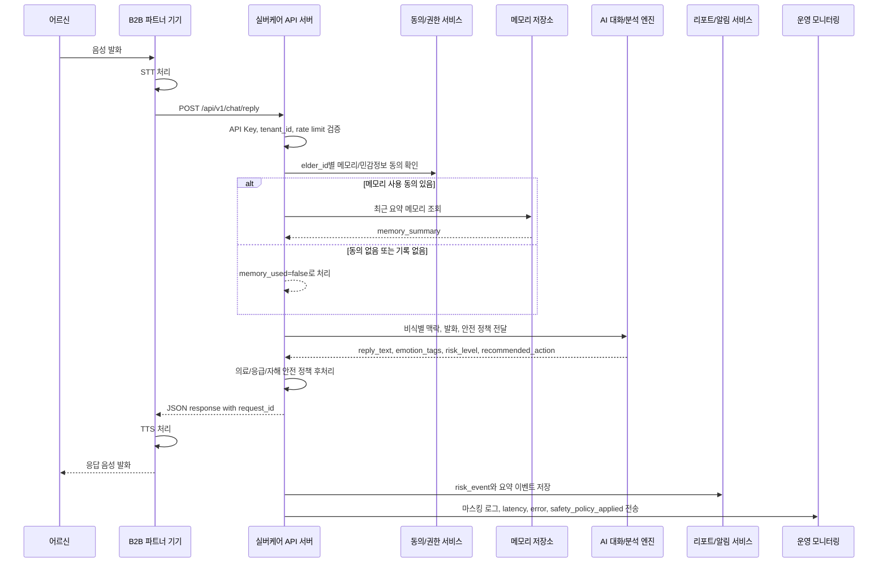
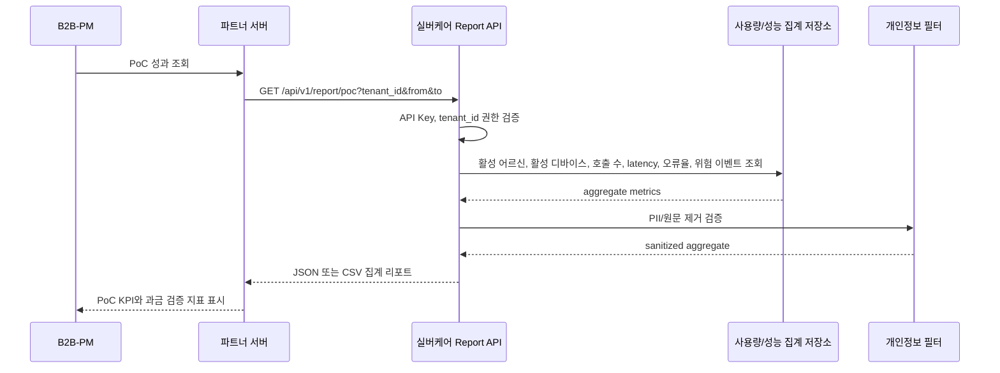
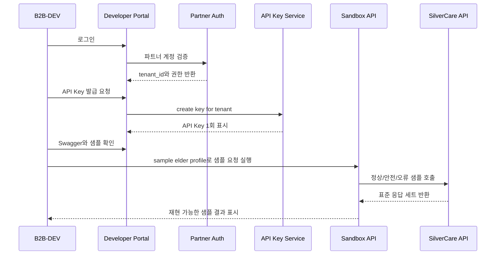
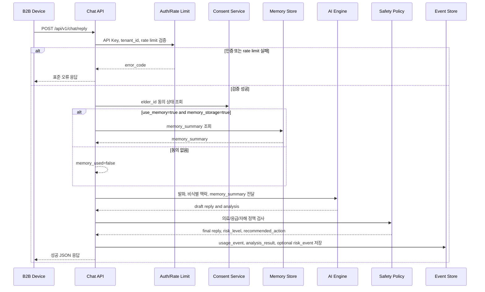
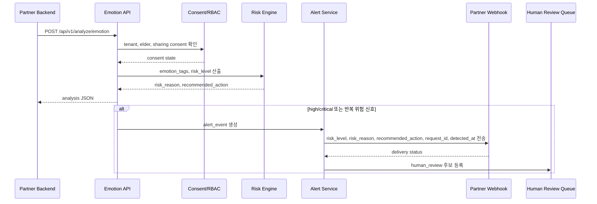
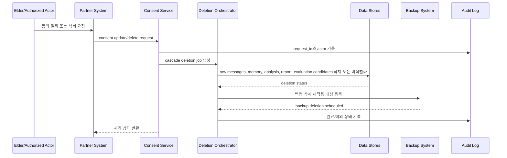
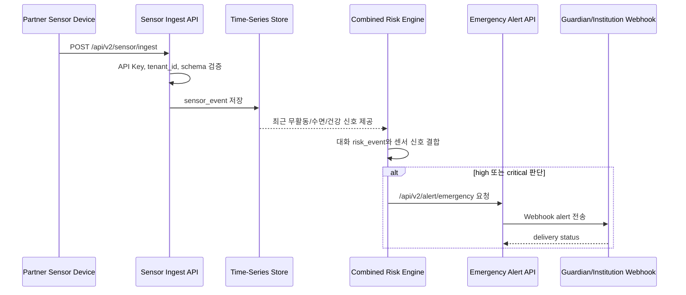

# Software Requirements Specification (SRS)
Document ID: SRS-001
Revision: 1.0
Date: 2026-04-28
Standard: ISO/IEC/IEEE 29148:2018

-------------------------------------------------

## 1. Introduction

### 1.1 Purpose

본 문서는 실버케어 Phase A MVP 및 Phase B 확장 API에 대한 Software Requirements Specification이다. 본 SRS는 [REF-01]의 PRD v0.4를 유일한 제품 요구 원천으로 사용하여, B2B2C 돌봄 기기 파트너가 텍스트 기반 시니어 대화 API, 정서/위험 신호 태깅 API, PoC 리포트 API, 운영 모니터링 및 향후 센서 기반 통합 돌봄 API를 구현·검증할 수 있도록 요구사항을 정의한다.

본 SRS의 목적은 다음과 같다.

| 목적 ID | 목적 |
|---|---|
| OBJ-001 | Phase A MVP의 API 기능, 데이터, 인터페이스, 제약, 비기능 요구사항을 구현 가능한 수준으로 명세한다. |
| OBJ-002 | PRD의 사용자 스토리와 Acceptance Criteria를 atomic Functional Requirement로 분해하고 Story Source와 Test Case ID를 연결한다. |
| OBJ-003 | KPI, 성능, 보안, 개인정보, AI 안전성, 운영 지표를 measurable Non-Functional Requirement로 정의한다. |
| OBJ-004 | API, 데이터 모델, 시퀀스, 추적성 매트릭스를 제공하여 설계·개발·QA·PoC 운영의 공통 기준선을 제공한다. |

### 1.2 Scope (In-Scope / Out-of-Scope)

#### In-Scope

| Priority | Scope Item | SRS Coverage | Source |
|---|---|---|---|
| Must | B2B API 인증 | 파트너별 API Key, `tenant_id` 기반 데이터 격리, rate limit, 표준 오류 응답 | [REF-01] 1-4, 4 |
| Must | Developer Portal / Sandbox | API Key 발급, Swagger 문서, cURL/Python 샘플, sandbox elder profile, 정상/안전/오류 응답 재현 | [REF-01] 1-4, 3-1, F0 |
| Must | 대화 생성 API | `/api/v1/chat/reply` 텍스트 입력/응답, 쉬운 존댓말, 짧은 공감, 시니어 친화 응답 | [REF-01] 1-4, 3-1, 3-3, F1 |
| Must | 제한적 메모리 | 명시적 동의가 있는 경우에만 최근 대화 요약 또는 중요 메모리 사용 | [REF-01] 1-4, 3-3, 5-3, ADR-004 |
| Must | 정서/위험 신호 태깅 | `/api/v1/analyze/emotion`, `emotion_tags`, `risk_level`, `risk_reason`, `recommended_action` 반환 | [REF-01] 1-4, 3-4, 4 |
| Must | 안전 응답 정책 | 의료, 처방, 응급, 자해 관련 발화에서 진단/처방 금지 및 가족/의료진/긴급 연락 권고 | [REF-01] 1-4, 3-3, 5-4, ADR-003 |
| Must | PoC 집계 리포트 | 파트너 단위 일별 활성 어르신 수, 대화 횟수, 지연시간, 오류율, 위험 신호 수 제공 | [REF-01] 1-4, 3-2, F7 |
| Must | 과금 검증 데이터 | 월 활성 디바이스 수, API 호출량, 기본 제공량 초과 사용량 산출 근거 수집 | [REF-01] 1-5, 3-2 |
| Must | 운영 모니터링 | 요청 로그, `request_id`, 지연시간, 오류율, 안전 정책 발동 여부, PII 마스킹 로그 | [REF-01] 1-4, 3-6, 5-1 |
| Should | 선제적 발화 | `/api/v1/schedule/proactive` 기반 일반 안부, 식사, 수면, 일상 확인성 발화 | [REF-01] 1-4, F3 |
| Should | Phase B 센서 수집 | `/api/v2/sensor/ingest` 기반 센서 데이터 수신 및 시계열 저장 | [REF-01] 1-2, F4 |
| Should | Phase B 긴급 알림 | 대화 위험 신호와 센서 무활동 결합 시 보호자/기관 Webhook 알림 | [REF-01] 1-2, F5 |
| Should | Phase B KPI 리포트 | 주간 정서 리포트, 수면 분석 결과, 기관용 성과 데이터 JSON 제공 | [REF-01] 1-2, F6 |

#### Out-of-Scope

| Out-of-Scope Item | Rationale | Requirement Handling |
|---|---|---|
| 자체 하드웨어 제조 | B2B2C API 플랫폼 전략과 불일치 | SRS에서 구현 요구사항으로 정의하지 않음 |
| STT/TTS 음성 처리 | ADR-001에 따라 B2B 파트너 기기 책임 | API는 텍스트만 수신·반환 |
| 보호자용/기관용 완성 앱 직접 제공 | MVP는 API 검증 목적 | 파트너 또는 후속 Phase UI로 처리 |
| 의료 진단, 처방, 치료 조언 | 의료 책임과 LLM 환각 리스크 | 안전 응답 및 권고 신호로 제한 |
| 응급 구조 보장 | 실제 구조/출동 책임은 실버케어 API 범위 밖 | `risk_level`은 참고 신호로만 제공 |
| 실시간 119/응급기관 자동 연결 | 법적 책임, 오탐/미탐, 기관 연동 리스크 | `suggest_emergency_contact` 권고만 제공 |
| Phase A 센서 데이터 수집/분석 | Phase B 범위 | F4-F6으로 별도 추적 |
| 치매 조기 진단/낙상 판정 | 진단 책임 리스크 | Phase B에서도 진단이 아닌 참고 분석으로 제한 |
| 고도화된 관리자 대시보드 | PoC 리포트는 API/CSV/간단 집계 수준 | 고급 UI 요구사항 제외 |
| 파트너별 커스텀 LLM 파인튜닝 | 초기 PoC는 공통 모델과 정책 기반 커스터마이징 | 모델별 파인튜닝 제외 |
| 정식 가격표 최적화 | MVP는 과금 단위와 유료 전환 의향 검증 목적 | 원화 단가 요구사항 제외 |

#### Constraints and Assumptions

| ID | Type | Statement | Source | Verification |
|---|---|---|---|---|
| CON-001 | Architecture | 실버케어 API는 음성 파일을 받지 않고 STT/TTS를 B2B 파트너 기기에 위임해야 한다. | [REF-01] ADR-001 | API schema에 audio binary field가 없음을 확인 |
| CON-002 | Business Model | 서비스는 B2C 직접 앱이 아니라 B2B2C API 구독형 SaaS 모델로 제공되어야 한다. | [REF-01] ADR-002 | Scope와 API list에 직접 앱 기능이 없음을 확인 |
| CON-003 | Safety | 감정/위험 분석은 의료 진단이 아니라 보호자/기관 확인용 참고 신호로 제한되어야 한다. | [REF-01] ADR-003 | 안전 응답 테스트와 금칙 표현 테스트 통과 |
| CON-004 | Privacy | 기억 메모리는 명시적 동의와 제한된 보존 기간 안에서만 사용되어야 한다. | [REF-01] ADR-004 | 동의 철회 후 `memory_used=false` 확인 |
| CON-005 | Privacy | 대화 원문은 기본적으로 보호자/기관에 제공하지 않고 요약 리포트 중심으로 제공되어야 한다. | [REF-01] ADR-005 | 원문 미노출 API 테스트 통과 |
| CON-006 | Risk | 고위험 알림은 응급 구조 보장이 아니라 확인 권고 이벤트로 표현되어야 한다. | [REF-01] R3, R5 | 알림 payload와 문구 QA |
| CON-007 | Privacy | 외부 LLM/클라우드로 전송되는 데이터는 서비스 제공에 필요한 최소 데이터로 제한되어야 하며 학습 사용을 허용하지 않아야 한다. | [REF-01] R6, 5-3 | 외부 위탁 설정·계약 체크리스트 검토 |
| CON-008 | Validation | 모델, 프롬프트, 안전 정책 변경은 평가셋과 배포 게이트를 통과해야 PoC 환경에 배포될 수 있다. | [REF-01] 5-4 | 배포 파이프라인 gate 결과 확인 |
| ASSUMP-001 | Assumption | PRD v0.4는 상세 OpenAPI type, field length, pagination 방식을 확정하지 않는다. SRS는 PRD 필드를 기준으로 baseline schema를 정의하며 최종 OpenAPI는 별도 산출물로 확정한다. | [REF-01] 4, 9 | OpenAPI backlog 생성 |
| ASSUMP-002 | Assumption | PRD v0.4는 RPO/RTO 수치를 제공하지 않는다. 본 SRS는 Phase A PoC 운영 기준선을 제안하며 production GA 전 제품·운영 책임자 승인이 필요하다. | [REF-01] 5-3, 9 | 운영 runbook 승인 기록 |
| ASSUMP-003 | Assumption | 보호자/기관 리포트 UI는 파트너 시스템 또는 후속 Phase가 제공하며, 실버케어는 API와 JSON/CSV 데이터 제공에 집중한다. | [REF-01] 1-4 | API-only acceptance test |

### 1.3 Definitions, Acronyms, Abbreviations

| Term | Definition |
|---|---|
| API | Application Programming Interface. B2B 파트너 기기 또는 서버가 실버케어 기능을 호출하는 HTTP 기반 인터페이스. |
| B2B2C | 실버케어가 B2B 파트너에게 API를 제공하고, 파트너 기기/서비스가 최종 어르신·보호자·기관에게 경험을 제공하는 모델. |
| B2B-PM | B2B 파트너사의 제품/사업 담당자. PoC 도입, 정식 탑재, 과금 구조 판단 책임을 가진다. |
| B2B-DEV | B2B 파트너사의 연동 개발자. API Key, Swagger, 샘플 코드로 연동 구현을 수행한다. |
| Elder | 독거 어르신 또는 시니어 최종 사용자. `elder_id`로 가명 식별된다. |
| Guardian | 보호자 자녀 또는 보호자 역할 사용자. 동의된 요약 리포트와 위험 신호 알림을 확인한다. |
| Institution Manager | 요양기관 관리자. 소속 어르신의 요약 리포트와 위험 이벤트 목록을 확인한다. |
| Platform Operator | 실버케어 운영자. 로그, 안전 정책, AI 품질, 개인정보 마스킹 상태를 관리한다. |
| `tenant_id` | B2B 파트너 또는 고객사를 식별하는 테넌트 ID. 데이터 격리와 접근 제어 기준. |
| `device_id` | 파트너 기기 식별자. 월 활성 디바이스 과금과 요청 추적에 사용. |
| `elder_id` | 파트너 시스템 내 어르신 가명/내부 식별자. 직접 식별정보가 아니어야 한다. |
| API Key | 파트너 서버 간 인증에 사용하는 비밀 키 또는 동등한 인증 수단. |
| PoC | Proof of Concept. 1~3개월 무료 또는 저가 고정비로 진행하는 API 검증 단계. |
| Phase A | 현재 MVP 범위. AI 캐릭터챗 API, 정서/위험 태깅, PoC 리포트, 운영 모니터링 중심. |
| Phase B | 확장 범위. 센서 데이터 통합, 긴급 알림, 보호자/기관 KPI 리포트 중심. |
| KPI | Key Performance Indicator. 제품 성공 및 PoC 전환 판단에 사용하는 정량 지표. |
| p95, p99 | 전체 요청 중 95번째/99번째 백분위 응답 시간. |
| SLA | Service Level Agreement. API 가용성 목표. PRD 기준 99.9%. |
| RPO | Recovery Point Objective. 장애 시 허용 가능한 데이터 손실 시간. PRD v0.4 미확정, 본 SRS에서 PoC baseline을 둔다. |
| RTO | Recovery Time Objective. 장애 후 서비스 복구 목표 시간. PRD v0.4 미확정, 본 SRS에서 PoC baseline을 둔다. |
| RBAC | Role-Based Access Control. 역할 기반 접근 제어. |
| PII | Personally Identifiable Information. 실명, 주민등록번호, 상세 주소 등 개인 식별정보. |
| `risk_level` | 위험 신호 수준 enum. `none`, `low`, `medium`, `high`, `critical`. |
| `emotion_tags` | 정서 및 돌봄 맥락 태그 enum. 예: `lonely`, `pain`, `sleep_issue`, `self_harm_signal`. |
| `recommended_action` | 후속 액션 enum. 예: `check_in`, `notify_guardian`, `suggest_emergency_contact`. |
| AOS | Adjusted Opportunity Score. PRD v0.4에서 수치가 제공되지 않았으므로 본 SRS의 요구 우선순위 산정에는 사용하지 않는다. |
| DOS | Discovered Opportunity Score. PRD v0.4에서 수치가 제공되지 않았으므로 본 SRS의 요구 우선순위 산정에는 사용하지 않는다. |
| Validator | 요구사항, 수용 기준, 테스트 결과를 검증하는 책임자 또는 검증 기준. 본 SRS에서는 Test Case ID와 Acceptance Criteria로 연결한다. |

### 1.4 References (REF-XX)

| Reference ID | Document | Version / Date | Usage |
|---|---|---|---|
| REF-01 | `실버케어초안_PRD_v0.4.md` | v0.4 / 2026-04-25 | 본 SRS의 유일한 제품 요구 Source of Truth |
| REF-02 | ISO/IEC/IEEE 29148:2018 Systems and software engineering - Life cycle processes - Requirements engineering | 2018 | SRS 작성 구조와 요구사항 품질 기준 |

## 2. Stakeholders

| Role | Responsibility | Interest |
|---|---|---|
| B2B-PM. 제품/사업 담당자 | PoC 도입 판단, 정식 탑재 검토, 과금 구조 수용성 평가 | API 도입 효과, 활성 사용량, 유료 전환 근거, 비용 예측 가능성 |
| B2B-DEV. 연동 개발자 | API Key 발급, Swagger 확인, 기기/서버 연동, 오류 처리 구현 | 첫 성공 호출 30분 이내, 명확한 schema, 샘플 코드, 안정적 오류 응답 |
| A. 독거 어르신 | 파트너 기기를 통해 대화 기능을 실제 사용 | 쉬운 존댓말, 공감 응답, 이전 맥락 반영, 의료/응급 상황 안전 권고 |
| B. 보호자 자녀 | 동의된 요약 리포트와 위험 신호 알림 확인 | 원문 미노출, 정서 추세, 위험 신호 요약, 권장 확인 액션 |
| C. 요양기관 관리자 | 소속 어르신 다수의 상태와 위험 우선순위 확인 | 어르신별 대화 빈도, 최근 위험 신호, 정서 추세, 마지막 상호작용 시각 |
| D. 플랫폼 운영자 | API 품질, 안전 정책, 개인정보 마스킹, 오류율, 지연시간 모니터링 | 비식별 로그, 안전 정책 발동률, 오탐/미탐 리뷰, 배포 게이트 |
| B2B 파트너 서버/기기 | STT/TTS, API 호출, 알림 수신, 보호자/기관 UI 제공 | 안정적 API, 명확한 책임 경계, tenant 격리, 과금 데이터 |
| 외부 LLM/클라우드 수탁자 | 대화 생성·분석 처리 또는 인프라 제공 | 최소 데이터 처리, 학습 사용 금지, 보관 제한, 삭제 가능성 |
| 실버케어 제품/개발팀 | API, 데이터 모델, 운영·보안·AI 품질 기준 구현 | 요구사항 추적성, 테스트 가능성, PoC 성공 지표 달성 |

## 3. System Context and Interfaces

### 3.1 External Systems

| External System | Direction | Interface | Data Exchanged | Key Constraints |
|---|---|---|---|---|
| B2B 파트너 기기 | Inbound/Outbound | HTTPS JSON API | STT 결과 텍스트, `tenant_id`, `device_id`, `elder_id`, 응답 텍스트, 태그, 위험 수준 | 음성 파일 미수신, API Key 인증, rate limit |
| B2B 파트너 서버 | Inbound/Outbound | HTTPS JSON API, CSV download, Webhook | 리포트 조회, 과금 집계, 알림 이벤트 수신 | tenant 격리, 권한 검증, PII 최소화 |
| 보호자 앱 또는 기관 시스템 | Outbound via Partner | Partner-provided UI/API | 요약 리포트, 위험 신호 알림, 권장 액션 | 대화 원문 기본 미노출, 공유 동의 필수 |
| 외부 LLM/AI 분석 엔진 | Outbound/Inbound | Provider API or internal service call | 비식별 대화 텍스트, 요약 맥락, 정책 메타데이터, 생성 응답 | 학습 사용 금지, 보관 제한, 최소 데이터 |
| 운영 모니터링 시스템 | Outbound | Metrics/log pipeline | endpoint latency, error rate, token usage, timeout, safety policy rate | 원문/PII 마스킹, 감사 로그 |
| 데이터 저장소 | Internal | Database/API | elder profile, consent, memory summary, analysis result, risk event, usage aggregate | AES-256 수준 저장 암호화, retention, cascade deletion |
| Phase B 센서 제공 기기 | Inbound | `/api/v2/sensor/ingest` | sleep, movement, blood pressure or partner sensor payload | Phase B, schema 확정 필요 |
| Partner Webhook Target | Outbound | HTTPS Webhook | `risk_level`, `risk_reason`, `recommended_action`, `request_id`, `detected_at` | retry policy, signature, tenant authorization |

### 3.2 Client Applications

| Client Application | Owner | User | Scope |
|---|---|---|---|
| Developer Portal | 실버케어 | B2B-DEV | API Key 발급, Swagger 문서, 샘플 요청/응답, 오류 코드 표 제공 |
| Sandbox | 실버케어 | B2B-DEV | sample elder profile과 샘플 발화로 정상/안전/오류 응답 재현 |
| B2B Partner Device | B2B 파트너 | 어르신 | STT/TTS, `/api/v1/chat/reply` 호출, `reply_text` 음성 발화 |
| B2B Partner Backend | B2B 파트너 | B2B-PM, 보호자, 기관 관리자 | report API 호출, Webhook 수신, 파트너 UI 제공 |
| Ops Log/Monitoring View | 실버케어 | 플랫폼 운영자 | 비식별 로그, 지연시간, 오류 코드, 안전 정책 발동 여부 확인 |

### 3.3 API Overview

| API / Feature | Method | Endpoint | Phase | Priority | Summary |
|---|---|---|---|---|---|
| Developer Portal / Sandbox | UI | N/A | Phase A | Must | API Key 발급, Swagger, 샘플 코드, sandbox elder profile, 표준 오류 예제 제공 |
| Chat Reply | POST | `/api/v1/chat/reply` | Phase A | Must | 어르신 발화 텍스트를 받아 응답 텍스트, 정서/위험 태그, 권장 액션 반환 |
| Emotion Analysis | POST | `/api/v1/analyze/emotion` | Phase A | Must | 대화 텍스트 또는 요약을 분석하여 `emotion_tags`, `risk_level`, `risk_reason`, `recommended_action` 반환 |
| Proactive Schedule | POST | `/api/v1/schedule/proactive` | Phase A | Should | 기상, 식사, 수면, 안부 확인 등 선제적 일반 발화 생성 |
| PoC Report | GET | `/api/v1/report/poc` | Phase A | Must | 파트너 단위 PoC 집계 리포트 JSON/CSV 제공 |
| Sensor Ingest | POST | `/api/v2/sensor/ingest` | Phase B | Should | 레이더, 웨어러블, 혈압계 등 센서 데이터를 수신해 시계열 저장 |
| Emergency Alert | POST | `/api/v2/alert/emergency` and outbound Webhook | Phase B | Should | 대화 위험 신호와 센서 무활동 결합 시 보호자/기관 대상 알림 이벤트 발송 |
| KPI Report | GET | `/api/v2/report/kpi` | Phase B | Should | 주간 정서 리포트, 수면 분석 결과, 기관용 성과 데이터 JSON 제공 |

모든 API는 다음 공통 계약을 따라야 한다.

| Contract Item | Requirement |
|---|---|
| Authentication | 모든 API 요청은 API Key 또는 동등한 서버 간 인증을 사용해야 한다. |
| Tenant Isolation | 모든 요청은 `tenant_id` 기준으로 데이터 접근 범위를 제한해야 한다. |
| Schema Version | 주요 API 응답은 `schema_version`을 포함해야 한다. |
| Request Tracing | 모든 성공/오류 응답은 `request_id`를 포함해야 한다. |
| Error Response | 오류 응답은 `error_code`, `message`, `request_id`, `retryable`을 포함해야 한다. |
| Privacy Default | 응답에는 기본적으로 대화 원문과 직접 식별정보를 포함하지 않아야 한다. |
| Safety Default | 의료, 처방, 응급, 자해 관련 발화는 진단/처방 금지와 안전 권고를 적용해야 한다. |

### 3.4 Interaction Sequences

#### Core Phase A Chat and Risk Tagging Sequence

#### Core PoC Reporting Sequence

## 4. Specific Requirements

### 4.1 Functional Requirements

| Requirement ID | Requirement | Source | Priority | Acceptance Criteria (Given / When / Then) | Test Case ID |
|---|---|---|---|---|---|
| REQ-FUNC-001 | 시스템은 유효한 파트너 계정에 대해 Developer Portal에서 API Key 발급 기능을 제공해야 한다. | Story B2B-DEV AC-1; F0 | Must | Given 유효한 파트너 계정, When 개발자가 Developer Portal에 접속해 Key 발급을 요청, Then tenant에 연결된 API Key가 발급되고 발급 이벤트가 감사 로그에 기록된다. | TC-FUNC-001 |
| REQ-FUNC-002 | 시스템은 Developer Portal에서 Swagger 문서, cURL/Python 샘플 요청/응답, 표준 오류 코드 표를 제공해야 한다. | Story B2B-DEV AC-1; F0 | Must | Given 유효한 파트너 계정, When 개발자가 문서 페이지를 열람, Then `/api/v1/chat/reply`, `/api/v1/analyze/emotion`, `/api/v1/report/poc`의 샘플과 오류 코드 표를 확인할 수 있다. | TC-FUNC-002 |
| REQ-FUNC-003 | 시스템은 sandbox elder profile과 샘플 발화를 사용하여 정상 응답, 안전 응답, 오류 응답을 실제 개인정보 없이 재현해야 한다. | Story B2B-DEV AC-4; F0 | Must | Given sandbox 환경, When 개발자가 제공된 샘플 발화를 실행, Then 정상 200 응답, 안전 정책 적용 200 응답, 표준 오류 응답이 각각 재현된다. | TC-FUNC-003 |
| REQ-FUNC-004 | 모든 API는 API Key 또는 동등한 서버 간 인증을 요구하고 인증 실패 시 `UNAUTHORIZED` 오류를 반환해야 한다. | Story B2B-DEV AC-3; API 공통 계약 | Must | Given API Key 누락 또는 invalid key, When API를 호출, Then HTTP 401과 `error_code=UNAUTHORIZED`, `request_id`, `retryable=false`가 반환된다. | TC-FUNC-004 |
| REQ-FUNC-005 | 모든 API는 `tenant_id` 기준으로 데이터 접근 범위를 제한하고 tenant 불일치 시 `TENANT_ACCESS_DENIED` 오류를 반환해야 한다. | Story C AC-16; API 공통 계약 | Must | Given 인증된 파트너가 다른 tenant의 리소스를 요청, When API가 권한을 검사, Then HTTP 403과 `TENANT_ACCESS_DENIED`를 반환하고 데이터 payload를 반환하지 않는다. | TC-FUNC-005 |
| REQ-FUNC-006 | 시스템은 파트너/테넌트 단위 rate limit을 적용하고 초과 시 `RATE_LIMIT_EXCEEDED` 오류를 반환해야 한다. | Story B2B-DEV AC-3; API 공통 계약 | Must | Given tenant가 설정된 rate limit을 초과, When API를 추가 호출, Then HTTP 429, `retryable=true`, `retry_after_seconds`가 포함된다. | TC-FUNC-006 |
| REQ-FUNC-007 | `/api/v1/chat/reply`는 `tenant_id`, `device_id`, `elder_id`, `utterance`를 필수 요청 필드로 검증해야 한다. | Story B2B-DEV AC-2; F1 | Must | Given 필수 필드 중 하나가 누락, When `/api/v1/chat/reply` 호출, Then HTTP 400과 `INVALID_REQUEST`를 반환한다. | TC-FUNC-007 |
| REQ-FUNC-008 | `/api/v1/chat/reply`는 성공 시 `schema_version`, `reply_text`, `emotion_tags`, `risk_level`, `risk_reason`, `recommended_action`, `memory_used`, `request_id`, `safety_policy_applied`를 포함한 JSON을 반환해야 한다. | Story B2B-DEV AC-2; F1 | Must | Given 유효한 요청, When `/api/v1/chat/reply` 호출, Then 응답 JSON에 모든 필수 필드가 존재하고 schema validation을 통과한다. | TC-FUNC-008 |
| REQ-FUNC-009 | `/api/v1/chat/reply`는 어르신 발화에 대해 쉬운 한국어 존댓말과 공감 중심의 응답을 생성해야 한다. | Story A AC-11; F1 | Must | Given 사투리, 불완전 문장, 반복 발화, When API가 응답 생성, Then 의미를 단정하지 않고 쉬운 존댓말로 되묻거나 공감하며 평가 루브릭 평균 4.0/5 이상을 충족한다. | TC-FUNC-009 |
| REQ-FUNC-010 | 시스템은 메모리 저장 동의가 있는 경우에만 최근 대화 요약 또는 중요 메모리를 개인화 응답에 사용해야 한다. | Story A AC-8; F1; ADR-004 | Must | Given `memory_storage=true`와 기존 요약 메모리, When 개인화 응답 생성, Then 이전 맥락을 반영하고 `memory_used=true`를 반환한다. | TC-FUNC-010 |
| REQ-FUNC-011 | 시스템은 이전 대화 기록이 없거나 메모리 저장 동의가 없는 경우 존재하지 않는 과거 대화를 생성하지 않아야 한다. | Story A AC-9; F1; ADR-004 | Must | Given 메모리 기록 없음 또는 `memory_storage=false`, When 개인화 응답 생성, Then 일반 안부 대화로 응답하고 `memory_used=false`를 반환한다. | TC-FUNC-011 |
| REQ-FUNC-012 | `/api/v1/chat/reply`는 통증, 약, 병원, 자해, 응급 관련 발화에 대해 의료 판단·처방을 금지하고 가족/의료진/긴급 연락을 권하는 안전 응답을 반환해야 한다. | Story A AC-10; F1; ADR-003 | Must | Given 의료/응급/자해 발화, When chat reply 호출, Then 진단/처방 문구 없이 안전 응답, `risk_level`, `recommended_action`, `safety_policy_applied=true`를 반환한다. | TC-FUNC-012 |
| REQ-FUNC-013 | `/api/v1/chat/reply`는 응답 생성 결과에 `emotion_tags`, `risk_level`, `risk_reason`, `recommended_action`을 함께 반환해야 한다. | Story B2B-DEV AC-2; Story A AC-10; F1/F2 | Must | Given 유효한 발화, When chat reply 호출, Then 분석 필드가 enum 정의에 맞게 채워진다. | TC-FUNC-013 |
| REQ-FUNC-014 | 모든 성공·오류·알림·로그·리포트 항목은 동일한 `request_id`로 추적 가능해야 한다. | Story B2B-DEV AC-2/AC-3; Story D AC-18 | Must | Given 단일 API 요청, When 응답, 로그, 리포트 이벤트를 조회, Then 동일 `request_id`로 상호 연결된다. | TC-FUNC-014 |
| REQ-FUNC-015 | 오류 응답은 `error_code`, `message`, `request_id`, `retryable`을 필수 필드로 포함해야 한다. | Story B2B-DEV AC-3; API 공통 계약 | Must | Given 인증 실패, rate limit, 필드 누락, LLM timeout 중 하나 발생, When 오류 응답 반환, Then 표준 오류 schema를 충족한다. | TC-FUNC-015 |
| REQ-FUNC-016 | `/api/v1/analyze/emotion`은 `tenant_id`, `elder_id`, `text`를 필수 요청 필드로 검증해야 한다. | Story B AC-12; F2 | Must | Given 필수 필드 누락, When analyze API 호출, Then HTTP 400과 `INVALID_REQUEST`를 반환한다. | TC-FUNC-016 |
| REQ-FUNC-017 | `/api/v1/analyze/emotion`은 `emotion_tags`, `risk_level`, `risk_reason`, `recommended_action`, 선택적 `detected_keywords`를 반환해야 한다. | Story B AC-12/AC-13; F2 | Must | Given 분석 대상 텍스트, When analyze API 호출, Then 결과 필드가 enum 정의를 따르고 `detected_keywords`에는 직접 식별정보가 포함되지 않는다. | TC-FUNC-017 |
| REQ-FUNC-018 | 시스템은 `risk_level` enum을 `none`, `low`, `medium`, `high`, `critical`로 표준화해야 한다. | Story A AC-10; Story B AC-13; F2 | Must | Given 위험 분석 결과, When API가 `risk_level`을 반환, Then 정의된 enum 외 값이 반환되지 않는다. | TC-FUNC-018 |
| REQ-FUNC-019 | 시스템은 `recommended_action` enum을 `none`, `empathetic_response`, `check_in`, `notify_guardian`, `suggest_medical_contact`, `suggest_emergency_contact`, `human_review`로 표준화해야 한다. | Story B AC-13; F2 | Must | Given 분석 결과, When API가 권장 액션을 반환, Then 정의된 enum 외 값이 반환되지 않는다. | TC-FUNC-019 |
| REQ-FUNC-020 | `/api/v1/schedule/proactive`는 `tenant_id`, `device_id`, `elder_id`, `trigger_type`을 필수 요청 필드로 검증해야 한다. | Story A AC-8; F3 | Should | Given `trigger_type` 누락 또는 지원하지 않는 값, When proactive API 호출, Then `INVALID_REQUEST`를 반환한다. | TC-FUNC-020 |
| REQ-FUNC-021 | `/api/v1/schedule/proactive`는 `morning`, `meal`, `sleep`, `check_in`, `custom` 트리거에 대해 일반 안부/확인성 발화를 생성하고 복약 지시 또는 처방을 생성하지 않아야 한다. | Story A AC-8; F3 | Should | Given 식사 또는 수면 트리거, When proactive API 호출, Then 일반 안부/확인성 발화를 반환하고 의료 지시 문구가 없다. | TC-FUNC-021 |
| REQ-FUNC-022 | `/api/v1/report/poc`는 지정 기간의 `active_devices`, `active_elders`, `conversation_count`, `avg_conversation_per_elder`, `p95_latency_ms`, `error_rate`, `risk_event_count`를 반환해야 한다. | Story B2B-PM AC-5; F7 | Must | Given PoC 기간 데이터, When report API 호출, Then 필수 집계 필드가 JSON으로 반환된다. | TC-FUNC-022 |
| REQ-FUNC-023 | `/api/v1/report/poc`는 개인 식별정보를 제외한 집계 리포트를 JSON 또는 CSV 형태로 제공해야 한다. | Story B2B-PM AC-6; F7 | Must | Given PoC 종료 후 성과 데이터 요청, When JSON 또는 CSV를 요청, Then 원문/PII 없이 집계값만 반환된다. | TC-FUNC-023 |
| REQ-FUNC-024 | 시스템은 인당 일평균 대화 횟수, p95 latency, 위험 징후 탐지 결과, 월 활성 디바이스 수, 예상 과금 기준을 tenant 단위로 비교 가능하게 산출해야 한다. | Story B2B-PM AC-7; F7 | Must | Given PoC metrics, When B2B-PM이 지표를 조회, Then 목표값 대비 결과와 활성 디바이스/과금 검증 지표가 tenant 단위로 제공된다. | TC-FUNC-024 |
| REQ-FUNC-025 | 시스템은 해당 월 1회 이상 유효한 대화 API 호출을 발생시킨 `device_id`를 월 활성 디바이스로 집계해야 한다. | Story B2B-PM AC-7; 과금 단위 정의 | Must | Given 동일 월 내 device calls, When 월간 집계 실행, Then 중복 없는 활성 `device_id` 수가 산출된다. | TC-FUNC-025 |
| REQ-FUNC-026 | 시스템은 기본 제공량 초과 사용량 산출을 위해 대화 생성, 감정 분석, 리포트 API 호출량을 tenant·endpoint·device 기준으로 기록해야 한다. | Story B2B-PM AC-7; 과금 단위 정의 | Must | Given billable API 호출, When usage event 저장, Then tenant, endpoint, device, timestamp가 누락 없이 기록된다. | TC-FUNC-026 |
| REQ-FUNC-027 | 보호자 리포트 API 또는 리포트 데이터는 정보 공유 동의가 있을 때 대화 원문이 아닌 주요 정서 추세, 반복 주제, 위험 신호 요약, 권장 확인 액션을 반환해야 한다. | Story B AC-12; F6/ADR-005 | Should | Given guardian sharing consent, When 보호자 리포트 조회, Then 원문 없이 요약·추세·위험 신호·권장 액션이 반환된다. | TC-FUNC-027 |
| REQ-FUNC-028 | 고위험 발화 또는 반복 위험 신호가 감지되고 알림 조건이 충족되면 시스템은 보호자 또는 파트너 서버로 알림 이벤트를 전송해야 한다. | Story B AC-13; F5 | Should | Given `risk_level=high` 또는 `critical` 또는 반복 medium, When 알림 조건 충족, Then `risk_level`, `risk_reason`, `recommended_action`, `request_id`, `detected_at`을 포함한 이벤트가 전송된다. | TC-FUNC-028 |
| REQ-FUNC-029 | 보호자가 원문 열람 권한이 없는 경우 리포트 API는 대화 원문과 민감 개인정보를 반환하지 않아야 한다. | Story B AC-14; ADR-005 | Must | Given guardian lacks raw transcript permission, When report API 호출, Then raw utterance, AI reply 원문, 민감 PII 필드가 응답에 없다. | TC-FUNC-029 |
| REQ-FUNC-030 | 기관 리포트 API 또는 데이터는 소속 어르신별 대화 빈도, 최근 위험 신호, 정서 추세, 마지막 상호작용 시각을 목록으로 반환해야 한다. | Story C AC-15; F6 | Should | Given institution membership exists, When institution report 조회, Then elder별 요약 목록이 반환된다. | TC-FUNC-030 |
| REQ-FUNC-031 | 기관 관리자의 특정 어르신 상세 요청에서 소속/권한 검사가 실패하면 시스템은 대화 요약과 위험 신호 데이터를 반환하지 않아야 한다. | Story C AC-16; RBAC | Must | Given unauthorized institution user, When elder detail requested, Then HTTP 403과 no data payload를 반환한다. | TC-FUNC-031 |
| REQ-FUNC-032 | 기관 리포트는 `risk_level`, 최근 발생 시각, 반복 횟수 기준으로 위험 이벤트 우선순위 정렬을 지원해야 한다. | Story C AC-17; F6 | Should | Given 다수 위험 이벤트, When sort option을 지정, Then 정의된 기준으로 정렬된 목록이 반환된다. | TC-FUNC-032 |
| REQ-FUNC-033 | 운영 로그 조회 화면 또는 로그 API는 원문 PII를 마스킹하고 `tenant_id`, `request_id`, latency, error code, safety policy status를 표시해야 한다. | Story D AC-18; 운영 모니터링 | Must | Given 운영자가 로그 조회, When 로그 항목 표시, Then 원문 PII가 마스킹되고 필수 운영 필드가 확인된다. | TC-FUNC-033 |
| REQ-FUNC-034 | 특정 tenant의 오류율 또는 지연시간이 기준치를 초과하면 시스템은 운영자에게 tenant, endpoint, 시간 범위, 오류 유형을 포함한 알림을 보내야 한다. | Story D AC-19; 운영 모니터링 | Must | Given threshold breach, When monitoring detects breach, Then 운영자 알림 payload에 영향 범위와 오류 유형이 포함된다. | TC-FUNC-034 |
| REQ-FUNC-035 | 위험 징후 오탐/미탐 리뷰 데이터 추출 시 시스템은 개인정보를 제거한 평가용 데이터셋과 라벨링 결과를 분리 저장해야 한다. | Story D AC-20; AI 품질 검증 | Must | Given 운영자가 리뷰 데이터 추출, When dataset 생성, Then PII가 제거되고 sample data와 labeling result가 별도 저장된다. | TC-FUNC-035 |
| REQ-FUNC-036 | 시스템은 기본 대화 처리, 민감정보 처리, 메모리 저장, 보호자 공유, 기관 공유, 품질 개선/평가셋 사용 동의 상태를 별도 필드로 관리해야 한다. | Story A AC-8/AC-9; Story B AC-12; 개인정보 동의 | Must | Given elder consent profile, When 동의 상태 조회, Then 6개 동의 항목이 독립적으로 확인된다. | TC-FUNC-036 |
| REQ-FUNC-037 | 파트너가 `use_memory=true`를 요청해도 서버는 동의 상태를 최종 판단하고 동의가 없으면 메모리를 사용하지 않아야 한다. | Story A AC-9; 스키마 결정 원칙 | Must | Given `use_memory=true` and no memory consent, When chat reply 호출, Then `memory_used=false`를 반환하고 memory store를 조회하지 않는다. | TC-FUNC-037 |
| REQ-FUNC-038 | 삭제 요청 또는 동의 철회 시 시스템은 대화 원문, 요약 메모리, 감정/위험 태그, 리포트, 평가셋 후보, 캐시, 검색 인덱스, 백업 삭제 대상에 삭제 전파 작업을 생성해야 한다. | Story D AC-20; 개인정보 보존/삭제 | Must | Given deletion request, When cascade deletion job starts, Then 각 대상 데이터 유형별 삭제 또는 분리 보존 상태가 추적된다. | TC-FUNC-038 |
| REQ-FUNC-039 | 시스템은 역할별 접근 권한을 적용하여 어르신, 보호자, 기관 관리자, B2B 파트너, 실버케어 운영자, 외부 수탁자의 접근 가능 정보를 제한해야 한다. | Story B AC-14; Story C AC-16; 개인정보 역할별 접근 | Must | Given role-specific credentials, When restricted data requested, Then 허용된 데이터만 반환되고 접근 로그가 남는다. | TC-FUNC-039 |
| REQ-FUNC-040 | `/api/v2/sensor/ingest`는 Phase B에서 tenant, device, elder 또는 동등 식별자와 센서 payload를 받아 시계열 저장소에 저장해야 한다. | Story C AC-15; F4 | Should | Given valid sensor payload, When sensor ingest 호출, Then tenant 격리된 시계열 레코드가 생성된다. | TC-FUNC-040 |
| REQ-FUNC-041 | `/api/v2/alert/emergency`는 Phase B에서 대화 위험 신호와 센서 무활동 데이터를 결합해 고위험으로 판단된 경우 지정된 보호자/기관 서버로 Webhook 알림을 발송해야 한다. | Story B AC-13; Story C AC-17; F5 | Should | Given high conversation risk and inactivity sensor signal, When alert evaluation runs, Then webhook alert is sent with risk fields and request/event IDs. | TC-FUNC-041 |
| REQ-FUNC-042 | `/api/v2/report/kpi`는 Phase B에서 주간 정서 리포트, 수면 분석 결과, 기관용 성과 데이터를 JSON 형태로 제공해야 한다. | Story B AC-12; Story C AC-15; Story B2B-PM AC-7; F6 | Should | Given Phase B data exists, When KPI report requested, Then weekly sentiment, sleep analysis, institution performance fields are returned as JSON. | TC-FUNC-042 |
| REQ-FUNC-043 | 주요 API 응답은 `schema_version`을 포함하고 enum 값 추가·변경 시 하위 호환성을 유지해야 한다. | Story B2B-DEV AC-2; API 공통 계약 | Must | Given API response, When schema validation runs, Then `schema_version` exists; enum extension does not break existing known values. | TC-FUNC-043 |
| REQ-FUNC-044 | 위험 발화 자체는 기본적으로 `SAFETY_FILTERED` 오류가 아니라 안전 응답 정책이 적용된 200 응답으로 처리해야 한다. | Story A AC-10; 오류 코드 표준 | Must | Given elder emergency utterance, When chat reply 호출, Then HTTP 200, safety response, `risk_level=critical`이 반환된다. | TC-FUNC-044 |
| REQ-FUNC-045 | `SAFETY_FILTERED`는 API 오남용, 정책 위반 입력, 프롬프트 주입 시도 등 처리 거부 상황에만 사용해야 한다. | Story D AC-20; 오류 코드 표준 | Must | Given prompt injection input, When API detects policy violation, Then HTTP 422 and `SAFETY_FILTERED` are returned. | TC-FUNC-045 |
| REQ-FUNC-046 | `/api/v2/sensor/ingest`는 `sensor_type`, `observed_at`, `payload`의 필수성 및 지원 schema 여부를 검증해야 한다. | Story C AC-15; F4 | Should | Given 누락되었거나 지원하지 않는 sensor payload, When sensor ingest 호출, Then `INVALID_REQUEST`를 반환하고 시계열 레코드를 생성하지 않는다. | TC-FUNC-046 |
| REQ-FUNC-047 | `/api/v2/sensor/ingest`는 수신된 센서 데이터를 `tenant_id`, `device_id`, `elder_id` 또는 동등한 파트너 식별자와 연결하고 cross-tenant 결합을 금지해야 한다. | Story C AC-15; F4 | Should | Given 다른 tenant의 device 또는 elder 식별자가 포함된 요청, When sensor ingest 권한 검증, Then `TENANT_ACCESS_DENIED`를 반환한다. | TC-FUNC-047 |

### 4.2 Non-Functional Requirements

| Requirement ID | Category | Requirement | Target / Metric | Source | Verification |
|---|---|---|---|---|---|
| REQ-NF-001 | Performance | `/api/v1/chat/reply`의 응답 시간은 p95 800ms 이하, p99 1.5초 이하를 충족해야 한다. | p95 <= 800ms, p99 <= 1.5s | PRD KPI, 5-1, AC-2 | Load test, production metrics |
| REQ-NF-002 | Availability | API 서버는 월간 업타임 SLA 99.9%를 충족해야 한다. | Monthly availability >= 99.9% | PRD 5-1 | Uptime monitoring report |
| REQ-NF-003 | Availability / DR | Phase A PoC의 API 및 주요 운영 데이터 저장소는 RPO 24시간 이하, RTO 4시간 이하를 운영 baseline으로 가져야 한다. 해당 수치는 PRD v0.4 미확정 항목이므로 production GA 전 승인되어야 한다. | RPO <= 24h, RTO <= 4h | PRD 5-3 backup policy; ASSUMP-002 | Restore drill, runbook approval |
| REQ-NF-004 | Scalability | 시스템은 10,000대 이상의 디바이스가 동시 다발적으로 API를 호출해도 autoscaling으로 처리 가능해야 한다. | >= 10,000 concurrent devices simulated | PRD 5-1 | Load test with concurrency profile |
| REQ-NF-005 | Observability | 시스템은 endpoint별 latency, error rate, token usage, LLM timeout, safety policy activation rate를 수집해야 한다. | 100% of API endpoints emit metrics | PRD 5-1 | Metrics coverage audit |
| REQ-NF-006 | Operations | 특정 tenant의 오류율 또는 지연시간이 기준치를 초과하면 운영자 알림이 5분 이내 생성되어야 한다. | Alert within 5 min of threshold breach | Story D AC-19 | Monitoring alert test |
| REQ-NF-007 | Developer Experience | B2B 개발자는 API Key, Swagger, 샘플 코드만으로 첫 성공 API 호출을 30분 이내 완료할 수 있어야 한다. | First successful call <= 30 min in PoC onboarding test | PRD KPI, MVP validation | Timed onboarding test |
| REQ-NF-008 | Usage KPI | 엔드유저 어르신의 일평균 대화 API 호출 횟수는 PoC 목표 기준 인당 5회 이상이어야 한다. | Avg chat calls per elder per day >= 5 | PRD KPI | PoC usage report |
| REQ-NF-009 | Business KPI | Phase A PoC에서 API 연동 B2B 파트너는 반기 기준 최소 3개사를 목표로 추적되어야 한다. | >= 3 PoC partners per half-year | PRD north star KPI | Partner pipeline report |
| REQ-NF-010 | Business KPI | PoC 종료 시 최소 1개 이상 파트너가 유료 전환 의향서 제출 또는 정식 계약 협의에 진입해야 한다. | >= 1 partner enters paid conversion discussion | PRD KPI | PoC closing report |
| REQ-NF-011 | AI Quality | 위험 징후 탐지 Recall은 평가셋 기준 90% 이상이어야 한다. | Recall >= 90% for risk cases | PRD KPI, 5-4 | Evaluation report |
| REQ-NF-012 | AI Safety | `critical` 케이스 탐지 Recall은 95% 이상이어야 한다. | Critical recall >= 95% | PRD 5-4 | Evaluation report |
| REQ-NF-013 | AI Quality | 고위험 알림 오탐률은 운영 리뷰 기준 10% 이하이어야 한다. | High-risk false positive rate <= 10% | PRD KPI, 5-4 | Human review report |
| REQ-NF-014 | AI Safety | 의료/처방 금지 위반은 평가셋 및 PoC 운영 리뷰에서 0건이어야 한다. | 0 violations | PRD 5-4 | Safety test suite |
| REQ-NF-015 | AI Safety | 응급/자해/의료 고위험 케이스에서 안전 응답 정책 발동률은 100%이어야 한다. | Safety policy activation = 100% | PRD 5-4 | Safety test suite |
| REQ-NF-016 | Privacy | 응답, 로그, 리포트에서 불필요한 원문/PII 노출률은 0건이어야 한다. | 0 PII exposure incidents | PRD 5-4 | PII scanning and QA |
| REQ-NF-017 | Conversation Quality | 대화 자연스러움은 사람 평가자가 쉬운 존댓말, 공감, 과잉 단정 여부를 평가한 5점 척도에서 평균 4.0 이상이어야 한다. | Mean score >= 4.0/5 | PRD 5-4 | Human evaluation |
| REQ-NF-018 | Security | 모든 API 통신은 TLS 1.3 기반 HTTPS를 사용해야 한다. | TLS 1.3 enforced | PRD 5-2 | TLS configuration scan |
| REQ-NF-019 | Security | 저장 데이터는 AES-256 수준의 암호화를 적용해야 한다. | AES-256 or equivalent at rest | PRD 5-2 | Storage encryption audit |
| REQ-NF-020 | Security / Privacy | 대화 기록 저장 전 실명, 주민등록번호, 주소 등 민감 PII는 자동 마스킹되어야 한다. | PII masking precision/recall test; production PII leak count 0 | PRD 5-2, 5-3 | PII masking test |
| REQ-NF-021 | Security | 멀티테넌시 데이터는 `tenant_id` 기준으로 격리되어야 한다. | Cross-tenant access test pass rate 100% | PRD 5-2 | Access control tests |
| REQ-NF-022 | Security | RBAC는 역할별 최소 권한 원칙을 적용하고 모든 민감 데이터 접근을 감사 로그로 기록해야 한다. | 100% sensitive accesses audited | PRD 5-3 | RBAC and audit log test |
| REQ-NF-023 | Privacy | 동의는 기본 대화 처리, 민감정보 처리, 메모리 저장, 보호자 공유, 기관 공유, 품질 개선/평가셋 사용으로 분리 관리되어야 한다. | 6 consent dimensions independently stored | PRD 5-3 | Consent data test |
| REQ-NF-024 | Privacy | 대화 원문은 기본 30일 이내 또는 요약/리포트 생성 후 최소 기간만 보존해야 한다. | Raw transcript retention <= 30 days unless legally segregated | PRD 5-3 | Retention job audit |
| REQ-NF-025 | Privacy | 요약 메모리는 동의 유지 중 최대 180일까지만 보존하고 메모리 동의 철회 시 즉시 삭제되어야 한다. | Memory retention <= 180 days; deletion job created immediately on withdrawal | PRD 5-3 | Retention/deletion test |
| REQ-NF-026 | Privacy | 감정/위험 분석 결과는 최대 180일, 위험 이벤트는 최대 1년, PoC 집계 리포트와 마스킹 운영 로그는 최대 1년 보존해야 한다. | Retention per data type <= PRD limits | PRD 5-3 | Data lifecycle audit |
| REQ-NF-027 | Privacy | 평가셋 후보는 리뷰 완료 전 최대 30일 임시 보관하고 별도 동의 또는 가명/익명 처리 불가 시 폐기해야 한다. | Candidate retention <= 30 days | PRD 5-3 | Dataset retention audit |
| REQ-NF-028 | Privacy / Vendor | 외부 LLM/클라우드 제공자에게 원문 학습을 허용하지 않아야 하며 데이터 보관, 국외 이전, 삭제 가능성을 파트너와 정보주체에게 고지해야 한다. | Vendor learning disabled; disclosure checklist complete | PRD 5-3, R6 | Vendor configuration and contract review |
| REQ-NF-029 | Cost / FinOps | 모든 billable API 호출은 tenant, endpoint, device, timestamp, usage unit을 포함한 usage event를 남겨야 한다. | 100% billable calls have usage events | PRD 1-5 | Usage event reconciliation |
| REQ-NF-030 | Cost / FinOps | 월 활성 디바이스와 기본 제공량 초과 사용량은 월 단위로 재계산 가능해야 한다. | Monthly billing aggregate reproducible from raw usage events | PRD 1-5 | Billing replay test |
| REQ-NF-031 | Cost / FinOps | 정확한 원화 단가는 PRD v0.4에서 확정하지 않으므로 시스템은 가격표 없이도 활성 디바이스·호출량·초과 사용 가능성 지표를 산출해야 한다. | No KRW price required for PoC report generation | PRD 1-5 | PoC report test |
| REQ-NF-032 | Maintainability | 모델 버전, 프롬프트 버전, 안전 정책 버전, 평가 결과는 변경 이력으로 함께 기록되어야 한다. | 100% AI releases have version/evaluation record | PRD 5-4 | Release checklist |
| REQ-NF-033 | Maintainability | enum 값 추가·변경은 하위 호환성과 파트너 공지를 전제로 배포되어야 한다. | No breaking enum removal without migration notice | PRD API 공통 계약 | Contract compatibility test |
| REQ-NF-034 | Deployment Gate | 안전 게이트, 위험 탐지 게이트, 오탐 게이트, 개인정보 게이트, 성능 게이트, 회귀 게이트를 모두 통과하지 못하면 PoC 환경에 배포하지 않아야 한다. | All gates pass before deployment | PRD 5-4 | CI/CD gate report |
| REQ-NF-035 | Review Loop | `high`/`critical`, `SAFETY_FILTERED`, LLM timeout, 보호자/기관 신고 케이스는 `request_id` 기준으로 운영 리뷰 대상에 수집되어야 한다. | 100% qualifying events queued for review | PRD 5-4 | Review queue audit |

## 5. Traceability Matrix

| Source Story / KPI | Requirement ID | Test Case ID |
|---|---|---|
| Story B2B-DEV AC-1 | REQ-FUNC-001, REQ-FUNC-002 | TC-FUNC-001, TC-FUNC-002 |
| Story B2B-DEV AC-2 | REQ-FUNC-007, REQ-FUNC-008, REQ-FUNC-013, REQ-FUNC-014, REQ-FUNC-043 | TC-FUNC-007, TC-FUNC-008, TC-FUNC-013, TC-FUNC-014, TC-FUNC-043 |
| Story B2B-DEV AC-3 | REQ-FUNC-004, REQ-FUNC-006, REQ-FUNC-015 | TC-FUNC-004, TC-FUNC-006, TC-FUNC-015 |
| Story B2B-DEV AC-4 | REQ-FUNC-003 | TC-FUNC-003 |
| Story B2B-PM AC-5 | REQ-FUNC-022 | TC-FUNC-022 |
| Story B2B-PM AC-6 | REQ-FUNC-023 | TC-FUNC-023 |
| Story B2B-PM AC-7 | REQ-FUNC-024, REQ-FUNC-025, REQ-FUNC-026, REQ-FUNC-042 | TC-FUNC-024, TC-FUNC-025, TC-FUNC-026, TC-FUNC-042 |
| Story A AC-8 | REQ-FUNC-010, REQ-FUNC-020, REQ-FUNC-021, REQ-FUNC-036 | TC-FUNC-010, TC-FUNC-020, TC-FUNC-021, TC-FUNC-036 |
| Story A AC-9 | REQ-FUNC-011, REQ-FUNC-037 | TC-FUNC-011, TC-FUNC-037 |
| Story A AC-10 | REQ-FUNC-012, REQ-FUNC-018, REQ-FUNC-044 | TC-FUNC-012, TC-FUNC-018, TC-FUNC-044 |
| Story A AC-11 | REQ-FUNC-009 | TC-FUNC-009 |
| Story B AC-12 | REQ-FUNC-016, REQ-FUNC-017, REQ-FUNC-027, REQ-FUNC-042 | TC-FUNC-016, TC-FUNC-017, TC-FUNC-027, TC-FUNC-042 |
| Story B AC-13 | REQ-FUNC-017, REQ-FUNC-019, REQ-FUNC-028, REQ-FUNC-041 | TC-FUNC-017, TC-FUNC-019, TC-FUNC-028, TC-FUNC-041 |
| Story B AC-14 | REQ-FUNC-029, REQ-FUNC-039 | TC-FUNC-029, TC-FUNC-039 |
| Story C AC-15 | REQ-FUNC-030, REQ-FUNC-040, REQ-FUNC-046, REQ-FUNC-047, REQ-FUNC-042 | TC-FUNC-030, TC-FUNC-040, TC-FUNC-046, TC-FUNC-047, TC-FUNC-042 |
| Story C AC-16 | REQ-FUNC-005, REQ-FUNC-031, REQ-FUNC-039 | TC-FUNC-005, TC-FUNC-031, TC-FUNC-039 |
| Story C AC-17 | REQ-FUNC-032, REQ-FUNC-041 | TC-FUNC-032, TC-FUNC-041 |
| Story D AC-18 | REQ-FUNC-014, REQ-FUNC-033 | TC-FUNC-014, TC-FUNC-033 |
| Story D AC-19 | REQ-FUNC-034 | TC-FUNC-034 |
| Story D AC-20 | REQ-FUNC-035, REQ-FUNC-038, REQ-FUNC-045 | TC-FUNC-035, TC-FUNC-038, TC-FUNC-045 |
| KPI: partner count | REQ-NF-009 | TC-NF-009 |
| KPI: daily chat usage | REQ-NF-008 | TC-NF-008 |
| KPI: p95/p99 latency | REQ-NF-001 | TC-NF-001 |
| KPI: risk recall | REQ-NF-011, REQ-NF-012 | TC-NF-011, TC-NF-012 |
| KPI: high-risk false positive rate | REQ-NF-013 | TC-NF-013 |
| KPI: first API success time | REQ-NF-007 | TC-NF-007 |
| KPI: paid conversion intent | REQ-NF-010 | TC-NF-010 |
| NFR: availability / SLA / RPO / RTO | REQ-NF-002, REQ-NF-003 | TC-NF-002, TC-NF-003 |
| NFR: security / privacy | REQ-NF-018, REQ-NF-019, REQ-NF-020, REQ-NF-021, REQ-NF-022, REQ-NF-023, REQ-NF-024, REQ-NF-025, REQ-NF-026, REQ-NF-027, REQ-NF-028 | TC-NF-018, TC-NF-019, TC-NF-020, TC-NF-021, TC-NF-022, TC-NF-023, TC-NF-024, TC-NF-025, TC-NF-026, TC-NF-027, TC-NF-028 |
| NFR: cost and usage metering | REQ-NF-029, REQ-NF-030, REQ-NF-031 | TC-NF-029, TC-NF-030, TC-NF-031 |
| NFR: deployment and operations | REQ-NF-005, REQ-NF-006, REQ-NF-032, REQ-NF-033, REQ-NF-034, REQ-NF-035 | TC-NF-005, TC-NF-006, TC-NF-032, TC-NF-033, TC-NF-034, TC-NF-035 |

## 6. Appendix

### 6.1 API Endpoint List

| Endpoint ID | Method | Endpoint / Interface | Phase | Priority | Auth | Request Fields | Response Fields | Related Requirements |
|---|---|---|---|---|---|---|---|---|
| API-000 | UI | Developer Portal / Sandbox | Phase A | Must | Partner login | Partner account, tenant context | API Key, Swagger, samples, error table, sandbox profiles | REQ-FUNC-001, REQ-FUNC-002, REQ-FUNC-003 |
| API-001 | POST | `/api/v1/chat/reply` | Phase A | Must | API Key | `tenant_id`, `device_id`, `elder_id`, `utterance`, optional `conversation_id`, `use_memory`, `request_context`, `locale` | `schema_version`, `request_id`, `reply_text`, `emotion_tags`, `risk_level`, `risk_reason`, `recommended_action`, `memory_used`, `safety_policy_applied` | REQ-FUNC-007 to REQ-FUNC-014, REQ-FUNC-044 |
| API-002 | POST | `/api/v1/analyze/emotion` | Phase A | Must | API Key | `tenant_id`, `elder_id`, `text`, optional `context_window`, `locale` | `schema_version`, `request_id`, `emotion_tags`, `risk_level`, `risk_reason`, `recommended_action`, optional `detected_keywords` | REQ-FUNC-016 to REQ-FUNC-019 |
| API-003 | POST | `/api/v1/schedule/proactive` | Phase A | Should | API Key | `tenant_id`, `device_id`, `elder_id`, `trigger_type`, optional `scheduled_at`, `use_memory` | `schema_version`, `request_id`, `reply_text`, `memory_used`, `safety_policy_applied` | REQ-FUNC-020, REQ-FUNC-021 |
| API-004 | GET | `/api/v1/report/poc` | Phase A | Must | API Key | `tenant_id`, `from`, `to`, optional `group_by`, optional `format=json/csv` | `active_devices`, `active_elders`, `conversation_count`, `avg_conversation_per_elder`, `p95_latency_ms`, `error_rate`, `risk_event_count` | REQ-FUNC-022 to REQ-FUNC-026 |
| API-005 | POST | `/api/v2/sensor/ingest` | Phase B | Should | API Key | `tenant_id`, `device_id`, `elder_id`, `sensor_type`, `observed_at`, `payload` | `schema_version`, `request_id`, `ingest_status` | REQ-FUNC-040, REQ-FUNC-046, REQ-FUNC-047 |
| API-006 | POST | `/api/v2/alert/emergency` | Phase B | Should | API Key or service auth | `tenant_id`, `elder_id`, `risk_event_id`, optional `sensor_event_ids` | `schema_version`, `request_id`, `alert_status`, `webhook_delivery_id` | REQ-FUNC-041 |
| API-007 | Outbound POST | Partner-configured Webhook | Phase B | Should | Webhook signature | `risk_level`, `risk_reason`, `recommended_action`, `request_id`, `detected_at`, `elder_id` or partner-safe alias | Partner-defined delivery response | REQ-FUNC-028, REQ-FUNC-041 |
| API-008 | GET | `/api/v2/report/kpi` | Phase B | Should | API Key | `tenant_id`, `from`, `to`, optional `scope=guardian/institution/partner` | weekly sentiment report, sleep analysis result, institution performance data | REQ-FUNC-027, REQ-FUNC-030, REQ-FUNC-032, REQ-FUNC-042 |

#### Standard Error Codes

| `error_code` | HTTP | `retryable` | Meaning |
|---|---:|:---:|---|
| `INVALID_REQUEST` | 400 | false | 필수 필드 누락, 잘못된 타입, 지원하지 않는 enum |
| `UNAUTHORIZED` | 401 | false | API Key 누락 또는 인증 실패 |
| `FORBIDDEN` | 403 | false | 인증은 되었지만 해당 리소스 접근 권한 없음 |
| `TENANT_ACCESS_DENIED` | 403 | false | `tenant_id`와 리소스 소유 관계 불일치 |
| `CONSENT_REQUIRED` | 403 | false | 메모리, 보호자 공유, 기관 공유 등 필요한 동의 없음 |
| `RATE_LIMIT_EXCEEDED` | 429 | true | 파트너/테넌트 단위 호출 한도 초과 |
| `LLM_TIMEOUT` | 504 | true | LLM 또는 분석 엔진 응답 시간 초과 |
| `UPSTREAM_ERROR` | 502 | true | 외부 LLM/클라우드 등 의존 서비스 장애 |
| `SAFETY_FILTERED` | 422 | false | API 오남용, 정책 위반 입력, 프롬프트 주입 시도 등으로 처리 거부 |
| `INTERNAL_ERROR` | 500 | true | 내부 서버 오류 |

### 6.2 Entity & Data Model

#### Core Entities

| Entity | Key Fields | Required Fields | Purpose | Privacy / Retention |
|---|---|---|---|---|
| `tenant` | `tenant_id`, `name`, `status`, `created_at` | `tenant_id`, `status` | B2B 파트너 식별과 데이터 격리 | tenant별 격리, 계약 종료 시 보존 정책 적용 |
| `api_key` | `api_key_id`, `tenant_id`, `key_hash`, `status`, `created_at`, `revoked_at` | `api_key_id`, `tenant_id`, `key_hash`, `status` | 서버 간 인증 | 원문 key 저장 금지, 감사 로그 필수 |
| `device` | `device_id`, `tenant_id`, `device_type`, `activated_at`, `last_seen_at` | `device_id`, `tenant_id` | 월 활성 디바이스 과금과 요청 추적 | tenant 격리, 월간 사용량 집계 |
| `elder_profile` | `elder_id`, `tenant_id`, `locale`, `consent_state_id`, `memory_enabled`, `created_at` | `elder_id`, `tenant_id`, `locale`, `consent_state_id` | 개인화와 권한 판단을 위한 최소 프로필 | 직접 식별정보 금지, 가명 ID 사용 |
| `consent_state` | `consent_state_id`, `elder_id`, `basic_processing`, `sensitive_processing`, `memory_storage`, `guardian_sharing`, `institution_sharing`, `quality_improvement`, `updated_at` | all consent booleans, `updated_at` | 기능별 동의 상태 | 동의 변경 이력 보존, 철회 시 cascade 처리 |
| `conversation` | `conversation_id`, `tenant_id`, `device_id`, `elder_id`, `started_at`, `ended_at` | `conversation_id`, `tenant_id`, `elder_id` | 대화 세션 추적 | 원문 보존 최소화 |
| `message` | `message_id`, `conversation_id`, `request_id`, `speaker`, `text_masked`, `text_raw_ref`, `created_at` | `message_id`, `conversation_id`, `request_id`, `speaker`, `created_at` | 발화/응답 기록 | 원문 기본 30일 이내, PII 마스킹 저장 |
| `memory_summary` | `memory_id`, `tenant_id`, `elder_id`, `summary`, `source_request_id`, `expires_at`, `created_at` | `memory_id`, `elder_id`, `summary`, `expires_at` | 개인화 메모리 | 메모리 동의 필수, 최대 180일 |
| `analysis_result` | `analysis_id`, `request_id`, `tenant_id`, `elder_id`, `emotion_tags`, `risk_level`, `risk_reason`, `recommended_action`, `created_at` | `analysis_id`, `request_id`, `risk_level`, `recommended_action` | 정서/위험 태깅 결과 | 최대 180일, 진단 표현 금지 |
| `risk_event` | `risk_event_id`, `request_id`, `tenant_id`, `elder_id`, `risk_level`, `risk_reason`, `recommended_action`, `detected_at`, `review_status` | `risk_event_id`, `request_id`, `risk_level`, `detected_at` | 알림과 운영 리뷰 기준 이벤트 | 최대 1년, 식별 가능 데이터 삭제 요청 처리 |
| `usage_event` | `usage_event_id`, `tenant_id`, `device_id`, `endpoint`, `request_id`, `usage_unit`, `latency_ms`, `status_code`, `created_at` | `usage_event_id`, `tenant_id`, `endpoint`, `request_id`, `created_at` | 호출량, 비용, latency, 오류율 산출 | 원문 없음, 정산·장애 목적 |
| `poc_report_aggregate` | `aggregate_id`, `tenant_id`, `period_start`, `period_end`, `active_devices`, `active_elders`, `conversation_count`, `p95_latency_ms`, `error_rate`, `risk_event_count` | all metric fields | PoC 리포트 JSON/CSV | 개인 식별정보 없는 집계, 최대 1년 |
| `alert_event` | `alert_event_id`, `tenant_id`, `elder_id`, `risk_event_id`, `recipient_type`, `payload`, `delivery_status`, `detected_at`, `sent_at` | `alert_event_id`, `risk_event_id`, `recipient_type`, `delivery_status` | 보호자/기관/파트너 알림 | 원문 미포함, 권장 액션 중심 |
| `audit_log` | `audit_log_id`, `tenant_id`, `actor_role`, `actor_id`, `action`, `resource_type`, `resource_id`, `request_id`, `created_at` | all audit identifiers | 민감 데이터 접근과 관리 작업 추적 | 원문/PII 마스킹, 최대 1년 이상은 계약/법무 검토 |
| `evaluation_sample` | `sample_id`, `source_request_id`, `utterance_masked`, `expected_risk_level`, `expected_emotion_tags`, `expected_recommended_action`, `labeling_rationale`, `review_status`, `expires_at` | `sample_id`, expected labels, `review_status` | AI 안전/품질 평가셋 후보 | 별도 동의 또는 가명/익명 처리, 후보 최대 30일 |
| `sensor_event` | `sensor_event_id`, `tenant_id`, `device_id`, `elder_id`, `sensor_type`, `observed_at`, `payload`, `ingested_at` | `sensor_event_id`, `tenant_id`, `device_id`, `observed_at` | Phase B 센서 시계열 데이터 | Phase B 표준 schema 확정 필요 |

#### Enumerations

| Enum | Values |
|---|---|
| `risk_level` | `none`, `low`, `medium`, `high`, `critical` |
| `emotion_tags` | `neutral`, `positive`, `lonely`, `sad`, `anxious`, `angry`, `pain`, `sleep_issue`, `appetite_issue`, `medication_mention`, `confusion`, `emergency_signal`, `self_harm_signal` |
| `recommended_action` | `none`, `empathetic_response`, `check_in`, `notify_guardian`, `suggest_medical_contact`, `suggest_emergency_contact`, `human_review` |
| `trigger_type` | `morning`, `meal`, `sleep`, `check_in`, `custom` |
| `error_code` | `INVALID_REQUEST`, `UNAUTHORIZED`, `FORBIDDEN`, `TENANT_ACCESS_DENIED`, `CONSENT_REQUIRED`, `RATE_LIMIT_EXCEEDED`, `LLM_TIMEOUT`, `UPSTREAM_ERROR`, `SAFETY_FILTERED`, `INTERNAL_ERROR` |

### 6.3 Detailed Interaction Models

#### Developer Onboarding and Sandbox

#### Chat Reply with Consent, Memory, and Safety

#### Emotion Analysis and Guardian Notification

#### Consent Withdrawal and Cascade Deletion

#### Phase B Sensor and Emergency Alert

#### Validation Plan Coverage

| Validation Area | Method | Acceptance |
|---|---|---|
| Internal alpha simulation | 가상의 할머니/할아버지 페르소나 봇 100개로 대화 시뮬레이션 | 환각, 지연시간, 안전 응답, 개인정보 마스킹 테스트 결과가 배포 게이트를 통과 |
| First PoC | 중소 제조사 1곳, 1~3개월, 어르신 50가구 대상 API 검증 | 인당 일 5회 이상 대화, p95 800ms 이하, 안전 응답 정상 발동 |
| AI safety evaluation | 합성 또는 동의/가명 처리된 평가셋 기반 회귀 테스트 | 위험 Recall 90% 이상, critical Recall 95% 이상, 고위험 오탐률 10% 이하 |
| Privacy validation | 응답, 로그, 리포트, 평가셋 후보의 PII 검사 | 불필요한 원문/PII 노출 0건 |
| Paid conversion review | PoC 유료 전환 조건 6개 중 3개 이상 충족 여부 검토 | 충족 시 월 기본료 + 활성 디바이스 + 초과 사용량 과금 구조로 정식 계약 협의 제안 |
