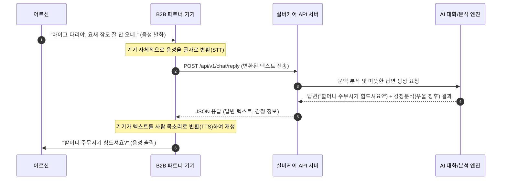
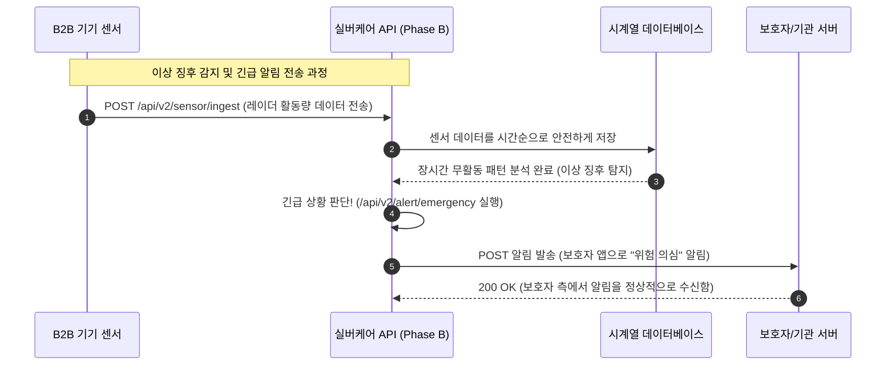

# Software Requirements Specification (SRS)
Document ID: SRS-001
Revision: 1.0
Date: 2026-04-18
Standard: ISO/IEC/IEEE 29148:2018

-------------------------------------------------
## 1. Introduction

### 1.1 Purpose
본 문서(SRS)의 목적은 하드웨어 기기 제조사들이 자체적으로 어려운 인공지능(AI) 소프트웨어를 개발하지 않아도, 우리 플랫폼에 연결하기만 하면 어르신들을 위한 맞춤형 'AI 대화 기능'을 사용할 수 있게 해주는 **실버케어 API 플랫폼**의 상세 요구사항을 정의하는 것입니다. 

### 1.2 Scope (In-Scope / Out-of-Scope)
**[In-Scope (개발 범위 내)]**
*   **Phase A (MVP 단계):** 어르신과 자연스럽게 대화하는 AI 캐릭터챗, 대화 내용을 분석해 감정 및 이상 징후를 알아내는 분석 기능, 기기가 먼저 어르신에게 말을 거는 선제적 발화 기능.
*   **Phase B (확장 단계):** 기기의 센서(레이더 등) 데이터를 수집하고, 대화 데이터와 결합해 응급 상황을 판단한 뒤 보호자에게 알림을 보내는 통합 돌봄 리포트 기능.
*   B2B 파트너(제조사)가 쉽게 연동해볼 수 있도록 설명서(Swagger)와 샘플 코드를 제공하는 개발자 포털.

**[Out-of-Scope (개발 범위 외 - 개발하지 않는 것)]**
*   돌봄 로봇, 스마트 스피커와 같은 실물 하드웨어 기기를 직접 만들거나 판매하지 않습니다. (제약사항/ADR-002)
*   일반 소비자(어르신, 보호자)가 휴대폰에 직접 깔아서 쓰는 모바일 앱은 출시하지 않습니다. (제약사항/ADR-002)
*   우리 서버에서 음성을 글자로(STT), 글자를 음성으로(TTS) 바꾸는 작업은 하지 않습니다. 이는 파트너사의 기기에서 처리해서 글자(텍스트)만 주고받습니다. (제약사항/ADR-001)

### 1.3 Definitions, Acronyms, Abbreviations
*   **Jobs to be Done (JTBD):** 고객이 우리 제품을 통해 궁극적으로 해결하고 싶어 하는 핵심 과제나 목적입니다.
*   **Adjusted Opportunity Score (AOS):** 고객이 느끼는 불편함과 중요도를 바탕으로, 우리가 먼저 개발해야 할 기능의 우선순위를 매긴 점수입니다.
*   **Discovered Opportunity Score (DOS):** 초기 리서치를 통해 발견된 잠재적 기회 점수입니다.
*   **Validator (검증자):** 우리가 만든 기능이 진짜 고객의 문제를 해결했는지 확인하는 사람 또는 절차입니다.
*   **API (Application Programming Interface):** 파트너사의 기기와 우리 서버가 데이터를 주고받기 위해 사용하는 '연결 통로'입니다.
*   **B2B2C 모델:** 기업(기기 제조사)에게 서비스를 팔지만, 최종적으로는 그 기기를 쓰는 소비자(어르신)를 만족시키는 사업 모델입니다.
*   **PoC (Proof of Concept):** 우리가 만든 기술이 시장에서 진짜 통하는지 테스트해보는 시범 사업입니다.

### 1.4 References
*   **REF-01:** 실버케어초안_PRD_v0.3.md (제품 요구사항 정의서 원본)

-------------------------------------------------
## 2. Stakeholders

우리 시스템과 엮여 있는 주요 관계자들은 다음과 같습니다.

| 역할(Role) | 책임(Responsibility) | 관심사(Interest) |
|---|---|---|
| **B2B 파트너 (기기 제조사)** | 우리 API를 자신들의 로봇/기기에 연결하고, 기기에서 음성을 글자로 바꾸는 역할을 담당합니다. | 인공지능 개발 비용 절약, 기기를 빠르게 시장에 출시하여 판매량 늘리기 |
| **A. 독거 어르신 (최종 사용자)** | 파트너사의 기기를 통해 실제로 AI와 대화합니다. | 외로움 달래기, 복잡하지 않고 사람처럼 내 말을 잘 알아듣는 친근한 대화 |
| **B. 보호자 자녀** | 부모님의 대화/감정 분석 결과가 담긴 리포트나 응급 알림을 받습니다. | 떨어져 사는 부모님의 마음 상태와 안전 여부 확인 |
| **C. 요양기관 원장** | 여러 어르신의 상태를 한눈에 볼 수 있는 리포트를 받습니다. (Phase B) | 기관 내 어르신들의 통합적인 관리 및 위험 상황 조기 대처 |

-------------------------------------------------
## 3. System Context and Interfaces

### 3.1 External Systems
*   **AI 대화/분석 엔진 (LLM):** 어르신이 하신 말씀의 뜻을 파악하고, 그에 맞는 따뜻한 답변이나 감정 상태를 분석해주는 핵심 두뇌 역할을 하는 시스템입니다.
*   **보호자/기관 서버:** 비명 소리 등 응급 상황이 발생했을 때 경고 알림(Webhook)을 전달받는 외부 시스템입니다.

### 3.2 Client Applications
*   **B2B 파트너 기기:** 어르신의 목소리를 듣고 글자로 바꾼 뒤 우리 서버로 보내고, 우리 서버가 준 답변 텍스트를 다시 사람 목소리로 읽어주는 실제 물리적 기기(로봇, 스피커 등)입니다.

### 3.3 API Overview
우리 플랫폼은 파트너 기기와 통신하기 위해 정해진 인터넷 주소(API 엔드포인트)를 제공합니다. 대화하기, 감정 분석하기, 센서 데이터 보내기 등의 통로가 준비되어 있습니다. (상세 주소는 Appendix 6.1 참고)

### 3.4 Interaction Sequences
기기와 우리 서버가 어떻게 대화를 주고받는지 보여주는 핵심 흐름도입니다.

-------------------------------------------------
## 4. Specific Requirements

### 4.1 Functional Requirements (기능 요구사항)
시스템이 '무엇을' 할 수 있어야 하는지 정의한 명세입니다.

| ID | Requirement Description (요구사항 설명) | Acceptance Criteria (인수 기준: 테스트 통과 조건) | Source (출처) | Priority |
|---|---|---|---|---|
| REQ-FUNC-001 | 시스템은 B2B 기기로부터 글자(텍스트) 형태로 변환된 어르신의 말을 수신받고 처리할 수 있어야 한다. | **Given** 기기에서 텍스트를 API로 전송하면, **When** 시스템이 수신하여, **Then** 1초 이내에 정상적으로 응답을 주어야 한다. | Story B2B | Must |
| REQ-FUNC-002 | 시스템은 수신된 텍스트와 예전 대화 기억을 합쳐서, 어르신께 딱 맞는 맞춤형 대답(예: 존댓말, 사투리 등)을 만들어내야 한다. | **Given** 며칠 전 "허리가 아프다"고 하신 기억 데이터가 있을 때, **When** 오늘 대화를 시작하면, **Then** "허리는 좀 어떠셔요?"와 같이 문맥을 기억하는 대답을 만든다. | Story A | Must |
| REQ-FUNC-003 | 시스템은 만들어진 대답과 분석된 감정 코드(기쁨, 슬픔 등)를 B2B 기기가 이해할 수 있는 형태(JSON)로 돌려주어야 한다. | **Given** AI 대답 생성이 끝나면, **When** 기기로 결과값을 보낼 때, **Then** 텍스트와 감정 코드가 포함된 정해진 포맷으로 반환해야 한다. | Story B2B | Must |
| REQ-FUNC-004 | 시스템은 대화 내용을 살펴보고 '외로움', '우울', '아픔' 등의 감정 점수와 위험한 단어들을 찾아내야 한다. | **Given** 어르신의 대화가 서버로 들어오면, **When** 감정 분석 기능을 실행할 때, **Then** 우울감 등 수치화된 점수와 키워드를 결과로 내어준다. | Phase A (F2) | Must |
| REQ-FUNC-005 | 시스템은 아침 기상 시간이나 약 드실 시간 등 특정 상황에 맞춰서 기기가 먼저 어르신께 말을 걸 수 있게 메시지를 생성해야 한다. | **Given** 미리 설정해둔 특정 시간이 되면, **When** 선제적 발화 기능이 작동하여, **Then** "할머니 약 드실 시간이에요" 같은 메시지를 기기로 보낸다. | Phase A (F3) | Must |
| REQ-FUNC-006 | 시스템은 B2B 개발자들이 우리 기능을 쉽게 가져다 쓸 수 있도록 설명서와 예제 코드가 있는 웹페이지(개발자 포털)를 제공해야 한다. | **Given** B2B 개발자가 연동 테스트를 원할 때, **When** 개발자 웹사이트에 접속하면, **Then** 즉시 API 설명서(Swagger)와 코드를 볼 수 있어야 한다. | Story B2B | Must |
| REQ-FUNC-007 | 시스템은 B2B 기기가 보내는 수면, 움직임, 혈압 등의 센서 데이터를 받아서 기록(저장)할 수 있어야 한다. | **Given** 기기에서 센서 측정값을 보내면, **When** 시스템이 수신하여, **Then** 시간대별로 데이터베이스에 안전하게 저장한다. | Phase B (F4) | Should |
| REQ-FUNC-008 | 시스템은 대화 내용 중 비명 소리나 센서의 멈춤 상태를 합쳐서 응급 상황인지 판단하고, 즉시 알림(Push/Webhook)을 보내야 한다. | **Given** 센서와 대화에서 위험 패턴이 감지되면, **When** 시스템이 응급 상황으로 판단 시, **Then** 등록된 보호자나 병원 서버로 긴급 알림을 보낸다. | Phase B (F5) | Should |
| REQ-FUNC-009 | 시스템은 쌓인 대화와 센서 기록을 정리해서 주간 단위의 리포트 데이터를 만들어 제공해야 한다. | **Given** 보호자나 기관에서 리포트를 요청하면, **When** 시스템이 일주일 치 데이터를 분석하여, **Then** 수면 분석 및 정서 상태 리포트 데이터를 반환한다. | Phase B (F6) | Should |

### 4.2 Non-Functional Requirements (비기능 요구사항)
기능이 '얼마나 빠르고, 안전하고, 정확하게' 동작해야 하는지 정한 기준입니다.

| ID | Category | Requirement Description (요구사항 설명) | Target Metric (성능/측정 지표) |
|---|---|---|---|
| REQ-NF-001 | 성능 (Performance) | 로봇과 사람의 대화가 어색하지 않도록 시스템의 대답 속도가 매우 빨라야 합니다. | 상위 95%의 요청이 800ms(0.8초) 이내 응답 |
| REQ-NF-002 | 가용성 (Availability) | 시스템은 한밤중이나 주말에도 절대 꺼지지 않고 항상 켜져 있어야 합니다. | 서버 정상 작동률(SLA) 99.9% 보장 |
| REQ-NF-003 | 확장성 (Scalability) | 수많은 기기들이 동시에 말을 걸어와도 멈춤 없이 척척 대답해낼 수 있어야 합니다. | 10,000대 이상 동시 접속 시에도 병목 없음 |
| REQ-NF-004 | 프라이버시 (Privacy) | 할머니의 성함, 주민번호, 주소 같은 민감한 정보는 서버에 저장되기 전에 누군지 모르게 가려야 합니다. | 모든 개인정보(PII) 자동 마스킹(비식별화) |
| REQ-NF-005 | 보안 (Security) | 기기와 서버가 데이터를 주고받을 때 남들이 훔쳐보지 못하도록 철저히 암호를 걸어야 합니다. | TLS 1.3 통신, 저장 데이터 AES-256 암호화 |
| REQ-NF-006 | 보안 (Security) | A라는 제조사의 데이터와 B라는 제조사의 데이터가 절대 서로 섞이거나 유출되지 않게 칸막이를 쳐야 합니다. | 완벽한 다테넌시(Multi-Tenancy) 분리 구조 |
| REQ-NF-007 | 신뢰성 (Reliability) | 인공지능이 어르신의 우울증이나 위험 징후를 짚어내는 실력이 아주 정확해야 합니다. | 대화 기반 우울/위험 감지 정확도 90% 이상 |
| REQ-NF-008 | 비용/운영 (Business) | 어르신들이 우리 시스템과 수다를 많이 떨도록 유도하여 제품의 활성도를 높여야 합니다. (성공 지표) | 엔드유저 1인당 하루 평균 5회 이상 호출 지원 |
| REQ-NF-009 | 제약사항 (Constraints) | 인공지능이 엉뚱한 의학적 조언을 해서 위험해지는 일이 없도록 강력한 안전장치(가드레일)를 두어야 합니다. (ADR/리스크 R1) | 의료 질문 시 무조건 "가족/의사에게 문의" 답변 강제 |

-------------------------------------------------
## 5. Traceability Matrix

사용자의 요구(스토리)가 어떤 기능(Requirement)으로 만들어지고, 향후 어떻게 테스트(TC)될지 연결해둔 표입니다.

| Story / Source (출처) | Requirement ID (요구사항 번호) | Test Case ID (테스트 케이스) |
|---|---|---|
| Story B2B (기기 제조사) | REQ-FUNC-001, REQ-FUNC-003, REQ-FUNC-006 | TC-001, TC-002 |
| Story A (독거 어르신) | REQ-FUNC-002 | TC-003 |
| Phase A (현재 목표 MVP) | REQ-FUNC-004, REQ-FUNC-005, REQ-NF-001 | TC-004, TC-005 |
| Phase B (확장 목표) | REQ-FUNC-007, REQ-FUNC-008, REQ-FUNC-009 | TC-006, TC-007 |

-------------------------------------------------
## 6. Appendix

### 6.1 API Endpoint List
B2B 개발자들이 우리 서버와 통신할 때 사용할 주소(엔드포인트) 목록입니다.

| ID | Endpoint URL | HTTP Method | Description (기능 설명) | 타겟 사용자 |
|---|---|---|---|---|
| F1 | `/api/v1/chat/reply` | POST | 어르신의 말에 답변을 생성합니다. (이전 기억 반영) | B2B, 어르신 |
| F2 | `/api/v1/analyze/emotion` | GET/POST | 대화 내용을 바탕으로 기분이 어떠신지 점수를 매깁니다. | B2B, 보호자 |
| F3 | `/api/v1/schedule/proactive` | GET | 기상, 식사 시간에 맞춰서 기기가 먼저 할 말을 줍니다. | B2B, 어르신 |
| F4 | `/api/v2/sensor/ingest` | POST | 수면 기록이나 활동량 같은 센서 기록을 수신받아 저장합니다. | B2B |
| F5 | `/api/v2/alert/emergency` | POST | 위험 상황일 때 보호자나 병원 서버에 즉시 알람을 울려줍니다. | 보호자, 기관 |
| F6 | `/api/v2/report/kpi` | GET | 일주일치 감정/수면 기록을 예쁘게 정리해서 리포트용 데이터로 줍니다. | 보호자, 기관 |

### 6.2 Entity & Data Model
시스템이 정보를 기억하기 위해 사용하는 데이터베이스 표(구조)입니다.

| Entity Name (테이블명) | Description (설명) | Key Attributes (주요 필드) | 보안 중요도 |
|---|---|---|---|
| **B2B_Partner** | 우리 API를 쓰는 제조사 정보 | id (고유번호), company_name (회사명), api_key (인증키), webhook_url (알림받을 주소) | 매우 높음 |
| **Elder_User** | 우리 서비스를 쓰는 어르신 정보 | id (고유번호), partner_id (제조사 연결), name (비식별화된 이름), device_id (기기 번호) | 높음 (개인정보 보호) |
| **Chat_History** | 어르신과 인공지능이 나눈 대화 기록 | id (고유번호), elder_id (어르신 연결), message (대화 내용), emotion_score (감정 점수) | 높음 (개인정보 보호) |
| **Sensor_Log** | 레이더 등에서 측정한 센서 수치 | id (고유번호), elder_id (어르신 연결), sensor_type (센서 종류), value (측정값) | 보통 |
| **Alert_Event** | 응급 상황이 발생해서 알림을 보낸 내역 | id (고유번호), elder_id (어르신 연결), trigger_reason (발생 원인), status (처리 상태) | 높음 |

### 6.3 Detailed Interaction Models
Phase B 단계에서 센서가 위험을 감지하고 보호자에게 알림을 보내는 상세 흐름도입니다.

**[Validation Plan (검증 및 실험 계획)]**
*   **알파 테스트:** 개발팀에서 가상의 어르신 로봇 100개를 만들어, 인공지능이 이상한 소리(환각)를 하거나 대답이 느리지 않은지 내부적으로 꼼꼼히 점검합니다.
*   **1차 실증(PoC):** 우리와 뜻이 맞는 중소 제조사 1곳과 손잡고, 실제 어르신 50가구에 무료로 기능을 제공해봅니다. (어르신들이 로봇과 하루 평균 5번 이상 수다를 떠시는지 측정하는 것이 목표입니다.)
*   **확장(Phase B):** 인공지능 대화로 고객들이 우리 서비스를 떠나지 못하게(Lock-in) 한 뒤, 건강 센서 분석 기능까지 얹어서 돈을 버는 프리미엄 서비스로 확장해 나갈 계획입니다.
