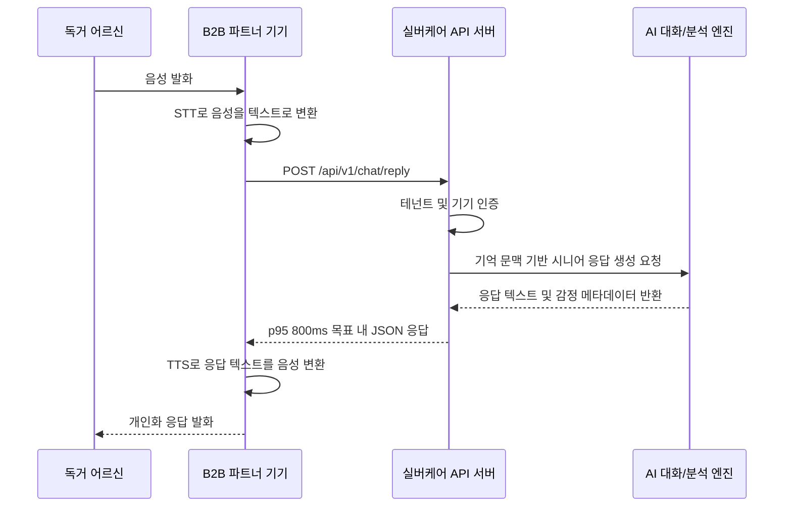
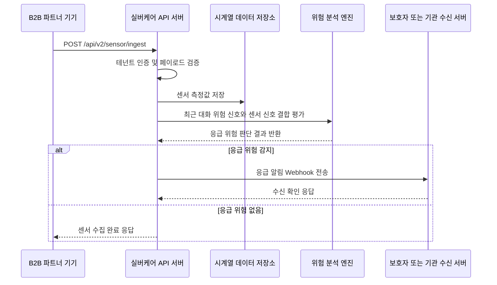
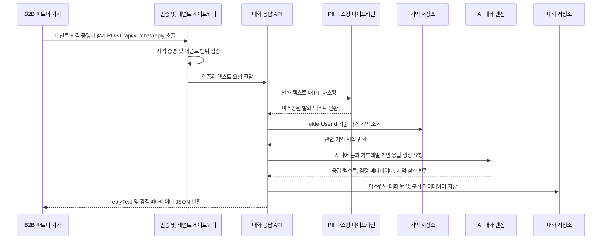
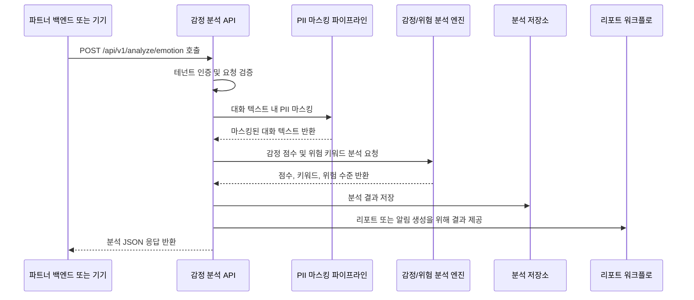
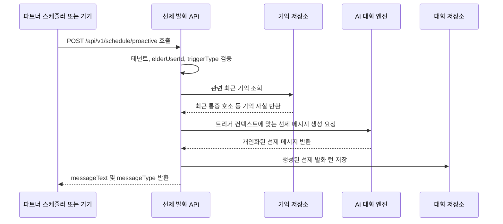
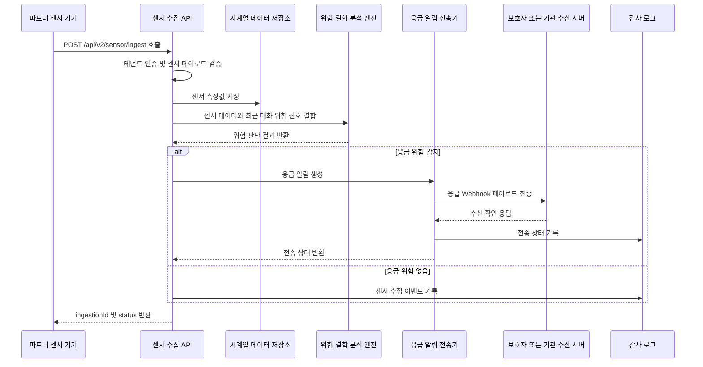
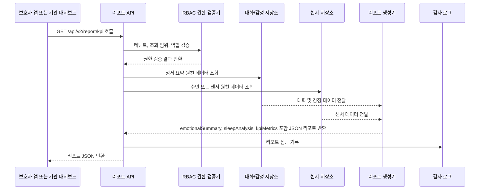

# Software Requirements Specification (SRS)
Document ID: SRS-001
Revision: 1.0
Date: 2026-04-18
Standard: ISO/IEC/IEEE 29148:2018

-------------------------------------------------
## 1. Introduction

### 1.1 Purpose

본 Software Requirements Specification(SRS)은 실버케어 시스템의 소프트웨어 요구사항을 정의한다. 실버케어는 시니어 특화 AI 캐릭터챗 및 돌봄 데이터 통합 API 플랫폼이며, B2B 파트너 기기에 텍스트 기반 대화 지능, 감정/위험 분석, 선제적 발화, 센서 데이터 수집, 응급 알림, 보호자/기관 리포트 기능을 제공한다.

본 시스템은 REF-01에서 정의한 다음 문제를 해결하는 것을 목적으로 한다.

| 문제 ID | 문제 정의 | 영향 지표 | 관련 이해관계자 |
|---|---|---:|---|
| PRB-001 | 돌봄 로봇, 스마트 스피커, 태블릿 등 하드웨어 제조사는 기기 제작 역량은 있으나 시니어 특화 AI 대화 소프트웨어를 자체 개발할 역량이 부족하다. | 자체 AI 소프트웨어 개발에 수억 원 및 수개월 소요 | B2B 파트너 |
| PRB-002 | 독거 어르신은 외로움과 우울 위험에 노출되어 있으며, 기존 돌봄 기기의 기계적 사용성으로 인해 기기 사용을 중단한다. | 우울 증상 경험률 16.1%, 도입 1개월 후 기존 기기 사용 중단율 70% 이상 | 독거 어르신 |

본 시스템은 B2B 파트너가 자체 AI 모델을 개발하지 않고도 시니어 대화 기능을 제품에 연동하도록 하며, 최종 사용자인 독거 어르신에게 개인화되고 정서적으로 지지적인 대화 경험을 제공해야 한다.

### 1.2 Scope (In-Scope / Out-of-Scope)

#### In-Scope

| 범위 ID | 범위 항목 | 단계 | 출처 |
|---|---|---|---|
| SCP-IN-001 | 텍스트 기반 시니어 대화 응답 API 제공 | Phase A | REF-01 F1 |
| SCP-IN-002 | 대화 기반 감정 및 이상 징후 분석 API 제공 | Phase A | REF-01 F2 |
| SCP-IN-003 | 기상, 식사, 복약 등 상황에 맞는 선제적 발화 생성 API 제공 | Phase A | REF-01 F3 |
| SCP-IN-004 | B2B 개발자가 API 명세서와 샘플 코드를 확인할 수 있는 개발자 포털 또는 Swagger/OpenAPI 제공 | Phase A | REF-01 AC-2 |
| SCP-IN-005 | B2B 파트너가 수집한 레이더, 수면, 움직임, 웨어러블, 혈압 등 센서 데이터 수집 API 제공 | Phase B | REF-01 F4 |
| SCP-IN-006 | 대화 위험 신호와 센서 이상 신호를 결합한 응급 알림 Webhook 제공 | Phase B | REF-01 F5 |
| SCP-IN-007 | 보호자 및 기관 대상 정서 리포트, 수면 분석, KPI 리포트 API 제공 | Phase B | REF-01 F6 |
| SCP-IN-008 | 제조사, 통신사, 지자체, 노인복지관 키오스크 등 API 연동 파트너를 대상으로 하는 B2B2C SaaS 모델 지원 | Phase A/B | REF-01 R2, ADR-002 |
| SCP-IN-009 | 반기별 PoC 파트너 수, 어르신별 일평균 대화 API 호출 횟수, API 지연 시간, 감정/위험 감지 정확도 측정 | Phase A/B | REF-01 KPI |

#### Out-of-Scope

| 범위 ID | 범위 제외 항목 | 제외 사유 | 출처 |
|---|---|---|---|
| SCP-OUT-001 | 물리적 하드웨어 제조, 물류, AS, 어르신 대상 직접 고객센터 운영 | 본 제품은 하드웨어 제조가 아닌 B2B2C API SaaS 모델을 채택한다. | REF-01 ADR-002 |
| SCP-OUT-002 | B2B 파트너 기기의 서버 측 STT/TTS 처리 | STT/TTS는 B2B 파트너 기기가 처리하며, 실버케어 API는 텍스트와 분석 메타데이터만 송수신한다. | REF-01 ADR-001 |
| SCP-OUT-003 | MVP 단계의 직접 B2C 앱 출시 | MVP는 B2B 파트너 API 연동을 우선한다. | REF-01 ADR-002 |
| SCP-OUT-004 | AI의 의료 진단, 처방, 치료 지시 제공 | 의료/처방 질문은 가족 또는 의사에게 문의하도록 응답해야 한다. | REF-01 R1 |
| SCP-OUT-005 | 실버케어 자체 하드웨어를 통한 센서 데이터 취득 | 센서 데이터는 B2B 파트너 기기 또는 파트너 시스템이 수집하여 API로 전송한다. | REF-01 F4 |

#### Constraints and Assumptions

| ID | 유형 | 내용 | 출처 |
|---|---|---|---|
| CON-001 | 제약사항 | 모든 음성 입력은 B2B 파트너 기기에서 텍스트로 변환된 뒤 실버케어 API로 전송되어야 한다. | REF-01 ADR-001 |
| CON-002 | 제약사항 | Phase A 대화 API는 원본 음성 파일 업로드를 필수로 요구하지 않아야 한다. | REF-01 ADR-001 |
| CON-003 | 제약사항 | 제품은 B2B2C API 구독형 SaaS 플랫폼으로 운영되어야 한다. | REF-01 ADR-002 |
| CON-004 | 제약사항 | AI는 의료 진단, 처방, 치료 방법을 직접 제공하지 않아야 한다. | REF-01 R1 |
| CON-005 | 제약사항 | 한 B2B 파트너의 데이터는 다른 B2B 파트너의 데이터와 논리적으로 격리되어야 한다. | REF-01 NFR Security |
| ASM-001 | 가정 | B2B 파트너는 테넌트 ID, 기기 ID, 어르신 사용자 ID, STT 결과 텍스트를 API 요청에 제공한다. | REF-01 ADR-001 |
| ASM-002 | 가정 | Phase B 센서 데이터는 B2B 파트너 기기 또는 파트너가 보유한 외부 연동 시스템에서 제공된다. | REF-01 F4 |
| ASM-003 | 가정 | 보호자 앱과 기관 모니터링 시스템은 B2B 파트너가 개발하거나 실버케어가 제공할 수 있다. | REF-01 Architecture |
| ASM-004 | 가정 | Phase A는 MVP 범위이며, Phase B API는 확장 요구사항으로 Should 우선순위를 가진다. | REF-01 Phase A/B |

### 1.3 Definitions, Acronyms, Abbreviations

| 용어 | 정의 |
|---|---|
| AC | PRD의 Given/When/Then 형식 수용 기준이며, 본 SRS에서는 검증 가능한 Acceptance Criteria로 변환된다. |
| ADR | Architectural Decision Record. 아키텍처 의사결정과 그 근거를 기록한 항목이다. |
| AI 캐릭터챗 API | LLM 기반 대화와 기억 메모리를 활용하여 시니어에게 적합한 응답을 생성하는 Phase A API 기능이다. |
| AOS | Adjusted Opportunity Score. 제품 기회 평가 개념이다. REF-01에는 수치가 제공되지 않았다. |
| API | Application Programming Interface. |
| B2B | Business-to-Business. 본 SRS에서는 하드웨어 제조사, 통신사, 지자체, 복지기관 등 직접 연동 및 지불 주체를 의미한다. |
| B2B2C | 실버케어가 B2B 파트너에 API를 제공하고, B2B 파트너 기기 또는 서비스가 최종 사용자에게 기능을 제공하는 모델이다. |
| DOS | Discovered Opportunity Score. 제품 기회 평가 개념이다. REF-01에는 수치가 제공되지 않았다. |
| 독거 어르신 | B2B 파트너 기기를 통해 음성으로 대화하고 AI 응답을 받는 최종 사용자이다. |
| 보호자 | 어르신의 정서 상태, 안전 상태, 리포트를 확인하는 자녀 또는 가족 사용자이다. |
| 요양기관/기관 | 다수의 어르신 상태를 모니터링하고 리포트 또는 알림을 확인하는 기관 사용자이다. |
| JTBD | Jobs to be Done. 이해관계자가 달성하려는 과업이며 REF-01의 페르소나 문제와 사용자 스토리에서 도출된다. |
| KPI | Key Performance Indicator. |
| LLM | Large Language Model. |
| MSA | Microservice Architecture. |
| MVP | Minimum Viable Product. 본 SRS에서는 Phase A 캐릭터챗 API 범위를 의미한다. |
| PII | Personally Identifiable Information. 실명, 주민등록번호, 주소 등 개인 식별 가능 정보이다. |
| PoC | Proof of Concept. |
| p95 | 95번째 백분위 지표. 측정 요청 중 95%가 해당 기준 이하로 완료됨을 의미한다. |
| RBAC | Role-Based Access Control. 역할 기반 접근 제어이다. |
| RPO | Recovery Point Objective. 장애 발생 시 허용 가능한 최대 데이터 손실 시간이다. |
| RTO | Recovery Time Objective. 장애 발생 후 서비스 복구까지 허용 가능한 최대 시간이다. |
| SLA | Service Level Agreement. |
| STT | Speech-to-Text. Phase A에서는 B2B 파트너 기기에서 처리한다. |
| TTS | Text-to-Speech. Phase A에서는 B2B 파트너 기기에서 처리한다. |
| Validator | 제품 검증 주체 또는 근거이다. REF-01에서는 B2B PoC 파트너와 어르신 50가구가 검증 주체로 정의된다. |
| Webhook | 실버케어가 등록된 파트너, 보호자, 기관 서버로 전송하는 서버 간 콜백이다. |

### 1.4 References (REF-XX)

| Reference ID | 제목 | 버전/일자 | 설명 |
|---|---|---|---|
| REF-01 | 실버케어초안_PRD_v0.3.md | v0.3 / 2026-04-18 | 실버케어 제품 요구사항의 유일한 비즈니스/기능 Source of Truth 문서 |
| REF-02 | ISO/IEC/IEEE 29148:2018 | 2018 | 본 SRS의 구조 및 요구사항 명세 기준 |

## 2. Stakeholders

| Stakeholder ID | 역할(Role) | 책임(Responsibility) | 관심사(Interest) |
|---|---|---|---|
| STK-001 | B2B 파트너 개발팀장 | 파트너 기기 소프트웨어와 실버케어 API를 연동하고, 문서와 샘플 코드로 API 동작을 검증한다. | 자체 AI 모델 개발 없이 출시 일정을 단축하고 제품 경쟁력을 강화한다. |
| STK-002 | B2B 파트너 사업 책임자 | PoC 도입, API 구독, 설치 기기 확대 여부를 결정한다. | 돌봄 로봇, 스피커, 태블릿, 키오스크, 통신/복지 서비스의 시장 경쟁력을 높인다. |
| STK-003 | 독거 어르신 | 파트너 기기에 음성으로 말하고 TTS로 AI 응답을 듣는다. | 사람처럼 자연스럽고 개인화된 말동무를 통해 정서적 위로를 얻는다. |
| STK-004 | 보호자 자녀 | 어르신의 정서 상태, 안전 상태, 요약 리포트를 확인한다. | 부모님이 하루를 안전하고 정서적으로 안정되게 보냈는지 확인한다. |
| STK-005 | 요양기관 원장/관리자 | 다수 어르신의 상태, 응급 알림, 기관 단위 KPI를 확인한다. | 돌봄 위험을 조기에 파악하고 기관 성과를 관리한다. |
| STK-006 | 실버케어 API 운영팀 | API 가용성, 테넌트 격리, 장애 대응, 모니터링을 운영한다. | 안정적이고 보안성이 높은 API 서비스를 유지한다. |
| STK-007 | 실버케어 AI/ML 팀 | 시니어 대화 프롬프트, 감정/위험 분석, 환각 방지 가드레일, 모델 평가를 관리한다. | 안전한 대화 품질과 90% 이상의 위험 징후 감지 정확도를 달성한다. |
| STK-008 | 보안/개인정보 책임자 | 개인정보 마스킹, 암호화, 감사 로그, 접근 제어 정책을 정의하고 검증한다. | 테넌트 간 데이터 노출과 개인정보 침해를 방지한다. |

## 3. System Context and Interfaces

### 3.1 External Systems

| External System ID | 시스템 | 방향 | 인터페이스 유형 | 설명 |
|---|---|---|---|---|
| EXT-001 | B2B 파트너 기기 | 클라이언트 → 실버케어 | HTTPS REST JSON | STT 결과 텍스트, 선제 발화 요청 컨텍스트, Phase B 센서 데이터를 전송하고 응답 텍스트 및 메타데이터를 수신한다. |
| EXT-002 | 파트너 STT/TTS 파이프라인 | 실버케어 외부 | 기기 내장 또는 파트너 서비스 | API 요청 전 음성을 텍스트로 변환하고, API 응답 후 텍스트를 음성으로 변환한다. |
| EXT-003 | AI 대화/분석 엔진 | 실버케어 내부 또는 연동 서비스 | 서비스 API | 대화 응답 생성, 감정/위험 분석, 의료 안전 가드레일 적용을 수행한다. |
| EXT-004 | 보호자 앱 또는 파트너 서버 | 실버케어 → 클라이언트 | HTTPS REST/Webhook | 리포트 데이터와 응급/이상 징후 알림을 수신한다. |
| EXT-005 | 기관 모니터링 시스템 | 실버케어 → 클라이언트 | HTTPS REST/Webhook | 기관 단위 응급 알림과 KPI 리포트를 수신한다. |
| EXT-006 | 개발자 포털 | B2B 사용자 → 실버케어 | Web UI / OpenAPI | Swagger/OpenAPI 명세와 샘플 코드를 제공한다. |
| EXT-007 | 시계열 데이터 저장소 | 실버케어 내부 | Database Interface | B2B 파트너 기기가 제출한 Phase B 센서 데이터를 저장한다. |

### 3.2 Client Applications

| Client ID | 클라이언트 애플리케이션 | 사용자 | 지원 단계 | 주요 기능 |
|---|---|---|---|---|
| CLI-001 | 돌봄 로봇, 스마트 스피커, 태블릿, 키오스크 등 파트너 기기 | 독거 어르신 | Phase A/B | 텍스트 전송, 응답 텍스트 수신, STT/TTS 처리, 센서 데이터 제출 |
| CLI-002 | 개발자 포털 | B2B 파트너 개발팀장 | Phase A/B | API 문서, Swagger/OpenAPI 스키마, 샘플 코드 확인 |
| CLI-003 | 보호자 모바일/웹 앱 | 보호자 자녀 | Phase B | 정서 리포트, 안전 알림, 주간 요약 확인 |
| CLI-004 | 기관 모니터링 대시보드 | 요양기관 관리자 | Phase B | 다수 어르신 상태, 응급 알림, 기관 KPI 확인 |

### 3.3 API Overview

| API ID | 엔드포인트 | Method | 단계 | Priority | 주요 소비자 | 개요 |
|---|---|---|---|---|---|---|
| API-001 | `/api/v1/chat/reply` | POST | A | Must | B2B 파트너 기기 | 어르신 발화 텍스트로부터 시니어 맞춤형 응답 텍스트와 감정 메타데이터를 생성한다. |
| API-002 | `/api/v1/analyze/emotion` | POST | A | Must | B2B 파트너 기기 또는 파트너 백엔드 | 대화 텍스트에서 외로움, 우울, 통증 호소, 감정 점수, 위험 키워드를 분석한다. |
| API-003 | `/api/v1/schedule/proactive` | POST | A | Must | B2B 파트너 기기 또는 파트너 백엔드 | 기상, 식사, 복약 독려 등 선제적 메시지를 생성한다. |
| API-004 | `/api/v2/sensor/ingest` | POST | B | Should | B2B 파트너 기기 또는 파트너 백엔드 | 레이더, 수면, 움직임, 웨어러블, 혈압 등 센서 데이터를 수신한다. |
| API-005 | `/api/v2/alert/emergency` | POST/Webhook dispatch | B | Should | 보호자/기관 수신 서버 | 대화 및 센서 신호 조합으로 응급 위험이 판단되면 알림 페이로드를 전송한다. |
| API-006 | `/api/v2/report/kpi` | GET | B | Should | 보호자 앱, 기관 대시보드, 파트너 백엔드 | 주간 정서 리포트, 수면 분석, 기관 KPI 데이터를 JSON으로 제공한다. |
| API-007 | `/openapi` 또는 개발자 포털 Swagger URL | GET | A/B | Must | B2B 파트너 개발자 | API 명세와 샘플 코드 접근 정보를 제공한다. |

### 3.4 Interaction Sequences (핵심 시퀀스 다이어그램 머메이드 차트 포함)

#### Core Sequence 1: Phase A 대화 응답 및 감정 메타데이터 반환

#### Core Sequence 2: Phase B 센서 결합 분석 및 응급 알림

## 4. Specific Requirements

### 4.1 Functional Requirements (테이블 필수)

| Requirement ID | Source | Priority | 요구사항 | Acceptance Criteria | Test Case ID |
|---|---|---|---|---|---|
| REQ-FUNC-001 | STORY-B2B, AC-1, F1 | Must | 시스템은 B2B 파트너 기기로부터 `POST /api/v1/chat/reply`를 통해 어르신 발화 텍스트를 수신해야 한다. | Given 유효한 테넌트, 기기, 어르신 사용자 ID, 발화 텍스트가 제공되었을 때, When 기기가 엔드포인트를 호출하면, Then API는 요청을 수락하고 구조화된 JSON 응답을 반환해야 한다. | TC-FUNC-001 |
| REQ-FUNC-002 | STORY-B2B, AC-1, F1 | Must | 시스템은 존댓말과 친근한 표현을 사용하는 시니어 맞춤형 응답 텍스트를 생성해야 한다. | Given 유효한 어르신 발화가 제공되었을 때, When 응답이 생성되면, Then 응답에는 TTS 재생에 사용할 수 있는 `replyText`가 포함되어야 한다. | TC-FUNC-002 |
| REQ-FUNC-003 | STORY-B2B, AC-1, F1 | Must | 시스템은 `POST /api/v1/chat/reply` 성공 응답마다 감정 메타데이터를 반환해야 한다. | Given 발화가 정상 처리되었을 때, When 응답이 반환되면, Then 기쁨, 슬픔, 외로움, 우울 위험, 통증 호소 등 적용 가능한 감정 코드가 하나 이상 포함되어야 한다. | TC-FUNC-003 |
| REQ-FUNC-004 | STORY-A, AC-3, F1 | Must | 시스템은 저장된 대화 기억을 사용하여 문맥 기반 개인화 응답을 생성해야 한다. | Given 어르신이 과거에 "허리가 아프다"고 말한 기록이 있을 때, When 이후 대화 또는 선제 발화가 생성되면, Then 어르신이 반복 설명하지 않아도 허리 통증 문맥을 참조할 수 있어야 한다. | TC-FUNC-004 |
| REQ-FUNC-005 | F1, R1 | Must | 시스템은 대화 응답 생성 시 의료 안전 가드레일을 적용해야 한다. | Given 어르신이 진단, 처방, 치료 방법을 질문했을 때, When AI가 응답을 생성하면, Then 의료 조언을 제공하지 않고 가족 또는 의사에게 문의하도록 안내해야 한다. | TC-FUNC-005 |
| REQ-FUNC-006 | F1, ADR-001 | Must | 시스템은 Phase A 대화 API에서 텍스트 입력만 처리하며 원본 음성 입력을 필수로 요구하지 않아야 한다. | Given 클라이언트가 음성 파일 없이 유효한 텍스트 페이로드를 전송했을 때, When `POST /api/v1/chat/reply`가 호출되면, Then 요청은 처리 가능해야 한다. | TC-FUNC-006 |
| REQ-FUNC-007 | STORY-B2B, AC-2 | Must | 시스템은 B2B 개발자가 API 문서를 확인할 수 있는 개발자 포털 또는 Swagger/OpenAPI 인터페이스를 제공해야 한다. | Given B2B 개발자가 포털 접근 권한을 가지고 있을 때, When 문서 페이지를 열면, Then 사용 가능한 엔드포인트의 API 명세가 표시되어야 한다. | TC-FUNC-007 |
| REQ-FUNC-008 | STORY-B2B, AC-2 | Must | 시스템은 B2B 개발자에게 샘플 연동 코드를 제공해야 한다. | Given B2B 개발자가 개발자 포털에서 엔드포인트 문서를 열었을 때, When 요청/응답 예제를 확인하면, Then 샘플 코드가 제공되어야 한다. | TC-FUNC-008 |
| REQ-FUNC-009 | F2 | Must | 시스템은 `POST /api/v1/analyze/emotion`을 통해 대화 텍스트를 수신하고 감정 및 이상 징후를 분석해야 한다. | Given 유효한 대화 텍스트가 제공되었을 때, When 엔드포인트가 호출되면, Then API는 분석 객체를 반환해야 한다. | TC-FUNC-009 |
| REQ-FUNC-010 | F2 | Must | 시스템은 대화 내용에서 외로움, 우울 위험, 통증 호소에 대한 감정 점수를 산출해야 한다. | Given 정서적 또는 신체적 불편 신호가 포함된 텍스트가 제공되었을 때, When 분석이 완료되면, Then 적용 가능한 감정/위험 점수가 응답에 포함되어야 한다. | TC-FUNC-010 |
| REQ-FUNC-011 | F2 | Must | 시스템은 분석된 대화 텍스트에서 위험 키워드를 추출해야 한다. | Given 위험 키워드가 포함된 텍스트가 제공되었을 때, When 분석이 완료되면, Then 정규화된 위험 키워드 목록이 응답에 포함되어야 한다. | TC-FUNC-011 |
| REQ-FUNC-012 | F2, B | Must | 시스템은 감정 및 이상 징후 분석 결과를 보호자 리포트 또는 알림 워크플로에서 사용할 수 있게 해야 한다. | Given 분석 결과가 외로움, 우울 위험, 통증 호소를 나타낼 때, When 결과가 저장되면, Then 리포트 또는 알림 생성을 위해 조회 가능해야 한다. | TC-FUNC-012 |
| REQ-FUNC-013 | STORY-A, AC-3, F3 | Must | 시스템은 `POST /api/v1/schedule/proactive`을 통해 선제적 메시지를 생성해야 한다. | Given 유효한 어르신 사용자 ID와 트리거 컨텍스트가 제공되었을 때, When 엔드포인트가 호출되면, Then API는 선제적 메시지를 반환해야 한다. | TC-FUNC-013 |
| REQ-FUNC-014 | F3 | Must | 시스템은 기상, 식사, 복약 독려 컨텍스트 유형의 선제적 메시지 생성을 지원해야 한다. | Given 요청에 지원되는 컨텍스트 유형이 포함되어 있을 때, When 메시지가 생성되면, Then 응답은 요청된 컨텍스트 유형을 반영해야 한다. | TC-FUNC-014 |
| REQ-FUNC-015 | STORY-A, AC-3, F3 | Must | 시스템은 선제적 메시지 생성 시 관련 있는 과거 대화 기억을 활용해야 한다. | Given 저장된 기억에 최근 건강 관련 문맥이 있을 때, When 선제적 메시지가 요청되면, Then 생성 메시지는 관련 과거 문맥을 포함해야 한다. | TC-FUNC-015 |
| REQ-FUNC-016 | F4 | Should | 시스템은 `POST /api/v2/sensor/ingest`를 통해 파트너가 수집한 센서 데이터를 수신해야 한다. | Given 유효한 테넌트, 기기, 어르신 사용자 ID, 타임스탬프, 센서 유형, 측정값이 제공되었을 때, When 엔드포인트가 호출되면, Then API는 센서 데이터를 수락해야 한다. | TC-FUNC-016 |
| REQ-FUNC-017 | F4 | Should | 시스템은 레이더, 수면, 움직임, 웨어러블, 혈압 센서 데이터 유형 수집을 지원해야 한다. | Given 지원되는 센서 유형의 페이로드가 제출되었을 때, When 페이로드가 처리되면, Then 센서 유형은 검증되고 저장되어야 한다. | TC-FUNC-017 |
| REQ-FUNC-018 | F4 | Should | 시스템은 수락된 센서 측정값을 시계열 데이터 저장소에 저장해야 한다. | Given 유효한 센서 데이터가 수락되었을 때, When 수집 처리가 완료되면, Then 테넌트, 어르신 사용자, 기기, 타임스탬프, 유형, 값 메타데이터가 함께 저장되어야 한다. | TC-FUNC-018 |
| REQ-FUNC-019 | F5 | Should | 시스템은 최근 대화 위험 신호와 센서 무활동 또는 이상 센서 데이터를 결합하여 응급 위험을 평가해야 한다. | Given 동일 어르신 사용자에 대해 대화 위험 데이터와 센서 이상 데이터가 존재할 때, When 응급 분석이 수행되면, Then 시스템은 응급 위험 판단 결과를 생성해야 한다. | TC-FUNC-019 |
| REQ-FUNC-020 | F5 | Should | 시스템은 응급 위험이 감지되면 등록된 보호자 또는 기관 엔드포인트로 Webhook을 전송해야 한다. | Given 응급 위험이 감지되고 콜백 엔드포인트가 등록되어 있을 때, When 알림 전송이 실행되면, Then 수신 엔드포인트는 응급 알림 페이로드를 받아야 한다. | TC-FUNC-020 |
| REQ-FUNC-021 | F5 | Should | 시스템은 응급 알림 페이로드에 어르신 사용자 참조, 위험 사유, 근거 신호, 타임스탬프, 심각도를 포함해야 한다. | Given 응급 알림이 전송되었을 때, When 수신자가 페이로드를 확인하면, Then 모든 필수 알림 필드가 존재해야 한다. | TC-FUNC-021 |
| REQ-FUNC-022 | F5 | Should | 시스템은 응급 Webhook의 전송 상태를 기록해야 한다. | Given 알림 전송 시도가 완료되었을 때, When 감사 기록을 조회하면, Then 성공, 실패, 수신 확인 상태와 타임스탬프가 표시되어야 한다. | TC-FUNC-022 |
| REQ-FUNC-023 | F6 | Should | 시스템은 `GET /api/v2/report/kpi`를 통해 보호자 및 기관 리포트를 제공해야 한다. | Given 권한 있는 요청자가 유효한 어르신 또는 기관 범위로 조회할 때, When 엔드포인트가 호출되면, Then API는 JSON 리포트를 반환해야 한다. | TC-FUNC-023 |
| REQ-FUNC-024 | F6 | Should | 시스템은 리포트 응답에 주간 정서 요약 데이터를 포함해야 한다. | Given 보고 기간 내 대화 및 감정 데이터가 존재할 때, When 리포트가 요청되면, Then 주간 정서 요약 필드가 포함되어야 한다. | TC-FUNC-024 |
| REQ-FUNC-025 | F6 | Should | 시스템은 수면 센서 데이터가 존재하는 경우 리포트 응답에 수면 분석 결과를 포함해야 한다. | Given 보고 기간 내 수면 센서 데이터가 존재할 때, When 리포트가 요청되면, Then 수면 분석 필드가 포함되어야 한다. | TC-FUNC-025 |
| REQ-FUNC-026 | F6 | Should | 시스템은 기관 범위 리포트 요청에 대해 기관 단위 KPI 데이터를 포함해야 한다. | Given 기관 범위 권한을 가진 요청자가 리포트 엔드포인트를 호출할 때, When 요청이 유효하면, Then 응답에는 집계 KPI 필드가 포함되어야 한다. | TC-FUNC-026 |
| REQ-FUNC-027 | F1-F6, NFR Security | Must | 시스템은 모든 API 요청을 테넌트 범위 자격 증명으로 인증해야 한다. | Given 요청에 유효한 테넌트 자격 증명이 없을 때, When 보호된 엔드포인트가 호출되면, Then 요청은 거부되어야 한다. | TC-FUNC-027 |
| REQ-FUNC-028 | F1-F6, NFR Multi-Tenancy | Must | 시스템은 요청자의 테넌트 경계 내 데이터에 대해서만 접근을 허용해야 한다. | Given Tenant A가 Tenant B의 데이터를 요청했을 때, When 권한 검사가 수행되면, Then 접근은 거부되어야 한다. | TC-FUNC-028 |
| REQ-FUNC-029 | Phase A Rollout | Must | 시스템은 대화 품질, 환각, 지연 시간 검증을 위해 100개의 가상 어르신 페르소나 기반 내부 알파 시뮬레이션을 지원해야 한다. | Given 100개의 가상 페르소나 프로필이 구성되어 있을 때, When 시뮬레이션이 실행되면, Then 각 프로필은 대화 API 테스트 흐름을 수행할 수 있어야 한다. | TC-FUNC-029 |

### 4.2 Non-Functional Requirements (테이블 필수)

| Requirement ID | Category | Source | Priority | 요구사항 | Verification Method | Test Case ID |
|---|---|---|---|---|---|---|
| REQ-NF-001 | 성능 | KPI, NFR Latency | Must | `POST /api/v1/chat/reply`의 p95 응답 지연 시간은 합의된 운영 부하 조건에서 800ms 이하여야 한다. | 부하 테스트로 서버 측 p95 지연 시간을 측정한다. | TC-NF-001 |
| REQ-NF-002 | 성능 | AC-1 | Must | 시스템은 유효한 Phase A 대화 요청에 대해 시니어 응답 텍스트와 감정 메타데이터를 1초 이내에 반환해야 한다. | End-to-End API 타이밍 테스트를 수행한다. | TC-NF-002 |
| REQ-NF-003 | 처리량/확장성 | NFR Concurrent Devices | Must | API 플랫폼은 10,000대 이상의 동시 활성 파트너 기기 조건에서 테스트 기간 중 지속 5xx 오류율이 1%를 초과하지 않아야 한다. | 동시성 부하 테스트를 수행한다. | TC-NF-003 |
| REQ-NF-004 | 가용성 | NFR Availability | Must | API 서버는 운영 API 엔드포인트 기준 월간 99.9% 이상의 업타임을 제공해야 한다. | 월간 SLA 모니터링 보고서로 확인한다. | TC-NF-004 |
| REQ-NF-005 | 복구성 | Derived from REQ-NF-004 | Must | 운영 API 장애 발생 시 RTO는 보호 대상 API 엔드포인트 가용성 복구 기준 30분 이하여야 한다. | 재해 복구 훈련 및 장애 사후 검토로 검증한다. | TC-NF-005 |
| REQ-NF-006 | 복구성 | Derived from stored conversation/sensor data requirements | Must | 대화, 감정 분석, 리포트, 센서 수집 데이터의 RPO는 15분 이하여야 한다. | 백업/복제 복구 테스트로 검증한다. | TC-NF-006 |
| REQ-NF-007 | 정확도 | KPI | Must | 대화 기반 우울/위험 징후 감지 정확도는 승인된 월간 검증 데이터셋 기준 90% 이상이어야 한다. | 월간 모델 평가 보고서로 검증한다. | TC-NF-007 |
| REQ-NF-008 | 제품 KPI | KPI | Must | 플랫폼은 어르신 사용자별 일평균 대화 API 호출 횟수 5회 이상 달성 여부를 검증할 수 있는 지표를 수집해야 한다. | 일간 제품 분석 보고서로 검증한다. | TC-NF-008 |
| REQ-NF-009 | 사업 KPI | KPI | Must | 플랫폼은 반기별 B2B PoC 파트너 최소 3개사 확보 여부를 검증할 수 있는 파트너 연동 기록을 유지해야 한다. | 반기 파트너 연동 보고서로 검증한다. | TC-NF-009 |
| REQ-NF-010 | 보안 | NFR Encryption | Must | 모든 외부 API 통신은 TLS 1.3 기반 HTTPS를 사용해야 한다. | TLS 설정 스캔으로 검증한다. | TC-NF-010 |
| REQ-NF-011 | 보안 | NFR Encryption | Must | 저장되는 민감 데이터는 AES-256 또는 그 이상의 강도로 암호화되어야 한다. | 저장소 암호화 감사로 검증한다. | TC-NF-011 |
| REQ-NF-012 | 개인정보 | NFR De-identification | Must | 대화 기록 내 실명, 주민등록번호, 주소 등 PII는 AI 파이프라인 저장 전에 마스킹 또는 비식별화되어야 한다. | PII 마스킹 테스트 데이터셋 및 저장소 점검으로 검증한다. | TC-NF-012 |
| REQ-NF-013 | 보안 | NFR Multi-Tenancy | Must | Tenant A 데이터는 API 접근, 저장소, 로그, 리포트, 알림 워크플로 전반에서 Tenant B 데이터와 논리적으로 격리되어야 한다. | 교차 테넌트 접근 테스트 및 저장 정책 감사로 검증한다. | TC-NF-013 |
| REQ-NF-014 | 보안 | Derived from API platform access needs | Must | 개발자 포털과 운영 인터페이스는 B2B 개발자, 파트너 관리자, 실버케어 운영자, 보안 책임자 역할에 대해 RBAC를 적용해야 한다. | RBAC 권한 테스트로 검증한다. | TC-NF-014 |
| REQ-NF-015 | 감사 가능성 | Derived from security/privacy needs | Must | 시스템은 인증 실패, 데이터 접근, PII 마스킹, 리포트 접근, 응급 Webhook 전송 시도에 대한 감사 로그를 기록해야 한다. | 감사 로그 완전성 테스트로 검증한다. | TC-NF-015 |
| REQ-NF-016 | 안전성 | R1 | Must | AI 응답 시스템은 의료 진단, 처방, 치료 지시를 차단하고 가족 또는 의사에게 문의하도록 안내해야 한다. | 안전 프롬프트 테스트 스위트로 검증한다. | TC-NF-016 |
| REQ-NF-017 | 비용/운영 | ADR-001 | Should | 플랫폼은 테넌트 및 API 엔드포인트별 성공 API 요청 1건당 월간 단위 처리 비용을 산출해야 한다. | 월간 비용 보고서 대사로 검증한다. | TC-NF-017 |
| REQ-NF-018 | 운영/모니터링 | NFR Operations | Must | 플랫폼은 요청 수, p95 지연 시간, 5xx 오류율, 가용성, 동시 활성 기기 수, 모델 위험 감지 정확도, 성공 요청당 API 비용 지표를 발행해야 한다. | 관측성 대시보드 점검으로 검증한다. | TC-NF-018 |
| REQ-NF-019 | 운영/모니터링 | NFR Operations | Must | 플랫폼은 p95 대화 지연 시간이 800ms를 초과하거나, 월간 99.9% 업타임 목표를 위반하거나, 모니터링 구간의 5xx 오류율이 1%를 초과할 때 운영팀에 알림을 발생시켜야 한다. | 알림 규칙 시뮬레이션으로 검증한다. | TC-NF-019 |
| REQ-NF-020 | 유지보수성 | API platform model | Should | 모든 공개 API는 기계 판독 가능한 OpenAPI 형식으로 기술되고 URL 경로 기준으로 버전 관리되어야 한다. | OpenAPI 계약 검토로 검증한다. | TC-NF-020 |
| REQ-NF-021 | 확장성 | NFR Concurrent Devices | Should | 운영 아키텍처는 10,000대 동시성 목표를 초과하는 성장에 대응할 수 있도록 API 서비스의 수평 확장을 지원해야 한다. | 아키텍처 검토 및 오토스케일링 테스트로 검증한다. | TC-NF-021 |
| REQ-NF-022 | 데이터 품질 | F4-F6 | Should | 센서 측정값과 리포트 원천 데이터는 리포트 추적성을 위해 테넌트 ID, 어르신 사용자 ID, 기기 ID, 타임스탬프, 데이터 유형, 출처 메타데이터를 유지해야 한다. | 데이터 계보 테스트로 검증한다. | TC-NF-022 |
| REQ-NF-023 | 신뢰성 | F5 | Should | 응급 Webhook 전송 시도는 성공, 실패, 수신 확인 상태로 관측 가능해야 한다. | Webhook 전송 모니터링 테스트로 검증한다. | TC-NF-023 |
| REQ-NF-024 | 검증 | Rollout Plan | Must | Phase A 알파 검증 환경은 PoC 전 환각 및 지연 시간 테스트를 위해 100개의 가상 어르신 페르소나 봇을 지원해야 한다. | 알파 검증 실행 보고서로 검증한다. | TC-NF-024 |

## 5. Traceability Matrix

| Source Story / PRD Item | Requirement ID | Test Case ID |
|---|---|---|
| STORY-B2B AC-1 | REQ-FUNC-001 | TC-FUNC-001 |
| STORY-B2B AC-1 | REQ-FUNC-002 | TC-FUNC-002 |
| STORY-B2B AC-1 | REQ-FUNC-003 | TC-FUNC-003 |
| STORY-B2B AC-1 | REQ-NF-002 | TC-NF-002 |
| STORY-B2B AC-2 | REQ-FUNC-007 | TC-FUNC-007 |
| STORY-B2B AC-2 | REQ-FUNC-008 | TC-FUNC-008 |
| STORY-A AC-3 | REQ-FUNC-004 | TC-FUNC-004 |
| STORY-A AC-3 | REQ-FUNC-013 | TC-FUNC-013 |
| STORY-A AC-3 | REQ-FUNC-015 | TC-FUNC-015 |
| F1 `/api/v1/chat/reply` | REQ-FUNC-001 | TC-FUNC-001 |
| F1 `/api/v1/chat/reply` | REQ-FUNC-002 | TC-FUNC-002 |
| F1 `/api/v1/chat/reply` | REQ-FUNC-003 | TC-FUNC-003 |
| F1 `/api/v1/chat/reply` | REQ-FUNC-004 | TC-FUNC-004 |
| F1 `/api/v1/chat/reply` | REQ-FUNC-005 | TC-FUNC-005 |
| F1 `/api/v1/chat/reply` | REQ-FUNC-006 | TC-FUNC-006 |
| F2 `/api/v1/analyze/emotion` | REQ-FUNC-009 | TC-FUNC-009 |
| F2 `/api/v1/analyze/emotion` | REQ-FUNC-010 | TC-FUNC-010 |
| F2 `/api/v1/analyze/emotion` | REQ-FUNC-011 | TC-FUNC-011 |
| F2 `/api/v1/analyze/emotion` | REQ-FUNC-012 | TC-FUNC-012 |
| F3 `/api/v1/schedule/proactive` | REQ-FUNC-013 | TC-FUNC-013 |
| F3 `/api/v1/schedule/proactive` | REQ-FUNC-014 | TC-FUNC-014 |
| F3 `/api/v1/schedule/proactive` | REQ-FUNC-015 | TC-FUNC-015 |
| F4 `/api/v2/sensor/ingest` | REQ-FUNC-016 | TC-FUNC-016 |
| F4 `/api/v2/sensor/ingest` | REQ-FUNC-017 | TC-FUNC-017 |
| F4 `/api/v2/sensor/ingest` | REQ-FUNC-018 | TC-FUNC-018 |
| F5 `/api/v2/alert/emergency` | REQ-FUNC-019 | TC-FUNC-019 |
| F5 `/api/v2/alert/emergency` | REQ-FUNC-020 | TC-FUNC-020 |
| F5 `/api/v2/alert/emergency` | REQ-FUNC-021 | TC-FUNC-021 |
| F5 `/api/v2/alert/emergency` | REQ-FUNC-022 | TC-FUNC-022 |
| F6 `/api/v2/report/kpi` | REQ-FUNC-023 | TC-FUNC-023 |
| F6 `/api/v2/report/kpi` | REQ-FUNC-024 | TC-FUNC-024 |
| F6 `/api/v2/report/kpi` | REQ-FUNC-025 | TC-FUNC-025 |
| F6 `/api/v2/report/kpi` | REQ-FUNC-026 | TC-FUNC-026 |
| F1-F6 Security | REQ-FUNC-027 | TC-FUNC-027 |
| F1-F6 Multi-Tenancy | REQ-FUNC-028 | TC-FUNC-028 |
| Phase A Rollout | REQ-FUNC-029 | TC-FUNC-029 |
| KPI Latency | REQ-NF-001 | TC-NF-001 |
| KPI Detection Accuracy | REQ-NF-007 | TC-NF-007 |
| KPI Daily API Calls | REQ-NF-008 | TC-NF-008 |
| KPI B2B Partners | REQ-NF-009 | TC-NF-009 |
| NFR Availability | REQ-NF-004 | TC-NF-004 |
| NFR Concurrent Devices | REQ-NF-003 | TC-NF-003 |
| NFR Encryption | REQ-NF-010 | TC-NF-010 |
| NFR Encryption | REQ-NF-011 | TC-NF-011 |
| NFR De-identification | REQ-NF-012 | TC-NF-012 |
| NFR Multi-Tenancy | REQ-NF-013 | TC-NF-013 |
| ADR-001 Text-only API | REQ-FUNC-006 | TC-FUNC-006 |
| ADR-001 Text-only API | REQ-NF-017 | TC-NF-017 |
| R1 LLM Hallucination | REQ-FUNC-005 | TC-FUNC-005 |
| R1 LLM Hallucination | REQ-NF-016 | TC-NF-016 |
| Phase A Validation | REQ-NF-024 | TC-NF-024 |

## 6. Appendix

### 6.1 API Endpoint List

| API ID | Method | Endpoint | Request Data | Response Data | Auth | Phase | Related Requirements |
|---|---|---|---|---|---|---|---|
| API-001 | POST | `/api/v1/chat/reply` | `tenantId`, `deviceId`, `elderUserId`, `utteranceText`, optional `locale`, optional `conversationContextId` | `replyText`, `emotionCode`, `emotionScores`, `riskKeywords`, `memoryReferences`, `responseId` | 테넌트 자격 증명 | A | REQ-FUNC-001 to REQ-FUNC-006, REQ-NF-001 |
| API-002 | POST | `/api/v1/analyze/emotion` | `tenantId`, `elderUserId`, `conversationText`, optional `conversationId`, optional `timestamp` | `emotionScores`, `riskKeywords`, `riskLevel`, `analysisId` | 테넌트 자격 증명 | A | REQ-FUNC-009 to REQ-FUNC-012, REQ-NF-007 |
| API-003 | POST | `/api/v1/schedule/proactive` | `tenantId`, `deviceId`, `elderUserId`, `triggerType`, optional `scheduledAt`, optional `recentContext` | `messageText`, `messageType`, `memoryReferences`, `responseId` | 테넌트 자격 증명 | A | REQ-FUNC-013 to REQ-FUNC-015 |
| API-004 | POST | `/api/v2/sensor/ingest` | `tenantId`, `deviceId`, `elderUserId`, `sensorType`, `timestamp`, `value`, optional `unit`, optional `rawPayload` | `ingestionId`, `status`, `acceptedAt` | 테넌트 자격 증명 | B | REQ-FUNC-016 to REQ-FUNC-018 |
| API-005 | POST/Webhook dispatch | `/api/v2/alert/emergency` | `tenantId`, `elderUserId`, `alertId`, `severity`, `riskReason`, `sourceSignals`, `detectedAt` | 수신자 확인 응답 또는 전송 상태 | 테넌트 자격 증명 또는 서명된 Webhook | B | REQ-FUNC-019 to REQ-FUNC-022 |
| API-006 | GET | `/api/v2/report/kpi` | Query: `tenantId`, `scope`, optional `elderUserId`, optional `institutionId`, `from`, `to` | `emotionalSummary`, `sleepAnalysis`, `kpiMetrics`, `generatedAt` | 테넌트 자격 증명 + RBAC | B | REQ-FUNC-023 to REQ-FUNC-026 |
| API-007 | GET | `/openapi` 또는 개발자 포털 Swagger URL | 개발자 세션 또는 API Key | OpenAPI 문서 및 샘플 코드 참조 | 개발자 포털 인증 | A/B | REQ-FUNC-007, REQ-FUNC-008, REQ-NF-020 |

### 6.2 Entity & Data Model (표 필수)

| Entity | Field | Type | Required | Description | Related API |
|---|---|---|---|---|---|
| Tenant | `tenantId` | String | Yes | B2B 파트너 테넌트의 고유 식별자 | All APIs |
| Tenant | `tenantName` | String | Yes | B2B 파트너 명칭 | Developer Portal |
| Tenant | `tenantType` | Enum | Yes | 제조사, 통신사, 지자체, 복지기관 등 파트너 유형 | Developer Portal |
| Tenant | `status` | Enum | Yes | Active, suspended, PoC 등 테넌트 상태 | All APIs |
| ApiCredential | `credentialId` | String | Yes | API 자격 증명 식별자 | All APIs |
| ApiCredential | `tenantId` | String | Yes | 자격 증명이 속한 테넌트 | All APIs |
| ApiCredential | `role` | Enum | Yes | Developer, partner-admin, operator, security-officer 등 역할 | Developer Portal |
| Device | `deviceId` | String | Yes | 파트너 기기 식별자 | API-001, API-003, API-004 |
| Device | `tenantId` | String | Yes | 기기를 소유한 테넌트 | API-001, API-003, API-004 |
| Device | `deviceType` | Enum | Yes | 로봇, 스피커, 태블릿, 키오스크, 웨어러블, 레이더 등 기기 유형 | API-001, API-004 |
| ElderUser | `elderUserId` | String | Yes | 테넌트 범위의 어르신 사용자 식별자 | API-001 to API-006 |
| ElderUser | `tenantId` | String | Yes | 어르신 사용자가 속한 테넌트 | API-001 to API-006 |
| ElderUser | `profileAttributes` | Object | No | 대화 개인화에 사용할 수 있는 비PII 프로필 속성 | API-001, API-003 |
| ConversationTurn | `conversationId` | String | Yes | 대화 세션 식별자 | API-001, API-002 |
| ConversationTurn | `turnId` | String | Yes | 대화 턴 고유 식별자 | API-001 |
| ConversationTurn | `elderUserId` | String | Yes | 발화와 연결된 어르신 사용자 | API-001 |
| ConversationTurn | `utteranceTextMasked` | String | Yes | PII가 마스킹된 어르신 발화 텍스트 | API-001, API-002 |
| ConversationTurn | `replyText` | String | Yes | AI가 생성한 응답 텍스트 | API-001 |
| ConversationTurn | `createdAt` | DateTime | Yes | 대화 턴 생성 시각 | API-001 |
| MemoryFact | `memoryId` | String | Yes | 저장된 대화 기억 식별자 | API-001, API-003 |
| MemoryFact | `elderUserId` | String | Yes | 기억과 연결된 어르신 사용자 | API-001, API-003 |
| MemoryFact | `memoryTextMasked` | String | Yes | PII가 마스킹된 기억 내용 | API-001, API-003 |
| MemoryFact | `sourceTurnId` | String | No | 기억이 추출된 대화 턴 식별자 | API-001 |
| EmotionAnalysis | `analysisId` | String | Yes | 감정 분석 식별자 | API-001, API-002 |
| EmotionAnalysis | `conversationId` | String | No | 관련 대화 세션 | API-001, API-002 |
| EmotionAnalysis | `elderUserId` | String | Yes | 분석 대상 어르신 사용자 | API-001, API-002 |
| EmotionAnalysis | `emotionScores` | Object | Yes | 외로움, 우울 위험, 통증 호소, 기쁨, 슬픔 등 감정 점수 | API-001, API-002 |
| EmotionAnalysis | `riskKeywords` | Array | No | 추출된 위험 키워드 목록 | API-001, API-002 |
| EmotionAnalysis | `riskLevel` | Enum | Yes | Normal, watch, high, emergency 등 위험 수준 | API-002, API-005 |
| ProactiveScheduleRequest | `triggerType` | Enum | Yes | 기상, 식사, 복약 등 선제 발화 트리거 유형 | API-003 |
| ProactiveScheduleRequest | `scheduledAt` | DateTime | No | 요청된 스케줄 시각 | API-003 |
| SensorReading | `sensorReadingId` | String | Yes | 센서 측정값 식별자 | API-004 |
| SensorReading | `tenantId` | String | Yes | 측정값을 제출한 테넌트 | API-004 |
| SensorReading | `deviceId` | String | Yes | 측정값을 생성 또는 중계한 기기 | API-004 |
| SensorReading | `elderUserId` | String | Yes | 측정값과 연결된 어르신 사용자 | API-004 |
| SensorReading | `sensorType` | Enum | Yes | 레이더, 수면, 움직임, 웨어러블, 혈압, 심박 등 센서 유형 | API-004 |
| SensorReading | `timestamp` | DateTime | Yes | 측정값이 수집된 시각 | API-004 |
| SensorReading | `value` | Number/Object/String | Yes | 측정값 또는 정규화된 페이로드 | API-004 |
| EmergencyAlert | `alertId` | String | Yes | 응급 알림 식별자 | API-005 |
| EmergencyAlert | `elderUserId` | String | Yes | 알림과 연결된 어르신 사용자 | API-005 |
| EmergencyAlert | `severity` | Enum | Yes | Watch, high, emergency 등 심각도 | API-005 |
| EmergencyAlert | `riskReason` | String | Yes | 알림 발생 사유 | API-005 |
| EmergencyAlert | `sourceSignals` | Array | Yes | 판단에 사용된 대화 및 센서 신호 | API-005 |
| EmergencyAlert | `deliveryStatus` | Enum | Yes | Pending, sent, acknowledged, failed 등 전송 상태 | API-005 |
| Report | `reportId` | String | Yes | 생성된 리포트 식별자 | API-006 |
| Report | `scope` | Enum | Yes | Elder, guardian, institution, tenant 등 리포트 범위 | API-006 |
| Report | `periodStart` | DateTime | Yes | 리포트 기간 시작 시각 | API-006 |
| Report | `periodEnd` | DateTime | Yes | 리포트 기간 종료 시각 | API-006 |
| Report | `emotionalSummary` | Object | No | 주간 정서 리포트 데이터 | API-006 |
| Report | `sleepAnalysis` | Object | No | 수면 데이터가 있는 경우 수면 분석 데이터 | API-006 |
| Report | `kpiMetrics` | Object | No | 기관 또는 테넌트 KPI 지표 | API-006 |
| AuditLog | `auditLogId` | String | Yes | 감사 이벤트 식별자 | All APIs |
| AuditLog | `tenantId` | String | Yes | 이벤트와 연결된 테넌트 | All APIs |
| AuditLog | `actorId` | String | No | 작업을 수행한 API 자격 증명 또는 사용자 식별자 | All APIs |
| AuditLog | `eventType` | Enum | Yes | authentication, data-access, PII-mask, report-access, webhook-dispatch, authorization-denied 등 이벤트 유형 | All APIs |
| AuditLog | `createdAt` | DateTime | Yes | 이벤트 발생 시각 | All APIs |

### 6.3 Detailed Interaction Models

#### Detailed Sequence 1: `POST /api/v1/chat/reply`

#### Detailed Sequence 2: `POST /api/v1/analyze/emotion`

#### Detailed Sequence 3: `POST /api/v1/schedule/proactive`

#### Detailed Sequence 4: `POST /api/v2/sensor/ingest` and Emergency Webhook

#### Detailed Sequence 5: `GET /api/v2/report/kpi`

#### Appendix Validation Plan

| Validation ID | 시나리오 | 요구사항 범위 | 성공 기준 |
|---|---|---|---|
| VAL-001 | 100개의 가상 어르신 페르소나를 사용한 내부 알파 시뮬레이션 | REQ-FUNC-029, REQ-NF-001, REQ-NF-016, REQ-NF-024 | 100개 페르소나가 스크립트 대화 흐름을 완료하고, p95 대화 지연 시간이 800ms 이하이며, 의료 조언 차단 가드레일 테스트가 통과해야 한다. |
| VAL-002 | 중소 제조사 1곳과 어르신 50가구 대상 첫 PoC | REQ-NF-008, REQ-NF-009 | PoC 연동이 활성화되고, 어르신별 일평균 대화 API 호출 횟수가 5회 이상이어야 한다. |
| VAL-003 | 월간 감정/위험 감지 평가 | REQ-NF-007 | 승인된 검증 데이터셋 기준 감지 정확도가 90% 이상이어야 한다. |
| VAL-004 | Phase B 센서 및 응급 알림 검증 | REQ-FUNC-016 to REQ-FUNC-022, REQ-NF-023 | 유효한 센서 페이로드가 저장되고, 응급 조건에서 Webhook 페이로드가 생성되며 전송 상태가 기록되어야 한다. |
