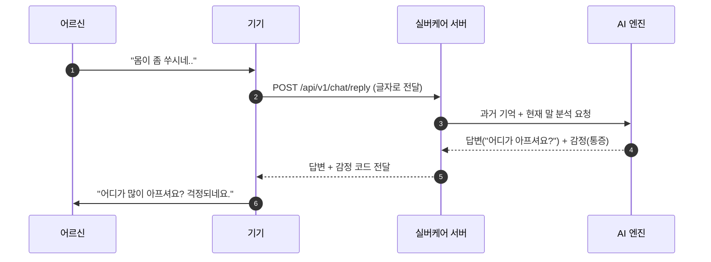
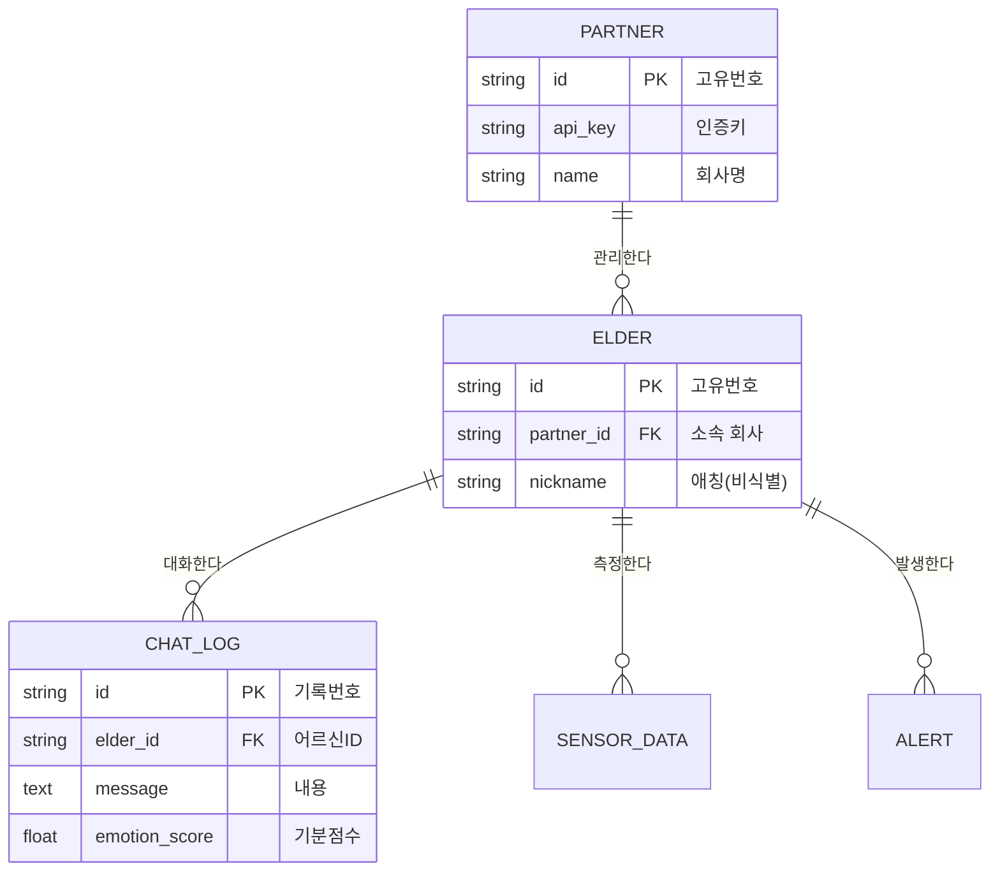
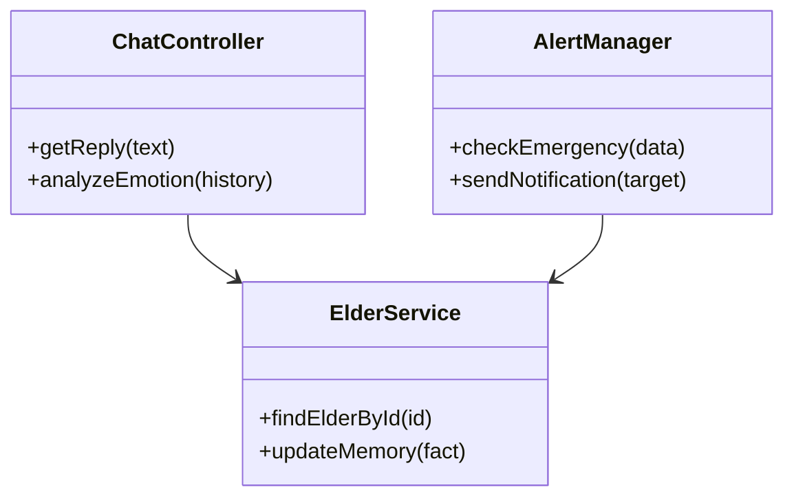
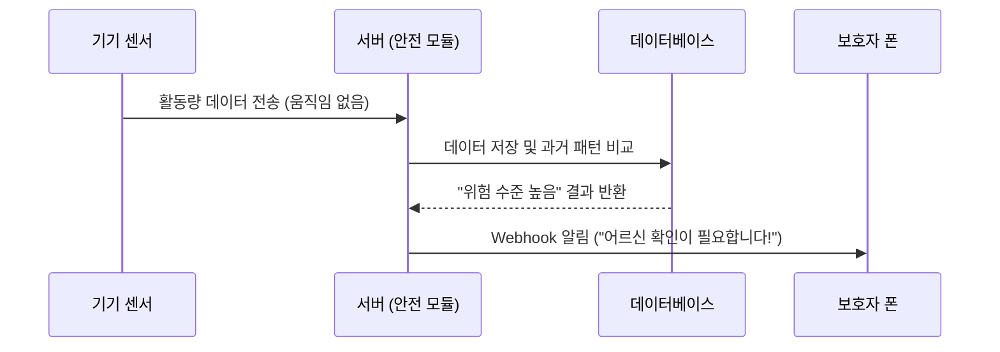
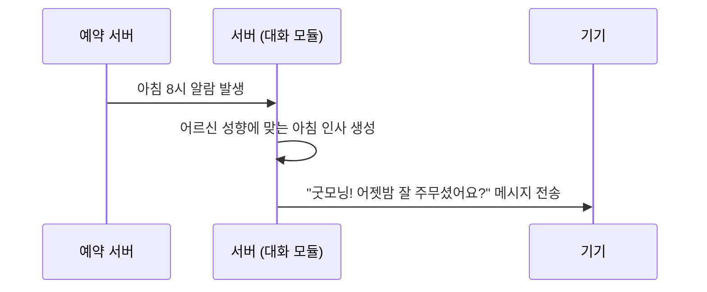

# Software Requirements Specification (SRS) - 실버케어 AI 플랫폼
Document ID: SRS-001
Revision: 0.2
Date: 2026-04-21
Standard: ISO/IEC/IEEE 29148:2018 기반

---

## 1. Introduction (소개)

### 1.1 Purpose (목적)
본 문서는 하드웨어 제조사들이 복잡한 AI를 직접 만들지 않고도, 우리 플랫폼을 통해 어르신들께 '따뜻한 AI 대화'와 '안전 돌봄' 기능을 제공할 수 있도록 하는 **실버케어 API 플랫폼**의 상세 설계도입니다.

### 1.2 Scope (개발 범위)
**[핵심 개발 내용 (In-Scope)]**
*   **어르신 대화 엔진:** 과거 대화를 기억하고 사투리까지 알아듣는 따뜻한 대화 기능.
*   **마음 분석:** 대화 속에서 우울함이나 아픔을 찾아내는 감정 분석 기능.
*   **긴급 알림:** 센서와 대화를 분석해 위험 상황 시 보호자에게 즉시 알림.
*   **개발자 포털:** 제조사 개발자들이 API를 쉽게 연결해볼 수 있는 설명서 웹사이트.

**[개발하지 않는 것 (Out-of-Scope)]**
*   로봇이나 스피커 같은 실제 기기 제작.
*   음성을 글자로 바꾸거나(STT), 글자를 소리로 읽어주는(TTS) 기능 (기기에서 처리).
*   일반 사용자용 전용 모바일 앱 제작.

### 1.3 Definitions (용어 설명)
*   **API (연결 통로):** 기기와 우리 서버가 서로 정보를 주고받기 위해 약속한 대화 방식입니다.
*   **JSON (데이터 택배 상자):** 정보를 주고받을 때 쓰는 표준적인 상자 모양입니다.
*   **Webhook (자동 호출):** 위험이 생기면 우리 서버가 보호자 서버에 "똑똑" 하고 즉시 알려주는 기능입니다.
*   **멀티테넌시 (방 가르기):** A회사 데이터와 B회사 데이터가 서로 섞이지 않게 칸막이를 치는 기술입니다.

---

## 2. Stakeholders (관계자)

| 역할 | 설명 | 주요 관심사 |
|---|---|---|
| **기기 제조사 (B2B)** | 우리 API를 기기에 연결하는 고객사 | 개발 비용 절감, 빠른 제품 출시 |
| **어르신 (사용자)** | 기기와 대화하는 분 | 외로움 해소, 친절하고 쉬운 인터페이스 |
| **보호자 (자녀)** | 리포트와 알림을 받는 분 | 부모님의 안부 확인 및 긴급 상황 대처 |
| **요양기관 (관리자)** | 여러 어르신을 돌보는 곳 | 효율적인 어르신 상태 관리 및 통계 |

---

## 3. System Context (시스템 구조 및 흐름)

### 3.1 UseCase Diagram (누가 무엇을 하나요?)
어르신, 제조사, 보호자가 우리 시스템을 통해 얻는 가치를 시각화했습니다.

```mermaid
usecaseDiagram
    actor "어르신" as Elder
    actor "제조사 개발자" as Dev
    actor "보호자/기관" as Guardian

    Elder --> (따뜻한 AI와 대화하기)
    Elder --> (안전 돌봄 서비스 받기)
    Dev --> (API 연동 및 테스트)
    Dev --> (기기 상태 전송)
    Guardian --> (감정/건강 리포트 확인)
    Guardian --> (응급 상황 알림 수신)
```

### 3.2 Component Diagram (시스템은 어떻게 구성되나요?)
우리 서버 내부의 주요 부품들이 어떻게 나뉘어 있는지 보여줍니다.

```mermaid
componentDiagram
    node "Partner Device" as Device
    node "SilverCare API Server" {
        [API Gateway] as GW
        [Chat Service] as Chat
        [Analysis Service] as Analysis
        [Alert Service] as Alert
    }
    database "Database" as DB
    node "External AI (LLM)" as AI

    Device --> GW : API Call
    GW --> Chat
    GW --> Analysis
    GW --> Alert
    Chat --> AI
    Chat --> DB
    Analysis --> DB
    Alert --> DB
```

### 3.3 Main Interaction Sequence (핵심 대화 흐름)
어르신의 말이 어떻게 AI 답변으로 돌아오는지 보여주는 가장 중요한 흐름입니다.



---

## 4. Specific Requirements (상세 요구사항)

### 4.1 Functional Requirements (기능 요구사항)

| ID | 설명 | 인수 기준 | 출처 | 중요도 |
|---|---|---|---|---|
| REQ-F-001 | 글자(텍스트) 수신 및 처리 | 기기가 보낸 글자를 서버가 정확히 받아야 함 | Story B2B | Must |
| REQ-F-002 | 문맥 기억 대화 생성 | 예전에 "허리 아프다"고 한 것을 기억하고 물어야 함 | Story A | Must |
| REQ-F-003 | 감정 분석 기능 | 대화 속에서 기쁨, 슬픔, 우울 등을 수치로 추출함 | Phase A | Must |
| REQ-F-004 | 선제적 발화 (먼저 말 걸기) | 아침 8시에 "잘 주무셨어요?"라고 먼저 메시지 생성 | Phase A | Must |
| REQ-F-005 | 개발자 포털 제공 | API 설명서와 예제 코드를 웹에서 바로 볼 수 있음 | Story B2B | Must |
| REQ-F-006 | 센서 데이터 기록 | 움직임, 심박수 등 기기 센서값을 DB에 저장함 | Phase B | Should |
| REQ-F-007 | 응급 판단 및 알림 | 비명이나 무활동 감지 시 10초 내 보호자 알림 발송 | Phase B | Should |

### 4.2 Non-Functional Requirements (품질 요구사항)

| ID | 구분 | 설명 | 목표 지표 |
|---|---|---|---|
| REQ-NF-001 | 성능 | 대화 답변이 끊기지 않게 아주 빨라야 함 | 95% 이상의 요청이 0.8초 내 응답 |
| REQ-NF-002 | 보안 | 어르신 개인정보는 남들이 못 보게 가려야 함 | 성명, 주소 등 PII 자동 비식별화 처리 |
| REQ-NF-003 | 안정성 | 서버는 1년 내내 거의 꺼지지 않아야 함 | 가동률(SLA) 99.9% 보장 |
| REQ-NF-004 | 칸막이 | A사 기기가 B사 어르신 정보를 볼 수 없어야 함 | 멀티테넌시(Multi-Tenancy) 완전 분리 |
| REQ-NF-005 | 정확도 | 위험 상황을 짚어내는 능력이 우수해야 함 | 감정/위험 감지 정확도 90% 이상 |

---

## 5. Traceability Matrix (추적표)

| 구분 | 요구사항 ID | 연결된 PRD 항목 | 테스트 케이스 |
|---|---|---|---|
| 비즈니스 리스크 | REQ-NF-003 | R2 (파트너 확보 실패 대비) | TC-System-01 |
| 기술적 결정 | REQ-F-001 | ADR-001 (텍스트 전용 API) | TC-API-01 |
| 핵심 기능 | REQ-F-002 | Story A (문맥 기억 대화) | TC-Chat-01 |
| 성능 목표 | REQ-NF-001 | KPI (응답 속도 800ms) | TC-Perf-01 |
| 보안/제약 | REQ-NF-002 | ADR-002 (B2B2C 모델/개인정보) | TC-Sec-01 |

---

## 6. Appendix (부록)

### 6.1 ERD (데이터 관계도)
데이터들이 서로 어떤 '연결 고리'를 가지고 있는지 보여줍니다.



### 6.2 Class Diagram (프로그램 구조)
개발자들이 코드를 짤 때 참고할 핵심 부품들의 설계도입니다.



### 6.3 Detailed Sequence Models (상세 흐름도)

**[1. 응급 상황 알림 흐름 (Phase B)]**


**[2. 선제적 발화 흐름 (Phase A)]**


---
**[검증 계획]**
1. **알파 테스트:** 개발 서버에서 1,000번 이상의 대화 테스트로 정확도 90% 확인.
2. **베타 테스트(PoC):** 실제 제조사 1곳과 연동하여 어르신 50분께 시범 서비스.
3. **최종 확인:** 하루 5회 이상 대화가 발생하는지 지표 확인 후 정식 출시.
