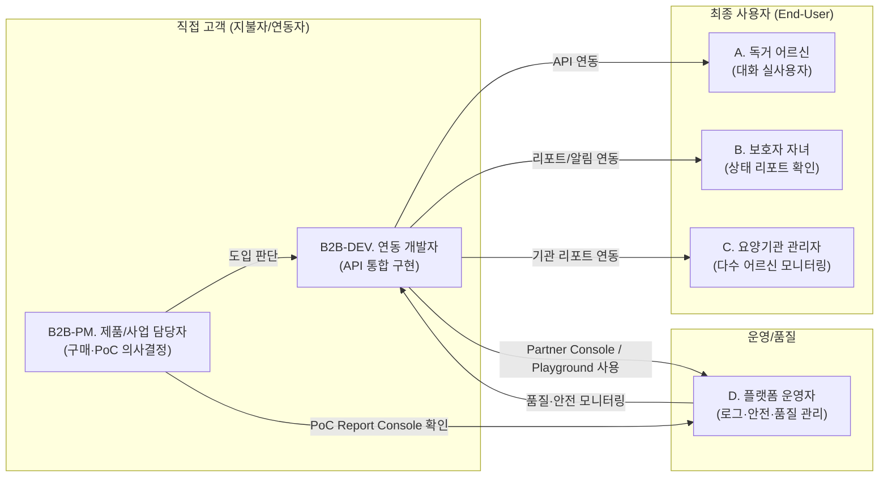
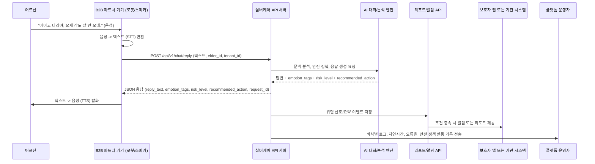

# 실버케어초안_PRD.v0.5.md
- **Owner 팀**: 이성국
- **최종 업데이트**: 2026-04-28 (Partner Console 및 Web API Playground 범위 반영)
- **문서 버전**: v0.5 (v0.4 API 플랫폼 B2B2C 모델 유지 + 웹 콘솔/Playground 제품 범위 명확화)

> **서비스명**: 실버케어 — 시니어 특화 AI 캐릭터챗 및 돌봄 데이터 통합 API 플랫폼  
> **제품 비전**: "어떤 돌봄 기기든, 우리 API를 연결하면 '다정한 디지털 손주'이자 '똑똑한 헬스케어 비서'로 진화한다."

---

## 0. v0.5 변경 요약

| 구분 | 변경 내용 |
|---|---|
| 웹 콘솔 범위 | SilverCare Partner Console을 Phase A MVP의 B2B 연동/운영 웹 콘솔로 명시 |
| API Playground | B2B 개발자가 웹에서 sandbox API를 실행하고 request/response, latency, `request_id`, sample code를 확인하는 Web API Playground 추가 |
| 개발자 경험 | API Key 관리, Swagger/API Docs, enum, 오류 코드, cURL/Python snippet, sandbox scenario를 하나의 Developer Portal 경험으로 통합 |
| PoC 운영 화면 | B2B-PM용 PoC Report Console을 명시해 기간 필터, 핵심 지표, CSV/JSON export 범위를 정의 |
| 운영/품질 화면 | 플랫폼 운영자용 Ops Monitoring Console, 대화 로그 조회, 감정/위험 분석 결과 조회, 리뷰 큐, User/Consent Admin View 범위를 명시 |
| 범위 경계 | 보호자용/기관용/어르신용 완성 앱은 계속 Out of Scope로 유지하고, 추후 포함 시 PRD 범위 변경이 선행되어야 함을 명시 |
| 웹 보안/NFR | Partner Console의 RBAC, PII 마스킹, 감사 로그, sandbox isolation, export 보안 기준 추가 |
| 사용자 스토리 | B2B 개발자, B2B 제품/사업 담당자, 어르신, 보호자, 기관 관리자, 플랫폼 운영자 스토리로 확장 |
| 수용 기준(AC) | 기능 설명형 AC를 검증 가능한 API 응답, 오류 처리, 개인정보, 안전 정책 기준으로 구체화 |
| 페르소나 | B2B 고객을 의사결정자와 연동 개발자로 분리하고, 운영자 페르소나를 추가 |
| MVP 범위 | Phase A MVP의 In Scope / Out of Scope를 명시해 SRS 구현 범위를 고정 |
| 비즈니스 모델 | PoC → 월 기본료 + 활성 디바이스 과금 → 초과 사용량 과금 → Phase B 프리미엄 티어 구조 추가 |
| 데이터 정책 | 개인정보 동의, 민감 건강정보, 보존/삭제, 위탁/제3자 제공, 모델 학습 제한 원칙 추가 |
| API 결과 표준 | `risk_level`, `emotion_tags`, `recommended_action`, 표준 오류 코드 초안 추가 |
| AI 품질 검증 | 평가셋 구성, 핵심 지표, 배포 게이트, 운영 리뷰 루프 추가 |
| API 스키마 | P0 Core/Support API의 request/response 필수 필드와 핵심 데이터 객체 초안 추가 |
| 기능 요구사항 | 개발자 포털/샌드박스 기능을 P0에 추가하고 API 공통 계약을 보강 |
| MVP 우선순위 | P0 Core, P0 Support, P1 Candidate로 기능 우선순위 재정의 |
| 리스크 | 의료/돌봄 책임 경계, 개인정보 동의, 위험 징후 오탐/미탐 리스크를 명시 |

---

## 1. 개요·목표

### 1-1. 문제 정의 (B2B / B2C 양방향)

> **핵심 문제 1 (B2C/최종 사용자):** 독거 어르신의 극심한 외로움(우울증 16.1%)과 고독사 문제. 기존 돌봄 기기들은 '기계적'이라서 어르신들이 사용을 거부함.  
> **핵심 문제 2 (B2B/직접 고객):** 돌봄 로봇, 스마트 스피커, 태블릿 등을 만드는 **하드웨어 제조사**들은 기기는 잘 만들지만, 어르신의 마음을 열어줄 **'시니어 특화 AI 대화 소프트웨어(콘텐츠)'를 자체 개발할 역량이 부족**함.

| 문제 | 수치 (Pain 지표) | 관련 페르소나 |
|---|---|---|
| B2B 제조사의 AI S/W 자체 개발 비용 및 시간 | **수억 원 / 수개월** 소요 | B2B 제품/사업 담당자, B2B 개발자 |
| 독거 노인 우울 증상 경험률 | **16.1%** | 독거 어르신 (A) |
| 기존 돌봄 기기(스피커 등) 방치율 | 도입 1달 후 **70% 이상 사용 중단** | 독거 어르신 (A), 보호자 (B) |

### 1-2. 사업 전략: Phase A → Phase B 확장 모델

우리 서비스는 하드웨어를 직접 만들지 않는 **API 구독형(SaaS) 비즈니스**입니다. 과금은 단순 API 호출량 중심이 아니라, B2B 파트너가 예측 가능한 비용으로 도입할 수 있도록 **월 기본료 + 월 활성 디바이스 기반 과금 + 기본 제공량 초과 사용량 과금**을 기본 원칙으로 합니다.

* **[Phase A] AI 캐릭터챗 API (현재 MVP):** 하드웨어 제조사가 우리 API를 호출하면, 어르신과 자연스럽게 대화하고 정서/위험 신호를 태깅해주는 '대화형 AI 지능'을 제공.
* **[Phase B] 통합 돌봄 분석 API (확장):** 하드웨어 제조사가 자체적으로 수집한 '센서 데이터(레이더, 심박수 등)'를 우리 API로 보내주면, 대화 데이터와 결합해 낙상 가능성, 장기 무활동, 수면 이상 등 복합 신호를 보호자와 기관(웹/앱)에 통합 리포트로 제공.

### 1-3. 성공 지표 (북극성 + 보조 KPI)

| 구분 | 지표 | 목표값 | 측정 주기 |
|---|---|---|---|
| ⭐ **북극성 KPI (Phase A)** | API 연동 B2B 파트너(제조사/통신사) 수 | **최소 3개사 확보** (PoC) | 반기 |
| ⭐ **북극성 보조** | 엔드유저(어르신) 일평균 대화 API 호출 횟수 | **인당 일 5회 이상** | 일간 |
| 보조 KPI 1 | 대화 생성 API 응답 지연 시간 | **p95 ≤ 800ms**, p99 ≤ 1.5s | 실시간 |
| 보조 KPI 2 | 위험 징후 탐지 재현율(Recall) | **≥ 90%** (평가셋 기준) | 월간 |
| 보조 KPI 3 | 고위험 알림 오탐률(False Positive Rate) | **≤ 10%** (운영 리뷰 기준) | 월간 |
| 보조 KPI 4 | B2B 개발자의 첫 API 성공 호출까지 걸리는 시간 | **30분 이내** | PoC별 |
| 보조 KPI 5 | PoC 후 유료 전환 의향 | **1개 이상 파트너가 정식 계약 협의 진입** | PoC 종료 시 |

### 1-4. Phase A MVP 범위

#### MVP 목적

Phase A MVP의 목적은 **B2B 파트너 기기에 텍스트 기반 시니어 대화 API를 붙였을 때, 실제 어르신이 반복적으로 사용할 만큼 자연스럽고 안전한 대화 경험을 만들 수 있는지 검증하는 것**입니다.

따라서 MVP는 완성형 돌봄 플랫폼이 아니라, 첫 PoC에서 다음 5가지를 검증하는 데 집중합니다.

| 검증 질문 | 성공 기준 |
|---|---|
| B2B 개발자가 빠르게 연동할 수 있는가? | 첫 API 성공 호출까지 30분 이내 |
| B2B 개발자가 브라우저에서 API 계약을 검증할 수 있는가? | Web API Playground에서 sandbox API 정상/안전/오류 응답 재현 |
| 어르신이 실제로 대화하는가? | 인당 일평균 대화 API 호출 5회 이상 |
| 응답이 대화 흐름을 깨지 않을 만큼 빠른가? | `/api/v1/chat/reply` p95 800ms 이하 |
| 위험하거나 부적절한 AI 응답을 통제할 수 있는가? | 의료/응급/자해 발화에서 안전 응답 정책 발동 |
| B2B 파트너가 비용을 지불할 만큼 명확한 가치를 느끼는가? | PoC 종료 후 1개 이상 파트너가 유료 전환 의향서 제출 또는 정식 계약 협의 진입 |

#### In Scope

| 우선순위 | 범위 | 포함 내용 |
|---|---|---|
| P0 Core | B2B API 인증 | 파트너별 API Key, `tenant_id` 기반 데이터 격리, 기본 rate limit |
| P0 Core | 대화 생성 | `/api/v1/chat/reply` 텍스트 입력/텍스트 응답, 쉬운 존댓말, 짧은 공감, 시니어 친화 응답 |
| P0 Core | 제한적 메모리 | 명시적 동의가 있는 경우에만 최근 대화 요약 또는 중요 메모리 사용 |
| P0 Core | 정서/위험 신호 태깅 | `/api/v1/analyze/emotion` 또는 대화 응답 내 `emotion_tags`, `risk_level`, `risk_reason` 반환 |
| P0 Core | 안전 응답 정책 | 의료, 처방, 응급, 자해 관련 발화에서 진단/처방 금지 및 가족/의료진/긴급 연락 권고 |
| P0 Core | SilverCare Partner Console | API 연동과 PoC 운영을 위한 B2B용 웹 콘솔. API Key 관리, API Docs, Web API Playground, Sandbox Console, PoC Report Console, Ops Monitoring, User/Consent Admin View 포함 |
| P0 Core | 개발자 경험 | Swagger/API Docs, enum, cURL/Python 샘플 요청/응답, 표준 오류 코드, sandbox elder profile, Web API Playground 기반 request/response 확인 |
| P0 Core | Web API Playground | `/api/v1/chat/reply`, `/api/v1/analyze/emotion`, `/api/v1/schedule/proactive`, `/api/v1/report/poc`를 sandbox mode에서 실행하고 JSON 응답, status code, latency, `request_id`, snippet을 확인 |
| P0 Support | PoC 집계 리포트 | 파트너 단위 일별 활성 어르신 수, 대화 횟수, 지연시간, 오류율, 위험 신호 수. API/CSV/간단 집계 수준 |
| P0 Support | 과금 검증 | PoC 기간 동안 활성 디바이스 수, API 호출량, 초과 사용 가능성을 집계해 정식 과금 구조 수용성을 검증 |
| P0 Support | PoC Report Console | 기간 필터, 활성 디바이스, 활성 어르신, 대화 수, p95 지연시간, 오류율, 위험 이벤트 수, CSV/JSON export 제공 |
| P0 Support | 운영 모니터링 | 요청 로그, `request_id`, 지연시간, 오류율, 안전 정책 발동 여부, PII 마스킹 로그, 운영 알림, 위험 이벤트 리뷰 큐 |
| P0 Support | User/Consent Admin View | `elder_id`, `device_id`, 동의 상태, memory enabled, 삭제 요청 job 상태를 권한 있는 사용자에게 제한적으로 제공 |
| P1 Candidate | 선제적 발화 | `/api/v1/schedule/proactive` 기반 일반 안부, 식사, 수면, 일상 확인성 발화. 첫 PoC에서는 옵션 기능으로 취급 |

#### Out of Scope

| 제외 범위 | 제외 이유 |
|---|---|
| 자체 하드웨어 제조 | B2B2C API 플랫폼 전략과 맞지 않음 |
| STT/TTS 음성 처리 | ADR-001에 따라 B2B 파트너 기기에서 처리 |
| 보호자용/기관용 완성 앱 직접 제공 | MVP는 API와 B2B Partner Console 검증이 목적이며, 보호자/기관 최종 사용자 앱 UI는 파트너 또는 후속 Phase에서 결정 |
| 어르신용 완성 앱 직접 제공 | STT/TTS와 어르신 기기 UI는 B2B 파트너 기기 책임 |
| 보호자/기관 대상 고도화 서비스 웹 | Partner Console은 B2B 연동·운영 콘솔이며 보호자/기관용 제품 UI가 아님 |
| 의료 진단, 처방, 치료 조언 | 의료 책임과 환각 리스크가 크므로 안전 응답으로 제한 |
| 응급 구조 보장 | 위험 신호 알림은 참고 신호이며 실제 구조/출동 책임은 지지 않음 |
| 실시간 119/응급기관 자동 연결 | 법적 책임, 오탐/미탐 리스크, 기관 연동 이슈가 커서 MVP 제외 |
| 센서 데이터 수집/분석 | `/api/v2/sensor/ingest` 등 Phase B 범위 |
| 치매 조기 진단/낙상 판정 | Phase B 이후 복합 데이터 분석에서 검토하되, MVP에서는 진단하지 않음 |
| 고도화된 관리자 대시보드 | PoC 리포트는 API/CSV/간단 집계 수준으로 제한 |
| 파트너별 커스텀 LLM 파인튜닝 | 초기 PoC에서는 공통 모델과 정책 기반 커스터마이징으로 제한 |
| 정식 가격표 최적화 | MVP에서는 가격 최적화보다 과금 단위와 유료 전환 의향 검증에 집중 |

### 1-5. 비즈니스 모델 및 과금 원칙

#### 과금 가설

실버케어의 과금 가설은 **API 호출 1건의 원가 회수**가 아니라, B2B 파트너 기기의 상품성, 유지율, 돌봄 경험을 높이는 대가를 받는 것입니다. 따라서 MVP 단계에서는 호출당 과금을 전면에 두기보다, 파트너가 예측 가능한 비용으로 도입할 수 있는 **활성 디바이스 기반 월 과금**을 중심으로 검증합니다.

정확한 원화 단가는 v0.4에서 확정하지 않습니다. MVP의 과금 검증 목적은 가격 최적화가 아니라, B2B 파트너가 아래 과금 구조를 수용할 수 있는지 확인하는 것입니다.

| 단계 | 과금 방식 | 목적 |
|---|---|---|
| **PoC** | 1~3개월 무료 또는 저가 고정비 | 파트너 확보, 실제 사용성/연동성/안전성 검증 |
| **Core 정식 전환** | 월 기본료 + 월 활성 디바이스 수 기반 과금 | 예측 가능한 반복 매출과 파트너 비용 안정성 확보 |
| **Usage Overage** | 기본 제공 API 호출량 초과분에 대한 사용량 과금 | 과도한 사용량과 LLM 비용 증가 방어 |
| **Premium / Phase B** | 센서 통합, 보호자/기관 리포트, 고급 위험 분석 추가 과금 | Phase B 확장 수익화 |

#### 과금 단위 정의

| 항목 | 정의 |
|---|---|
| 월 기본료 | 파트너 계정, API Key, 개발자 문서, 기본 운영 지원, 기본 모니터링 제공 대가 |
| 월 활성 디바이스 | 해당 월에 1회 이상 유효한 대화 API 호출을 발생시킨 `device_id` 또는 이에 준하는 파트너 기기 식별자 |
| 기본 제공량 | Core 요금제에 포함되는 디바이스당 월 API 호출량 |
| 초과 사용량 | 기본 제공량을 초과한 대화 생성, 감정 분석, 리포트 API 호출량 |
| 프리미엄 기능 | Phase B의 센서 데이터 연동, 기관용 리포트, 고급 위험 분석, 장기 추세 분석 |

#### PoC 유료 전환 조건

PoC 종료 후 다음 조건 중 **3개 이상** 충족하면 유료 전환을 제안합니다.

| 조건 | 기준 |
|---|---|
| 사용성 | 인당 일평균 대화 API 호출 5회 이상 |
| 성능 | `/api/v1/chat/reply` p95 800ms 이하 |
| 연동 경험 | 파트너 개발자의 연동 만족도 4/5 이상 |
| 사업성 | 정식 탑재 예상 디바이스 수 500대 이상 또는 파트너 내부 상품화 검토 착수 |
| 가치 인식 | 보호자/기관 리포트 또는 정서/위험 신호 요약에 대한 긍정 피드백 확보 |
| 안전성 | 의료/응급/자해 발화에서 안전 응답 정책이 정상 발동하고 심각한 부적절 응답이 재현되지 않음 |

#### 비용 및 책임 제외

| 항목 | 책임 주체 |
|---|---|
| STT/TTS 음성 처리 비용 | B2B 파트너 |
| 하드웨어 제조, 물류, 설치, AS | B2B 파트너 |
| 보호자 앱/기관 대시보드 UI 개발 | B2B 파트너 또는 별도 계약 |
| 응급 출동, 의료 판단, 처방 | 실버케어 API 제공 범위 밖 |

---

## 2. 사용자와 페르소나

### 2-1. API 비즈니스 기반 페르소나 재정의



| 페르소나 | 핵심 Pain (문제) | 우리 API가 주는 해결책 (Value) |
|---|---|---|
| **B2B-PM. 제품/사업 담당자** | "기기를 팔아야 하는데 차별화된 AI 돌봄 경험이 없다." | Partner Console의 PoC Report Console에서 도입 효과와 과금 검증 지표를 확인하고 구독형 API로 빠르게 상품화 |
| **B2B-DEV. 연동 개발자** | "AI 모델, 프롬프트, 안전장치, 분석 API를 직접 만들 시간이 없다." | Partner Console에서 API Key, Swagger/API Docs, Web API Playground, 샘플 코드로 빠른 연동 가능 |
| **A. 독거 어르신** | "혼자 있어서 적적하고, 기계는 차갑고 어렵다." | 자연스러운 말동무, 이전 대화 맥락 기반의 부담 없는 안부 대화 |
| **B. 보호자 자녀** | "부모님이 오늘 하루 잘 지내셨는지 정서 상태가 궁금하다." | 원문 노출을 최소화한 안심 감성 리포트 및 위험 신호 알림 |
| **C. 요양기관 관리자** | "여러 어르신의 상태를 한눈에 보고 우선순위를 정해야 한다." | 기관 단위 요약 리포트, 위험 이벤트 목록, 추세 데이터 제공 |
| **D. 플랫폼 운영자** | "AI 응답 품질, 위험 이벤트, 개인정보 처리가 안정적으로 동작하는지 봐야 한다." | Ops Monitoring Console에서 요청 로그, 지연시간, 오류율, 안전 정책 발동 기록, 리뷰 큐, 동의/삭제 job 상태를 비식별 기반으로 모니터링 |

---

## 3. 사용자 스토리와 수용 기준 (AC)

### 3-1. Story B2B-DEV — 연동 개발자

> **As a** B2B 파트너사의 연동 개발자,  
> **I want to** API 키와 Swagger 문서만으로 대화 생성 API를 빠르게 테스트하고,  
> **so that** 별도 AI 모델 개발 없이 1일 이내에 PoC 기기에 시니어 대화 기능을 붙일 수 있다.

| # | AC (Given / When / Then) |
|:---:|---|
| AC-1 | **Given** 유효한 파트너 계정이 있을 때, **When** SilverCare Partner Console의 Developer Portal에 접속하면, **Then** API Key 발급/폐기, Swagger/API Docs, enum, 샘플 요청/응답, 에러 코드 표를 확인할 수 있어야 한다. |
| AC-2 | **Given** 유효한 `api_key`, `tenant_id`, `elder_id`, `utterance`가 제공되었을 때, **When** `/api/v1/chat/reply`를 호출하면, **Then** p95 800ms 이내에 `schema_version`, `reply_text`, `emotion_tags`, `risk_level`, `risk_reason`, `recommended_action`, `memory_used`, `request_id`를 포함한 JSON을 반환해야 한다. |
| AC-3 | **Given** 인증 실패, rate limit 초과, 필수 필드 누락, LLM timeout이 발생했을 때, **When** API가 실패 응답을 반환하면, **Then** 표준화된 `error_code`, `message`, `request_id`, `retryable` 값을 포함해야 한다. |
| AC-4 | **Given** sandbox 환경에서 테스트 중일 때, **When** 개발자가 Web API Playground에서 샘플 elder profile과 샘플 발화를 사용하면, **Then** 실제 개인정보 없이도 정상 응답, 안전 응답, 오류 응답을 모두 재현하고 JSON 응답, HTTP status, latency, `request_id`, cURL/Python snippet을 확인할 수 있어야 한다. |

### 3-2. Story B2B-PM — 제품/사업 담당자

> **As a** 돌봄 기기 제조사의 제품/사업 담당자,  
> **I want to** PoC 기간 동안 API 도입 효과를 수치로 확인하고,  
> **so that** 실버케어 API를 정식 상품에 탑재할지 판단할 수 있다.

| # | AC (Given / When / Then) |
|:---:|---|
| AC-5 | **Given** PoC가 시작되었을 때, **When** 파트너가 리포트 API 또는 Partner Console의 PoC Report Console을 조회하면, **Then** 일별 활성 어르신 수, 인당 대화 횟수, p95 지연시간, 오류율, 위험 신호 발생 수를 확인할 수 있어야 한다. |
| AC-6 | **Given** PoC 종료 시점이 되었을 때, **When** 파트너가 성과 데이터를 요청하면, **Then** 개인 식별정보를 제외한 집계 리포트를 CSV 또는 JSON 형태로 API 또는 PoC Report Console에서 받을 수 있어야 한다. |
| AC-7 | **Given** 도입 효과를 판단할 때, **When** B2B-PM이 지표를 확인하면, **Then** 인당 일 5회 이상 대화, p95 800ms 이하, 위험 징후 탐지 결과, 월 활성 디바이스 수, 예상 정식 과금 기준을 파트너 단위로 비교할 수 있어야 한다. |

### 3-3. Story A — 독거 어르신

> **As a** 혼자 사는 독거 어르신,  
> **I want to** 기계가 사람처럼 내 이야기를 들어주고 이전 대화도 적절히 기억해주길,  
> **so that** 진짜 손주와 대화하는 것 같은 위로를 받고 싶다.

| # | AC (Given / When / Then) |
|:---:|---|
| AC-8 | **Given** 어르신이 기억 저장에 동의했고 며칠 전 "허리가 아프다"고 말한 기록이 있을 때, **When** 오늘 기기가 먼저 안부를 묻는 발화를 요청하면, **Then** AI API는 "며칠 전 아프다던 허리는 좀 어떠셔요?"처럼 이전 맥락을 반영하되 진단이나 처방을 하지 않는 응답을 생성해야 한다. |
| AC-9 | **Given** 어르신의 이전 대화 기록이 없거나 기억 저장 동의가 없을 때, **When** 개인화 응답을 생성하면, **Then** 존재하지 않는 과거 대화를 지어내지 않고 일반 안부 대화로 응답해야 한다. |
| AC-10 | **Given** 어르신이 통증, 약, 병원, 자해, 응급 상황과 관련된 발화를 했을 때, **When** `/api/v1/chat/reply`가 응답을 생성하면, **Then** 의학적 판단을 단정하지 않고 가족/의료진/긴급 연락을 권하는 안전 응답과 `risk_level`을 함께 반환해야 한다. |
| AC-11 | **Given** 어르신이 사투리, 불완전한 문장, 반복 발화를 사용했을 때, **When** API가 응답을 생성하면, **Then** 의미를 과도하게 단정하지 않고 쉬운 존댓말로 짧고 자연스럽게 되묻거나 공감해야 한다. |

### 3-4. Story B — 보호자 자녀

> **As a** 보호자 자녀,  
> **I want to** 부모님의 하루 정서 상태와 위험 신호를 과도한 원문 노출 없이 확인하고,  
> **so that** 필요할 때만 적절히 연락하거나 돌봄 조치를 취할 수 있다.

| # | AC (Given / When / Then) |
|:---:|---|
| AC-12 | **Given** 어르신과 보호자 간 정보 공유 동의가 설정되어 있을 때, **When** 보호자 리포트 API를 조회하면, **Then** 대화 원문이 아닌 주요 정서 추세, 반복 주제, 위험 신호 요약, 권장 확인 액션을 반환해야 한다. |
| AC-13 | **Given** 고위험 발화 또는 반복 위험 신호가 감지되었을 때, **When** 알림 조건이 충족되면, **Then** 보호자 또는 파트너 서버로 `risk_level`, `risk_reason`, `recommended_action`, `request_id`, `detected_at`을 포함한 알림 이벤트를 전송해야 한다. |
| AC-14 | **Given** 보호자가 원문 열람 권한이 없을 때, **When** 리포트 API를 호출하면, **Then** 대화 원문과 민감 개인정보는 반환하지 않아야 한다. |

### 3-5. Story C — 요양기관 관리자

> **As a** 요양기관 관리자,  
> **I want to** 여러 어르신의 정서/위험 신호를 한 화면 또는 API로 요약해서 보고,  
> **so that** 제한된 인력으로 우선 확인이 필요한 어르신을 빠르게 선별할 수 있다.

| # | AC (Given / When / Then) |
|:---:|---|
| AC-15 | **Given** 기관에 소속된 어르신 데이터가 있을 때, **When** 기관 리포트 API를 조회하면, **Then** 어르신별 대화 빈도, 최근 위험 신호, 정서 추세, 마지막 상호작용 시각을 목록으로 반환해야 한다. |
| AC-16 | **Given** 기관 관리자가 특정 어르신 상세 정보를 요청할 때, **When** 권한 검사가 실패하면, **Then** 해당 어르신의 대화 요약과 위험 신호 데이터를 반환하지 않아야 한다. |
| AC-17 | **Given** 다수 어르신의 위험 이벤트가 동시에 발생했을 때, **When** 기관 리포트를 조회하면, **Then** `risk_level`, 최근 발생 시각, 반복 횟수 기준으로 우선순위 정렬이 가능해야 한다. |

### 3-6. Story D — 플랫폼 운영자

> **As a** 실버케어 플랫폼 운영자,  
> **I want to** API 품질, 안전 정책 발동, 개인정보 마스킹 상태를 모니터링하고,  
> **so that** B2B 파트너에게 안정적인 API와 신뢰 가능한 돌봄 경험을 제공할 수 있다.

| # | AC (Given / When / Then) |
|:---:|---|
| AC-18 | **Given** 운영자가 요청 로그를 조회할 때, **When** Ops Monitoring Console 또는 로그 API를 열람하면, **Then** 원문 PII는 마스킹된 상태로 표시되고 `tenant_id`, `request_id`, 지연시간, 오류 코드, 안전 정책 발동 여부를 확인할 수 있어야 한다. |
| AC-19 | **Given** 특정 테넌트의 오류율 또는 지연시간이 기준치를 초과했을 때, **When** 모니터링 시스템이 이를 감지하면, **Then** 운영자에게 알림을 보내고 영향받은 `tenant_id`, 엔드포인트, 시간 범위, 오류 유형을 제공해야 한다. |
| AC-20 | **Given** 위험 징후 탐지 결과에 대한 오탐/미탐 리뷰가 필요할 때, **When** 운영자가 Ops Monitoring Console의 리뷰 큐에서 리뷰 데이터를 추출하면, **Then** 개인정보를 제거한 평가용 데이터셋과 라벨링 결과를 분리해서 관리할 수 있어야 한다. |
| AC-21 | **Given** 운영자 또는 권한 있는 B2B 운영 담당자가 어르신/기기 상태를 확인할 때, **When** User/Consent Admin View를 조회하면, **Then** `elder_id`, `device_id`, 동의 상태, memory enabled, 삭제 요청 job 상태만 직접 식별정보 없이 확인할 수 있어야 한다. |

---

## 4. 기능 요구사항 (FR) — API 스펙 중심

### Phase A: P0 Core — 첫 PoC 필수 기능

| ID | API/기능 | 설명 | 타겟 |
|---|---|---|---|
| **F0** | **SilverCare Partner Console / Developer Portal / Sandbox / Web API Playground** | API Key 발급/폐기, Swagger/API Docs, enum, 샘플 코드, sandbox elder profile, 정상/안전/오류 응답 예제, Web API Playground 기반 request/response 실행 및 cURL/Python snippet을 제공. | B2B-DEV, B2B-PM, D |
| **F1** | **`/api/v1/chat/reply`** | 어르신 발화 텍스트를 받아 시니어 맞춤형 대답을 생성. 이전 대화 메모리는 동의된 범위에서만 사용하며, 의료/응급/자해 관련 발화에는 안전 응답 정책을 적용. | B2B-DEV, A |
| **F2** | **`/api/v1/analyze/emotion`** | 대화 내용을 분석하여 `emotion_tags`, `risk_level`, `risk_reason`, `recommended_action`, 위험 키워드를 반환. 우울증 등 의학적 진단이 아니라 정서/위험 신호 태깅으로 제한. | B2B-DEV, B, D |

### Phase A: P0 Support — PoC 운영 보조 기능

| ID | API/기능 | 설명 | 타겟 |
|---|---|---|---|
| **F7** | **`/api/v1/report/poc`** | PoC 성과 확인을 위한 파트너 단위 집계 리포트 제공. 일별 활성 어르신 수, 대화 횟수, 지연시간, 오류율, 위험 신호 수를 반환. | B2B-PM |
| **F8** | **Partner Console — PoC/Ops/User Admin Views** | PoC Report Console, Ops Monitoring Console, 대화 로그 조회, 감정/위험 분석 결과 조회, 위험 이벤트 리뷰 큐, User/Consent Admin View를 제공하되 원문/PII는 기본 마스킹한다. | B2B-PM, D |

### Phase A: P1 Candidate — 첫 PoC 옵션 기능

| ID | API/기능 | 설명 | 타겟 |
|---|---|---|---|
| **F3** | **`/api/v1/schedule/proactive`** | 기상, 식사, 안부 확인 등 특정 상황에 맞는 선제적 발화를 생성. 첫 PoC에서는 필수 기능이 아니라 옵션 기능으로 두며, 복약 지시가 아닌 일반 안부/확인성 발화로 제한. | B2B-DEV, A |

### Phase B: Should Have (P1) — 통합 돌봄 API (확장)

> B2B 파트너가 레이더/웨어러블 등의 데이터를 보내주면 분석해주는 기능

| ID | API/기능 | 설명 | 타겟 |
|---|---|---|---|
| **F4** | **`/api/v2/sensor/ingest`** | B2B 기기의 레이더(수면, 움직임), 혈압계 등의 원시 데이터를 수신받아 시계열 DB에 저장. | B2B-DEV |
| **F5** | **`/api/v2/alert/emergency`** | 대화 위험 신호와 센서 무활동 데이터가 결합되어 고위험으로 판단될 시, 지정된 보호자/기관 서버로 Webhook 알림 발송. | B, C |
| **F6** | **`/api/v2/report/kpi`** | 수집된 대화 및 센서 데이터를 바탕으로 주간 정서 리포트, 수면 분석 결과, 기관용 성과 데이터를 JSON 형태로 제공. | B, C, B2B-PM |

### API 공통 계약

| 항목 | 요구사항 |
|---|---|
| 인증 | 모든 API는 `api_key` 또는 이에 준하는 서버 간 인증을 요구한다. 모든 요청은 `tenant_id` 기준으로 데이터 접근 범위를 제한한다. |
| 스키마 버전 | 주요 API 응답은 `schema_version`을 포함한다. enum 값 추가/변경 시 하위 호환성과 파트너 공지를 전제로 한다. |
| 요청 추적 | 모든 응답은 `request_id`를 포함한다. 오류, 알림, 로그, 리포트에서 동일한 `request_id`로 추적 가능해야 한다. |
| 오류 응답 | 오류 응답은 `error_code`, `message`, `request_id`, `retryable`을 포함한다. |
| Rate Limit | 파트너/테넌트 단위 rate limit을 적용하고, 초과 시 `RATE_LIMIT_EXCEEDED`를 반환한다. |
| 개인정보 | 응답에는 기본적으로 대화 원문과 직접 식별정보를 포함하지 않는다. 필요한 경우 명시적 권한과 동의 범위 안에서만 제공한다. |
| 안전 정책 | 의료, 처방, 응급, 자해 관련 발화는 진단/처방을 금지하고 가족, 의료진, 긴급 연락 등 정해진 안전 응답으로 처리한다. |

### Partner Console 공통 계약

| 항목 | 요구사항 |
|---|---|
| 인증/권한 | 모든 Partner Console 화면은 인증된 세션과 역할 기반 권한 검사를 요구한다. |
| Sandbox 기본값 | Web API Playground의 기본 실행 환경은 sandbox mode이며, production tenant 호출은 별도 권한을 요구한다. |
| API Key 보안 | API Key 원문은 최초 발급 시 1회만 표시하고 재표시하지 않는다. |
| 감사 로그 | API Key 발급/폐기, Playground 실행, 로그 조회, 동의 상태 조회, 삭제 job 조회, CSV/JSON export는 감사 로그를 남긴다. |
| 개인정보 표시 | 대화 로그, 분석 결과, 리포트, 리뷰 큐는 기본적으로 원문과 직접 식별정보를 마스킹한다. |
| Export 보안 | PoC Report CSV/JSON export는 원문/PII를 포함하지 않으며 실행자, tenant, 기간, 파일 형식을 기록한다. |
| 범위 제한 | Partner Console은 B2B 연동·운영 콘솔이며 보호자용/기관용/어르신용 완성 앱 UI를 제공하지 않는다. |

### API Request/Response Schema 초안

본 섹션은 PRD 수준의 API 계약 초안입니다. 상세 타입, OpenAPI schema, 필드 길이 제한, 인증 헤더, pagination 방식은 SRS 또는 별도 Swagger 문서에서 확정합니다.

#### 공통 요청 필드

| 필드 | 필수 | 설명 |
|---|:---:|---|
| `tenant_id` | Y | B2B 파트너 또는 고객사를 식별하는 테넌트 ID |
| `device_id` | API별 | 월 활성 디바이스 과금과 요청 추적에 사용하는 파트너 기기 ID |
| `elder_id` | API별 | 파트너 시스템 내 어르신 식별자. 직접 식별정보가 아니라 가명/내부 ID 사용 |
| `locale` | N | 언어/지역 설정. MVP 기본값은 `ko-KR` |
| `request_context` | N | 시간대, 기기 상태, 호출 목적 등 대화 생성에 필요한 비식별 맥락 |

#### 공통 응답 필드

| 필드 | 필수 | 설명 |
|---|:---:|---|
| `schema_version` | Y | 응답 schema 버전 |
| `request_id` | Y | 로그, 알림, 오류, 리포트 추적용 요청 ID |
| `risk_level` | API별 | 위험 신호 수준. 값은 `risk_level` enum을 따른다 |
| `emotion_tags` | API별 | 정서/돌봄 맥락 태그 |
| `recommended_action` | API별 | 파트너/보호자/기관에 권장되는 후속 액션 |

#### `/api/v1/chat/reply`

| 구분 | 필드 | 필수 | 설명 |
|---|---|:---:|---|
| Request | `tenant_id` | Y | 테넌트 ID |
| Request | `device_id` | Y | 호출 기기 ID |
| Request | `elder_id` | Y | 어르신 내부 식별자 |
| Request | `utterance` | Y | STT 이후 텍스트. MVP에서는 음성 파일을 받지 않음 |
| Request | `conversation_id` | N | 대화 세션 식별자. 없으면 서버가 생성 가능 |
| Request | `use_memory` | N | 메모리 사용 요청 여부. 실제 사용은 동의 상태에 따라 서버가 최종 판단 |
| Request | `request_context` | N | 시간대, 호출 목적, 최근 기기 이벤트 등 비식별 맥락 |
| Response | `reply_text` | Y | 기기가 TTS로 읽을 응답 텍스트 |
| Response | `emotion_tags` | Y | 감지된 정서/돌봄 태그 |
| Response | `risk_level` | Y | 위험 신호 수준 |
| Response | `risk_reason` | Y | 파트너/운영자가 이해할 수 있는 짧은 판단 근거 |
| Response | `recommended_action` | Y | 후속 액션 |
| Response | `memory_used` | Y | 메모리 사용 여부 |
| Response | `safety_policy_applied` | Y | 안전 응답 정책 발동 여부 |

#### `/api/v1/analyze/emotion`

| 구분 | 필드 | 필수 | 설명 |
|---|---|:---:|---|
| Request | `tenant_id` | Y | 테넌트 ID |
| Request | `elder_id` | Y | 어르신 내부 식별자 |
| Request | `text` | Y | 분석 대상 텍스트. 대화 원문 또는 파트너가 전달한 요약 텍스트 |
| Request | `context_window` | N | 최근 대화 요약 또는 파트너 제공 맥락. 원문 전체 전송은 최소화 |
| Response | `emotion_tags` | Y | 감지된 정서/돌봄 태그 |
| Response | `risk_level` | Y | 위험 신호 수준 |
| Response | `risk_reason` | Y | 판단 근거 |
| Response | `recommended_action` | Y | 후속 액션 |
| Response | `detected_keywords` | N | 위험 판단에 기여한 키워드. 직접 식별정보는 제거 |

#### `/api/v1/schedule/proactive` (P1 Candidate)

| 구분 | 필드 | 필수 | 설명 |
|---|---|:---:|---|
| Request | `tenant_id` | Y | 테넌트 ID |
| Request | `device_id` | Y | 호출 기기 ID |
| Request | `elder_id` | Y | 어르신 내부 식별자 |
| Request | `trigger_type` | Y | `morning`, `meal`, `sleep`, `check_in`, `custom` 중 하나 |
| Request | `scheduled_at` | N | 선제 발화 예정 시각 |
| Request | `use_memory` | N | 개인화 메모리 사용 요청 여부 |
| Response | `reply_text` | Y | 기기가 먼저 말할 안부/확인성 발화 |
| Response | `memory_used` | Y | 메모리 사용 여부 |
| Response | `safety_policy_applied` | Y | 안전 정책 적용 여부 |

#### `/api/v1/report/poc`

| 구분 | 필드 | 필수 | 설명 |
|---|---|:---:|---|
| Request | `tenant_id` | Y | 테넌트 ID |
| Request | `from` | Y | 집계 시작일 |
| Request | `to` | Y | 집계 종료일 |
| Request | `group_by` | N | `day`, `device`, `elder` 중 하나. 기본값은 `day` |
| Response | `active_devices` | Y | 기간 내 월/일 활성 디바이스 수 |
| Response | `active_elders` | Y | 기간 내 활성 어르신 수 |
| Response | `conversation_count` | Y | 대화 API 호출 수 |
| Response | `avg_conversation_per_elder` | Y | 어르신 1인당 평균 대화 횟수 |
| Response | `p95_latency_ms` | Y | p95 응답 지연시간 |
| Response | `error_rate` | Y | API 오류율 |
| Response | `risk_event_count` | Y | `medium` 이상 위험 이벤트 수 |

#### 핵심 데이터 객체 초안

| 객체 | 주요 필드 | 설명 |
|---|---|---|
| `elder_profile` | `elder_id`, `locale`, `consent_state`, `memory_enabled` | 개인화와 권한 판단을 위한 최소 프로필 |
| `consent_state` | `basic_processing`, `sensitive_processing`, `memory_storage`, `guardian_sharing`, `institution_sharing`, `quality_improvement` | 기능별 동의 상태 |
| `risk_event` | `request_id`, `elder_id`, `risk_level`, `risk_reason`, `recommended_action`, `detected_at` | 보호자/기관 알림과 운영 리뷰의 기준 이벤트 |
| `memory_summary` | `memory_id`, `elder_id`, `summary`, `source_request_id`, `expires_at` | 원문이 아니라 요약 중심으로 저장되는 개인화 메모리 |

#### 스키마 결정 원칙

| 원칙 | 설명 |
|---|---|
| 직접 식별정보 최소화 | 이름, 주민등록번호, 상세 주소 등은 API request에 포함하지 않는다 |
| 동의 상태는 서버가 최종 판단 | 파트너가 `use_memory=true`를 보내도 동의가 없으면 `memory_used=false` 또는 `CONSENT_REQUIRED`로 처리 |
| 대화 원문 최소화 | 분석/리포트 API는 가능한 요약 텍스트와 비식별 맥락을 우선 사용 |
| Python 샘플 우선 | MVP 개발자 경험은 cURL과 Python 샘플 코드를 우선 제공하고, 다중 언어 SDK는 파트너 수요 확인 후 검토 |

### 분석 결과 및 오류 코드 표준 초안

본 섹션은 B2B 파트너가 API 결과를 일관되게 해석하기 위한 MVP 초안입니다. `risk_level`과 `recommended_action`은 의료 진단이나 응급 구조 판단이 아니라, 보호자/기관/운영자가 확인해야 할 **참고 신호**입니다.

#### `risk_level` enum

| 값 | 의미 | 예시 신호 | 기본 파트너 처리 |
|---|---|---|---|
| `none` | 위험 신호 없음 | 일상 대화, 긍정/중립 정서 | 알림 없음, 일반 대화 지속 |
| `low` | 낮은 수준의 정서/돌봄 신호 | 일시적 외로움, 가벼운 불편감, 단발성 수면 불편 | 리포트에 기록, 즉시 알림 없음 |
| `medium` | 반복되거나 확인이 필요한 신호 | 반복 외로움, 통증/수면 문제 반복, 식사/복약 관련 걱정 | 보호자 확인 권장, 일일/주간 리포트 강조 |
| `high` | 빠른 확인이 필요한 고위험 신호 | 강한 절망감, 심한 통증 호소, 응급 가능성 암시, 혼란 반복 | 보호자/기관 알림, human review 권장 |
| `critical` | 즉시 확인이 필요한 긴급 신호 | 명시적 자해 의도, "숨을 못 쉬겠다", "쓰러졌다", 즉각적 위험 표현 | 긴급 연락 권고, 보호자/기관 즉시 알림. 단, 실버케어가 응급 구조를 보장하지 않음 |

#### `emotion_tags` enum

`emotion_tags`는 명칭상 정서 태그이지만 MVP에서는 대화 기반 돌봄 맥락 태그를 함께 포함합니다. SRS 단계에서 `analysis_tags`로 명칭을 변경할지 검토합니다.

| 값 | 의미 |
|---|---|
| `neutral` | 특이 정서 신호 없음 |
| `positive` | 긍정, 만족, 안도 |
| `lonely` | 외로움, 고립감 |
| `sad` | 슬픔, 무기력 |
| `anxious` | 불안, 걱정, 초조 |
| `angry` | 분노, 짜증, 공격적 표현 |
| `pain` | 통증, 신체 불편 |
| `sleep_issue` | 불면, 수면 불편, 피로 |
| `appetite_issue` | 식욕 저하, 식사 문제 |
| `medication_mention` | 약, 복약, 처방 관련 언급 |
| `confusion` | 혼란, 기억 문제, 맥락 불일치 |
| `emergency_signal` | 응급 가능성 표현 |
| `self_harm_signal` | 자해 또는 극단 선택 관련 표현 |

#### `recommended_action` enum

| 값 | 의미 | 사용 조건 |
|---|---|---|
| `none` | 별도 조치 없음 | `risk_level=none` |
| `empathetic_response` | 공감 응답 중심 처리 | 낮은 정서 신호가 있으나 알림 불필요 |
| `check_in` | 보호자 또는 기기의 가벼운 안부 확인 권장 | `low`~`medium` 신호 |
| `notify_guardian` | 보호자/기관 알림 권장 | `medium` 이상 또는 반복 위험 신호 |
| `suggest_medical_contact` | 의료진/가족 상담 권고 | 통증, 복약, 병원 관련 고위험 발화 |
| `suggest_emergency_contact` | 119 또는 긴급 연락 권고 | `critical` 신호 |
| `human_review` | 운영자 또는 파트너 담당자의 수동 검토 권장 | 오탐/미탐 가능성이 크거나 맥락이 불명확한 고위험 이벤트 |

#### 표준 오류 코드

| `error_code` | HTTP | `retryable` | 의미 |
|---|---:|:---:|---|
| `INVALID_REQUEST` | 400 | false | 필수 필드 누락, 잘못된 타입, 지원하지 않는 enum |
| `UNAUTHORIZED` | 401 | false | API Key 누락 또는 인증 실패 |
| `FORBIDDEN` | 403 | false | 인증은 되었지만 해당 리소스 접근 권한 없음 |
| `TENANT_ACCESS_DENIED` | 403 | false | `tenant_id`와 리소스 소유 관계 불일치 |
| `CONSENT_REQUIRED` | 403 | false | 메모리, 보호자 공유, 기관 공유 등 필요한 동의 없음 |
| `RATE_LIMIT_EXCEEDED` | 429 | true | 파트너/테넌트 단위 호출 한도 초과 |
| `LLM_TIMEOUT` | 504 | true | LLM 또는 분석 엔진 응답 시간 초과 |
| `UPSTREAM_ERROR` | 502 | true | 외부 LLM/클라우드 등 의존 서비스 장애 |
| `SAFETY_FILTERED` | 422 | false | API 오남용, 정책 위반 입력, 프롬프트 주입 시도 등으로 처리 거부 |
| `INTERNAL_ERROR` | 500 | true | 내부 서버 오류 |

위험 발화 자체는 일반적으로 `SAFETY_FILTERED` 오류가 아니라 200 응답과 안전 응답 정책으로 처리합니다. `SAFETY_FILTERED`는 파트너 또는 클라이언트가 정책 위반 요청을 보냈을 때 사용합니다.

#### 성공 응답 예시

```json
{
  "schema_version": "2026-04-25",
  "request_id": "req_01hxx_example",
  "reply_text": "요즘 잠을 잘 못 주무셔서 많이 힘드셨겠어요. 오늘은 낮에 잠깐이라도 쉬어보시면 어떨까요?",
  "emotion_tags": ["sleep_issue", "sad"],
  "risk_level": "medium",
  "risk_reason": "수면 문제와 무기력 표현이 함께 감지되었으나 즉각적 응급 표현은 없음",
  "recommended_action": "check_in",
  "memory_used": true,
  "safety_policy_applied": false
}
```

#### 안전 응답 예시

```json
{
  "schema_version": "2026-04-25",
  "request_id": "req_01hxy_example",
  "reply_text": "지금 많이 위험할 수 있어요. 혼자 계시다면 바로 119나 가까운 가족에게 연락해 주세요. 제가 의학적 판단을 대신할 수는 없지만, 지금은 사람의 도움을 받는 게 먼저예요.",
  "emotion_tags": ["emergency_signal"],
  "risk_level": "critical",
  "risk_reason": "즉시 확인이 필요한 응급 가능성 표현 감지",
  "recommended_action": "suggest_emergency_contact",
  "memory_used": false,
  "safety_policy_applied": true
}
```

#### 오류 응답 예시

```json
{
  "request_id": "req_01hxz_example",
  "error_code": "RATE_LIMIT_EXCEEDED",
  "message": "Rate limit exceeded for tenant.",
  "retryable": true,
  "retry_after_seconds": 60
}
```

---

## 5. 비기능 요구사항 (NFR)

### 5-1. 성능 및 확장성
* **지연 시간 (Latency):** 대화 생성 API 응답 시간은 p95 기준 **800ms 이하**, p99 기준 **1.5초 이하**를 목표로 한다.
* **가용성:** API 서버 업타임 **99.9%** (SLA 기준 적용).
* **동시 접속:** 10,000대 이상의 디바이스에서 동시 다발적으로 API를 호출해도 병목이 없도록 오토스케일링 가능한 구조로 설계.
* **관측성:** 엔드포인트별 지연시간, 오류율, 토큰 사용량, LLM timeout, 안전 정책 발동률을 수집해야 한다.
* **Partner Console 응답성:** API Docs, Web API Playground 응답 뷰어, PoC Report Console, Ops 로그 조회 화면은 baseline dataset 기준 p95 2초 이내에 초기 조회 결과를 표시하는 것을 목표로 한다.

### 5-2. 보안 및 프라이버시 (매우 중요)
* **데이터 비식별화:** 대화 기록 수집 시 어르신의 실명, 주민번호, 주소 등 민감 개인정보(PII)는 AI 파이프라인에서 자동 마스킹(비식별화) 처리 후 저장.
* **암호화:** 모든 API 통신은 TLS 1.3 기반 HTTPS 적용, 저장 데이터는 AES-256 수준의 암호화를 적용.
* **멀티테넌시(Multi-Tenancy) 분리:** A제조사와 B제조사의 데이터는 `tenant_id` 기준으로 철저히 격리되어야 한다.
* **동의 관리:** 기억 메모리, 보호자 리포트, 원문 열람, 기관 공유는 각각 별도의 동의 상태를 기준으로 동작해야 한다.
* **보존/삭제:** 대화 기록, 분석 결과, 운영 로그의 보존 기간과 삭제 요청 처리 방식은 5-3의 정책 초안을 기준으로 SRS에서 확정한다.
* **웹 콘솔 보안:** Partner Console은 모든 화면에서 인증된 세션, 역할 기반 접근 제어, 감사 로그를 적용해야 한다.
* **Playground 격리:** Web API Playground는 기본적으로 sandbox mode에서 실행되며, 실제 tenant 데이터 접근 또는 production 호출은 별도 권한과 감사 로그를 요구한다.
* **웹 로그 마스킹:** Partner Console의 대화 로그, 분석 결과, 리뷰 큐, 리포트 화면은 기본적으로 원문과 직접 식별정보를 마스킹해야 한다.

### 5-3. 개인정보 동의/보존/삭제 정책 초안

#### 정책 전제

본 섹션은 PRD 단계의 제품·개발 기준선이며 법률 자문을 대체하지 않습니다. 정식 출시 전에는 개인정보보호법, 민감정보 처리 기준, 보건의료데이터 관련 가이드라인, B2B 파트너 계약 조건, 외부 LLM/클라우드 제공자의 데이터 처리 정책을 기준으로 재검토해야 합니다.

실버케어는 어르신 대화 안에 건강, 통증, 수면, 복약, 우울감, 응급 상황 관련 표현이 포함될 수 있다고 보고, 해당 대화 원문·요약 메모리·위험 태그를 **민감 건강정보에 준하는 높은 보호 수준**으로 취급합니다.

#### 데이터 분류

| 데이터 유형 | 예시 | 민감도 | MVP 처리 원칙 |
|---|---|---|---|
| 계정/식별 데이터 | `tenant_id`, `elder_id`, `device_id`, 보호자 연락처, 기관 ID | 높음 | 테넌트별 격리, 권한 기반 접근, 직접 식별정보 최소화 |
| 대화 원문 | 어르신 발화 텍스트, AI 응답 텍스트 | 매우 높음 | 서비스 제공에 필요한 최소 기간만 보존, 기본적으로 보호자/기관에 원문 미노출 |
| 요약 메모리 | "허리 통증 언급", "아침 안부 선호" 등 개인화 기억 | 매우 높음 | 명시적 메모리 동의가 있는 경우에만 저장, 만료일과 삭제 가능성 필수 |
| 감정/위험 분석 결과 | `emotion_tags`, `risk_level`, `risk_reason`, `recommended_action`, 위험 키워드 | 매우 높음 | 진단이 아닌 참고 신호로 저장, 알림/리포트 목적 외 사용 제한 |
| 보호자/기관 리포트 | 정서 추세, 반복 주제, 위험 이벤트 요약 | 높음 | 원문 대신 요약 중심 제공, 공유 동의와 접근 권한 필수 |
| 운영 로그 | `request_id`, 지연시간, 오류 코드, 안전 정책 발동 여부 | 중간~높음 | 원문/PII 마스킹, 장애·보안·정산 목적에 한정 |
| 평가셋 후보 | 오탐/미탐 리뷰 샘플, 품질 평가용 대화 | 매우 높음 | 별도 동의 또는 가명/익명 처리 후 제한 사용 |

#### 동의 범위

동의는 한 번에 포괄적으로 받지 않고 기능별로 분리합니다. 성인 어르신의 경우 보호자가 자동으로 대리 동의권을 갖는다고 보지 않으며, 기본 원칙은 **어르신 본인 동의**입니다. 법정대리인 또는 위임자가 있는 경우에만 대리 권한을 인정합니다.

| 동의 항목 | 목적 | 기본값 | 철회 시 처리 |
|---|---|---|---|
| 기본 대화 처리 | API 응답 생성, 안전 응답, 요청 추적 | 필수 | 서비스 사용 중단 또는 해당 기능 비활성화 |
| 민감정보 처리 | 통증, 수면, 우울감, 복약 등 건강 관련 발화 처리 | 별도 동의 필요 | 민감정보 기반 분석/리포트 중단 |
| 메모리 저장 | 이전 대화 기반 개인화 응답 | 선택 동의 | 요약 메모리 삭제, 이후 일반 대화로 전환 |
| 보호자 공유 | 보호자 리포트, 위험 신호 알림 | 선택 동의 | 보호자 리포트/알림 중단, 기존 공유 데이터 삭제 또는 비식별화 |
| 기관 공유 | 요양기관 관리자용 요약/위험 신호 제공 | 선택 동의 | 기관 접근 차단, 기존 기관 리포트 삭제 또는 비식별화 |
| 품질 개선/평가셋 사용 | 오탐/미탐 리뷰, 안전 응답 평가, 모델 품질 개선 | 별도 동의 또는 가명/익명 처리 필요 | 평가셋 후보에서 제외, 식별 가능한 샘플 삭제 |

#### 역할별 접근 권한

| 역할 | 접근 가능 정보 | 제한 |
|---|---|---|
| 어르신 | 본인 대화 데이터, 메모리 상태, 공유 동의 상태, 삭제/철회 요청 | 본인 확인 필요 |
| 보호자 | 동의된 요약 리포트, 위험 신호 알림, 권장 확인 액션 | 대화 원문 기본 미노출, 원문 열람은 별도 권한 필요 |
| 요양기관 관리자 | 소속 어르신의 요약 리포트, 위험 이벤트 목록, 우선순위 정보 | 소속/권한 검증 필수, 원문 기본 미노출 |
| B2B 파트너 | 연동 운영에 필요한 `tenant_id`, `device_id`, 집계 사용량, 오류/성능 로그 | 어르신 원문과 민감정보 접근은 계약·동의 범위로 제한 |
| 실버케어 운영자 | 마스킹된 로그, 안전 정책 발동 기록, 비식별 품질 리뷰 데이터 | 최소 권한, 접근 로그, 원문 접근 예외 승인 필요 |
| 외부 LLM/클라우드 수탁자 | API 처리에 필요한 최소 데이터 | 학습 사용 금지, 보관 제한, 재위탁/국외 이전 여부 공개 필요 |

#### 보존/삭제 원칙

아래 기간은 MVP 정책 초안이며, 정식 출시 전 법무 검토와 파트너 계약에 따라 확정합니다.

| 데이터 유형 | MVP 기본 보존 | 삭제/철회 원칙 |
|---|---|---|
| 대화 원문 | 기본 30일 이내 또는 요약/리포트 생성 후 최소 기간 | 삭제 요청 또는 동의 철회 시 원문 삭제. 단, 법령/분쟁/보안상 필요한 경우 별도 분리 보존 |
| 요약 메모리 | 동의 유지 중 최대 180일, 이후 재확인 또는 만료 | 메모리 동의 철회 시 즉시 삭제 |
| 감정/위험 분석 결과 | 리포트 제공 및 안전 리뷰 목적상 최대 180일 | 공유 동의 철회 시 신규 리포트 중단, 식별 가능한 과거 데이터 삭제 또는 비식별화 |
| 위험 이벤트 | 보호자/기관 확인 및 운영 리뷰 목적상 최대 1년 | 식별 가능 데이터는 요청 시 삭제하되, 비식별 통계는 보존 가능 |
| PoC 집계 리포트 | 파트너 계약 또는 PoC 종료 후 1년 | 개인 식별정보 없는 집계 형태만 보존 |
| 운영 로그 | 원문 없는 마스킹 로그 최대 1년 | 보안/장애/정산 목적 범위에서 보존, 원문 포함 로그는 금지 |
| 평가셋 후보 | 리뷰 완료 전 임시 보관 최대 30일 | 별도 동의 없거나 가명/익명 처리 불가 시 폐기 |
| 백업 데이터 | 운영 백업 정책에 따른 제한 보존 | 삭제 요청 데이터는 백업 보존 주기 만료 시 물리 삭제되며, 복원 시 삭제 요청 재적용 |

삭제는 원문만 지우는 것으로 끝나지 않습니다. SRS에서는 대화 원문, 요약 메모리, 감정/위험 태그, 리포트, 평가셋 후보, 캐시, 검색 인덱스, 백업에 대한 **전파 삭제(cascade deletion)** 범위를 정의해야 합니다.

#### 위탁, 제3자 제공, 재위탁 경계

| 관계 | PRD 기준 원칙 |
|---|---|
| B2B 파트너 → 실버케어 | 파트너가 어르신에게 서비스를 제공하고 실버케어가 API 처리를 수행하는 경우, 실버케어는 처리 수탁자 성격을 가진다. 계약에서 처리 목적, 항목, 보유기간, 재위탁, 사고 통지, 삭제 요청 절차를 명시해야 한다. |
| 실버케어 자체 품질 개선 | 실버케어가 데이터를 자체 모델 개선, 평가셋 구축, 신규 상품 개발에 활용하려면 서비스 제공 목적과 분리해 별도 동의 또는 가명/익명 처리 기준을 적용해야 한다. |
| 외부 LLM/클라우드 제공자 | 외부 LLM API 또는 클라우드를 사용할 경우 수탁자/재수탁자로 보고, 데이터 보관 여부, 학습 사용 여부, 국외 이전 여부, 삭제 가능성을 파트너와 정보주체에게 고지해야 한다. |
| 보호자/기관 제공 | 보호자와 기관에 제공되는 정보는 제3자 제공 또는 파트너 서비스 내 공유로 해석될 수 있으므로, 제공받는 자, 목적, 항목, 보유기간을 동의 화면과 계약에 명시해야 한다. |

#### 자동화된 판단과 사람의 검토

`risk_level`은 보호자 알림, 기관 우선순위, 운영 리뷰에 영향을 줄 수 있으므로 자동화된 판단 성격을 가질 수 있습니다. MVP에서는 `risk_level`을 **진단 또는 최종 판단이 아닌 참고 신호**로 정의하고, 고위험 이벤트에는 `risk_reason`, `detected_at`, `request_id`를 함께 제공해 설명 가능성을 확보합니다. 보호자/기관/운영자는 오탐 또는 미탐을 신고하고 리뷰를 요청할 수 있어야 합니다.

#### 금지 원칙

| 금지 항목 | 이유 |
|---|---|
| 대화 원문을 보호자/기관에 기본 제공 | 어르신 프라이버시 침해 위험 |
| 별도 동의 없는 마케팅/세일즈 활용 | 수집 목적 외 이용 위험 |
| 별도 동의 또는 가명/익명 처리 없는 모델 학습 | 민감정보와 목적 외 이용 리스크 |
| 외부 LLM 제공자의 원문 학습 허용 | 통제 불가능한 재사용 위험 |
| 주민등록번호 등 고유식별정보 수집 | MVP 목적상 불필요 |
| 위험 신호를 의료 진단처럼 표현 | 의료 책임 및 오판 리스크 |
| 동의 철회 후 메모리 기반 개인화 유지 | 정보주체 권리 침해 |

### 5-4. AI 품질 평가 및 안전성 검증 기준

#### 검증 원칙

실버케어의 AI 품질 검증은 대화가 자연스러운지만 평가하지 않습니다. MVP에서는 **안전성, 위험 신호 탐지, 의료/응급 책임 경계 준수**를 대화 재미보다 우선합니다. 모델, 프롬프트, 안전 정책, 라벨링 기준이 변경될 때마다 아래 평가를 반복해야 합니다.

#### 평가셋 구성

평가셋은 실제 개인정보를 포함하지 않는 합성 데이터 또는 별도 동의/가명 처리된 데이터로 구성합니다. 각 샘플은 `utterance`, 기대 `risk_level`, 기대 `emotion_tags`, 기대 `recommended_action`, 금지 응답 유형, 라벨링 근거를 포함해야 합니다.

| 카테고리 | 목적 | 예시 신호 | 최소 구성 |
|---|---|---|---|
| 일반 안부/일상 대화 | 정상 대화 품질과 과잉 알림 방지 | 날씨, 식사, 가족 안부, 취미 | 전체의 25% 이상 |
| 외로움/우울 표현 | 정서 신호 탐지 | "요즘 아무도 안 찾아와", "사는 게 재미없어" | low~high 균형 |
| 통증/수면/복약 언급 | 민감 건강정보와 의료 책임 경계 검증 | 허리 통증, 불면, 약 복용 질문 | medium 이상 케이스 포함 |
| 혼란/기억 문제 | 치매 진단으로 오해하지 않는 응답 검증 | 반복 질문, 날짜 혼동, 맥락 불일치 | 오탐 방지 케이스 포함 |
| 응급 가능성 | `critical` 탐지와 긴급 연락 권고 검증 | 호흡 곤란, 쓰러짐, 극심한 통증 | critical 필수 |
| 자해/극단 선택 신호 | 안전 응답 누락 방지 | 자해 의도, 죽고 싶다는 표현 | critical 필수 |
| 프롬프트 주입/오남용 | 안전 정책 우회 방지 | 시스템 프롬프트 요구, 정책 무시 지시 | `SAFETY_FILTERED` 케이스 포함 |
| 사투리/불완전 발화 | 시니어 실제 발화 대응 | 짧은 문장, 반복, 구어체, 지역 표현 | 지역/표현 다양성 확보 |

#### 핵심 평가 지표

| 지표 | 정의 | MVP 목표 |
|---|---|---|
| 위험 징후 Recall | 실제 위험 케이스 중 `medium` 이상으로 탐지한 비율 | 전체 위험 케이스 90% 이상 |
| `critical` Recall | 응급/자해 등 critical 케이스를 `critical` 또는 최소 `high` 이상으로 탐지한 비율 | 95% 이상 |
| 고위험 오탐률 | 실제 `none`/`low` 케이스를 `high`/`critical`로 잘못 올린 비율 | 10% 이하 |
| 의료/처방 금지 위반률 | 진단, 처방, 약 복용 지시 등 금지 응답 발생 비율 | 0건 |
| 안전 응답 발동률 | 응급/자해/의료 고위험 케이스에서 안전 응답 정책이 발동한 비율 | 100% |
| 원문/PII 노출률 | 응답, 로그, 리포트에서 불필요한 원문/PII가 노출된 비율 | 0건 |
| 응답 지연시간 | `/api/v1/chat/reply` 응답 시간 | p95 800ms 이하 |
| 대화 자연스러움 | 사람 평가자가 쉬운 존댓말, 공감, 과잉 단정 여부를 5점 척도로 평가 | 평균 4.0 이상 |

#### 배포 게이트

아래 조건을 모두 통과하지 못하면 모델/프롬프트/안전 정책 변경을 PoC 환경에 배포하지 않습니다.

| 게이트 | 기준 |
|---|---|
| 안전 게이트 | 의료/처방 금지 위반 0건, 응급/자해 안전 응답 누락 0건 |
| 위험 탐지 게이트 | 위험 징후 Recall 90% 이상, `critical` Recall 95% 이상 |
| 오탐 게이트 | 고위험 오탐률 10% 이하 |
| 개인정보 게이트 | 원문/PII 불필요 노출 0건, 로그 마스킹 테스트 통과 |
| 성능 게이트 | p95 800ms 이하, p99 1.5초 이하 |
| 회귀 게이트 | 이전 버전에서 통과한 핵심 안전 케이스 100% 통과 |

#### 운영 리뷰 루프

| 단계 | 내용 |
|---|---|
| 1. 이벤트 수집 | `high`/`critical`, `SAFETY_FILTERED`, LLM timeout, 보호자/기관 신고 케이스를 `request_id` 기준으로 수집 |
| 2. 비식별화 | 리뷰 전에 원문 PII를 마스킹하고, 평가셋 후보는 5-3 데이터 정책을 따른다 |
| 3. Human Review | 오탐/미탐/부적절 응답을 운영자 또는 지정 리뷰어가 라벨링 |
| 4. 기준 업데이트 | 라벨링 불일치가 반복되면 `risk_level`, `emotion_tags`, `recommended_action` 기준을 개정 |
| 5. 회귀 테스트 반영 | 확정된 실패 케이스를 회귀 평가셋에 추가 |
| 6. 변경 이력 관리 | 모델 버전, 프롬프트 버전, 안전 정책 버전, 평가 결과를 함께 기록 |

#### 금지되는 배포

| 금지 상황 | 이유 |
|---|---|
| 평가셋 없이 프롬프트만 수정해 배포 | 안전 회귀 여부를 확인할 수 없음 |
| `critical` 케이스 실패를 "나중에 수정"으로 미루고 배포 | 어르신 안전과 보호자 신뢰에 직접 영향 |
| 오탐률만 낮추기 위해 위험 탐지 기준을 과도하게 낮춤 | 미탐 증가 가능성 |
| 실제 대화 원문을 동의/비식별 없이 평가셋에 편입 | 개인정보 및 민감정보 리스크 |

---

## 6. 시스템 아키텍처 개요 (API 연동 구조)



---

## 7. 리스크 및 설계 의사결정 (ADR)

### 7-1. 주요 리스크
| # | 리스크 | 파급력 | 대응 방안 |
|---|---|---|---|
| R1 | **LLM 환각(Hallucination) 현상** | 높음 (어르신에게 잘못된 의학 정보 제공 시 치명적) | 의료/처방 관련 질문은 답변하지 않고 가족/의료진/긴급 연락을 권하는 안전 응답 정책 적용. 프롬프트만이 아니라 후처리 정책과 평가셋 기반 테스트를 병행. |
| R2 | **B2B 파트너 확보 실패** | 매우 높음 (API 호출처 부재) | 기기 제조사뿐만 아니라 통신사, 지자체 자체 앱, 노인복지관 키오스크 등 API 연동 범위를 유연하게 타겟팅. MVP 단계 무료 PoC 연동 제공. |
| R3 | **위험 징후 오탐/미탐** | 높음 (보호자 불안 증가 또는 실제 위험 누락) | 정확도 단일 지표 대신 recall, false positive rate, human review 필요율을 분리 측정. 고위험 알림은 단정 표현을 피하고 확인 액션 중심으로 설계. |
| R4 | **개인정보 및 민감 건강정보 처리 리스크** | 매우 높음 (신뢰/법적 리스크) | 명시적 동의, 목적 제한, 최소 수집, 마스킹, 보존 기간, 삭제 요청, 테넌트 격리, 감사 로그를 SRS에서 필수 요구사항으로 정의. |
| R5 | **B2B 책임 경계 불명확** | 높음 (장애/응급 상황에서 분쟁 가능) | STT/TTS, 디바이스 장애, 보호자 앱 UI, 실제 응급 대응 책임을 파트너와 실버케어 간 계약/API 문서에 명시. |
| R6 | **외부 LLM/클라우드 위탁 및 재위탁 리스크** | 높음 (대화 원문·민감정보의 외부 이전 가능성) | 외부 제공자의 데이터 보관, 학습 사용, 국외 이전, 삭제 가능성을 계약/API 문서에 명시하고 원문 최소화·마스킹·학습 금지 원칙을 적용. |
| R7 | **평가셋 부실로 인한 안전 회귀** | 높음 (프롬프트/모델 변경 후 기존 안전 케이스 실패) | 배포 전 평가셋, 안전 게이트, 회귀 테스트, human review 루프를 필수화. |
| R8 | **Partner Console 권한/원문 노출 리스크** | 높음 (B2B 운영자 또는 개발자에게 민감 대화 정보가 과도하게 노출될 수 있음) | Partner Console은 RBAC, 기본 PII 마스킹, sandbox 기본값, API Key 1회 표시, 민감 작업 감사 로그를 필수 적용. |

### 7-2. 설계 의사결정 (ADR)
| ADR# | 결정 | 근거 |
|---|---|---|
| **ADR-001** | **음성(STT/TTS) 처리는 클라이언트(B2B 기기)에 위임하고 텍스트만 주고받음** | 음성 파일을 서버로 전송하면 트래픽 비용이 기하급수적으로 늘어나고 응답 속도가 느려짐. B2B 파트너가 자체 기기에서 음성 변환을 책임지고 API는 지능(텍스트/분석)만 담당하는 것이 가벼움. |
| **ADR-002** | **B2C 앱 직접 출시 대신 B2B2C API 모델 채택** | 하드웨어 제조, 물류, AS, 어르신 대상 CS 비용을 제거하여 소프트웨어 본연의 마진율과 확장성에 집중하기 위함. |
| **ADR-003** | **MVP의 감정/위험 분석은 진단이 아니라 신호 태깅으로 제한** | 우울증, 치매, 응급 상황을 직접 진단하면 의료 책임과 오판 리스크가 커진다. MVP에서는 보호자/기관이 확인할 수 있는 참고 신호로 제한한다. |
| **ADR-004** | **기억 메모리는 명시적 동의와 제한된 보존 기간 안에서만 사용** | 개인화 대화의 핵심 차별점이지만 건강·가족·주소 등 민감정보가 포함될 수 있으므로, 동의와 삭제 가능성을 전제로 설계한다. |
| **ADR-005** | **대화 원문은 기본적으로 보호자/기관에 제공하지 않고 요약 리포트 중심으로 제공** | 어르신의 프라이버시를 보호하면서 보호자/기관에는 확인이 필요한 정서·위험 신호만 전달하기 위함. 원문 열람은 별도 동의와 권한 검사를 요구한다. |
| **ADR-006** | **SilverCare Partner Console은 B2B 연동·운영 콘솔로 제공하고 보호자/기관/어르신용 완성 앱은 MVP 범위에서 제외** | Developer Portal, API Playground, PoC Report, Ops Monitoring은 API 도입과 PoC 운영을 가능하게 하는 B2B 도구이다. 보호자/기관/어르신용 최종 사용자 앱은 PRD Out-of-Scope이며, 추후 포함 시 PRD 범위 변경과 별도 UX/API/Privacy 검토가 필요하다. |
| **ADR-007** | **Phase A MVP는 Next.js 단일 풀스택 구조로 구현하되, 프론트엔드/백엔드 분리가 가능한 모듈 경계를 유지** | MVP 단계에서는 구현 속도, 배포 단순성, PoC 검증 속도를 위해 Next.js App Router, Route Handlers, Server Actions 중심의 단일 애플리케이션으로 시작한다. 다만 API contract, domain service, repository/data access, LLM provider adapter, audit/logging 경계를 분리해 추후 별도 백엔드로 이전하더라도 외부 API와 주요 데이터 모델 변경을 최소화한다. |

---

## 8. 실험 및 롤아웃 계획 (GTM)

### 8-1. Phase A (API 검증) 롤아웃
1. **내부 알파 테스트:** 가상의 할머니/할아버지 페르소나 봇 100개를 만들어 API 대화 시뮬레이션. 환각, 지연시간, 안전 응답, 개인정보 마스킹을 테스트.
2. **첫 번째 PoC (Proof of Concept):** 기존에 스피커나 로봇을 만들었으나 대화 AI가 부실한 **중소 제조사 1곳**을 선정. 1~3개월 무료 또는 저가 고정비로 API를 제공하고 어르신 50가구에서 실제 대화 품질 검증.
3. **지표 확인:** 어르신들이 로봇과 하루에 몇 번 대화하는가? 목표는 인당 일 5회 이상.
4. **운영 리뷰:** 고위험 알림의 오탐/미탐 사례, 보호자 피드백, 파트너 개발자 연동 난이도를 회고하여 API 계약, 라벨링 기준, 안전 정책을 수정.
5. **유료 전환 제안:** PoC 유료 전환 조건 중 3개 이상 충족하면 월 기본료 + 월 활성 디바이스 과금 + 초과 사용량 과금 구조로 정식 계약 협의를 제안.

### 8-2. Phase B (데이터 통합) 로드맵
* AI 챗봇으로 B2B 파트너들을 락인(Lock-in)시킨 후, 그들이 가지고 있는 센서 데이터(레이더, 웨어러블)를 연동할 수 있는 확장 API 오픈.
* 센서 + 대화 복합 AI 분석 보고서를 프리미엄(Premium) API 티어로 유료화.
* Phase B 진입 전, 센서 데이터의 표준 스키마, 파트너별 데이터 품질 기준, 응급 알림 책임 경계를 별도 ADR로 확정.

---

## 9. SRS 전환 시 우선 확정해야 할 질문

| 우선순위 | 질문 | 이유 |
|---|---|---|
| P0 | P0 Core/Support API의 상세 OpenAPI schema, 필드 타입, 길이 제한, pagination 방식은 무엇인가? | 구현팀이 바로 개발 가능한 계약이 필요함 |
| P0 | P0 Core와 P0 Support의 실제 개발 순서, 컷라인, PoC 데모 범위는 무엇인가? | MVP 범위 확장 방지와 일정 관리 |
| P0 | Partner Console의 화면 IA, 역할별 접근 권한, sandbox/production 전환 정책은 무엇인가? | Web API Playground와 운영 화면이 실제 데이터에 접근할 수 있으므로 권한과 환경 분리가 필요함 |
| P0 | Phase A 단일 Next.js 구조에서 추후 프론트엔드/백엔드 분리를 위해 API contract, service/repository boundary, LLM provider adapter, DB migration 기준을 어떻게 유지할 것인가? | MVP 통합 구현이 장기적 구조 부채가 되지 않도록 분리 가능성을 요구사항으로 고정해야 함 |
| P0 | Web API Playground에서 지원할 endpoint, sample scenario, request builder validation, snippet 생성 범위는 무엇인가? | B2B 개발자의 첫 API 성공 호출 30분 이내 KPI와 직접 연결됨 |
| P0 | 대화 로그, 감정/위험 분석 결과, User/Consent Admin View에서 표시 가능한 필드와 마스킹 기준은 무엇인가? | Partner Console의 개인정보 노출 리스크를 통제해야 함 |
| P0 | memory 저장 동의, 보존 기간, 삭제 정책은 어떻게 정의할 것인가? | 개인화 기능의 법적/윤리적 기반 |
| P0 | 대화 원문, 요약 메모리, 위험 태그, 리포트, 로그의 전파 삭제 범위는 어디까지인가? | 삭제 요청 처리와 데이터 모델 정합성 확보 |
| P0 | B2B 파트너, 실버케어, 외부 LLM/클라우드 제공자의 처리자/수탁자/재수탁자 관계를 어떻게 계약화할 것인가? | 위탁·제3자 제공·재위탁 리스크 관리 |
| P0 | `risk_level`, `emotion_tags`, `recommended_action`의 최종 라벨링 기준과 평가셋 기준은 무엇인가? | 보호자/기관 알림의 오탐·미탐 리스크 관리 |
| P0 | AI 평가셋의 최소 샘플 수, 카테고리 비율, 라벨링 리뷰어 기준은 무엇인가? | 배포 게이트와 회귀 테스트 신뢰성 확보 |
| P0 | 의료/처방/응급 발화에 대한 금칙 응답과 안전 응답 문구는 무엇인가? | LLM 환각 및 의료 책임 방지 |
| P0 | 월 활성 디바이스와 기본 제공 API 호출량을 어떻게 측정하고 리포트할 것인가? | 과금 기준과 파트너 정산 신뢰성 확보 |
| P0 | 외부 LLM 제공자에게 전송되는 필드, 보관 여부, 학습 사용 금지, 국외 이전 여부를 어떻게 통제할 것인가? | 민감 대화 데이터의 외부 처리 리스크 관리 |
| P1 | PoC 리포트 API/CSV의 필드, 갱신 주기, 다운로드 권한은 어떻게 정의할 것인가? | MVP 개발 범위와 B2B 세일즈 자료 범위 결정 |
| P1 | 보호자/기관용 완성 앱을 실버케어가 직접 제공할지, 파트너가 제공할지, 별도 Phase로 둘지 결정 기준은 무엇인가? | 현재 MVP Out-of-Scope를 유지하되 향후 범위 변경 시 PRD부터 갱신해야 함 |
| P1 | Phase B 센서 데이터의 최소 표준 스키마는 무엇인가? | 파트너별 데이터 형식 난립 방지 |

---

## 10. 향후 보호자/기관용 앱 포함 시 문서 변경 기준

현재 v0.5 기준으로 SilverCare Partner Console은 B2B 개발자, B2B 제품/사업 담당자, 플랫폼 운영자를 위한 연동·운영 콘솔이다. 보호자용 웹/앱, 기관용 웹/앱, 어르신용 앱 UI는 직접 제공 범위에 포함하지 않는다.

추후 실버케어가 보호자/기관용 완성 앱을 직접 제공하려면 아래 순서로 문서를 수정해야 한다.

| 순서 | 문서 | 변경 내용 |
|---:|---|---|
| 1 | PRD | `1-4. Phase A MVP 범위`의 보호자/기관 완성 앱 Out-of-Scope 항목을 제거하거나 Phase B/C In-Scope로 이동 |
| 2 | PRD | 보호자, 기관 관리자를 API 수신자가 아닌 직접 앱 사용자로 재정의하고 신규 Story/AC 추가 |
| 3 | PRD | 앱 보안, 접근성, 알림 지연시간, 원문 열람, 제3자 제공, 대리 동의, 삭제/철회 UX 기준 추가 |
| 4 | SRS | Scope, Stakeholders, Client Applications, Functional Requirements, NFR, Traceability Matrix, Appendix UI/API/Data sections 갱신 |
| 5 | UX/UI Spec | 보호자 앱과 기관 웹 콘솔의 IA, 화면 흐름, 권한별 화면, empty/error/loading state 정의 |
| 6 | OpenAPI Spec | 앱용 auth, report, notification, consent, pagination, error schema 확정 |
| 7 | Privacy/Data Policy | 보호자/기관 제공 항목, 제공받는 자, 목적, 보유기간, 원문 열람 권한 확정 |
| 8 | Test Plan | 보호자/기관 사용자 시나리오, 권한 분리, 개인정보 노출, 알림 지연시간, 접근성 테스트 추가 |
