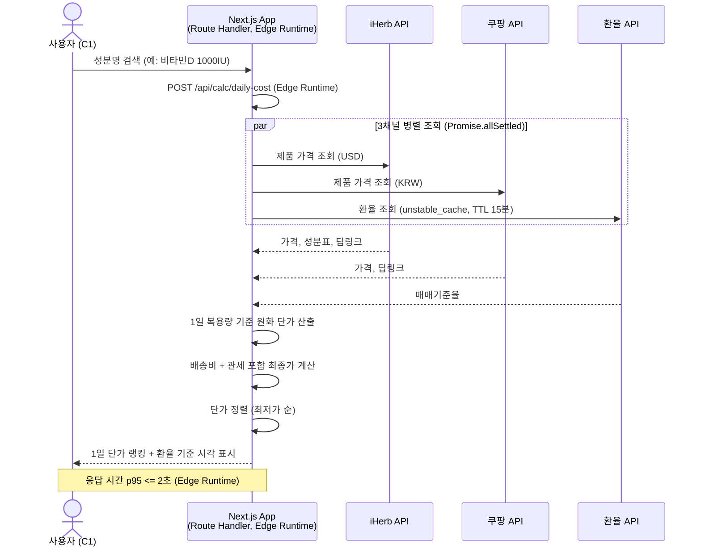
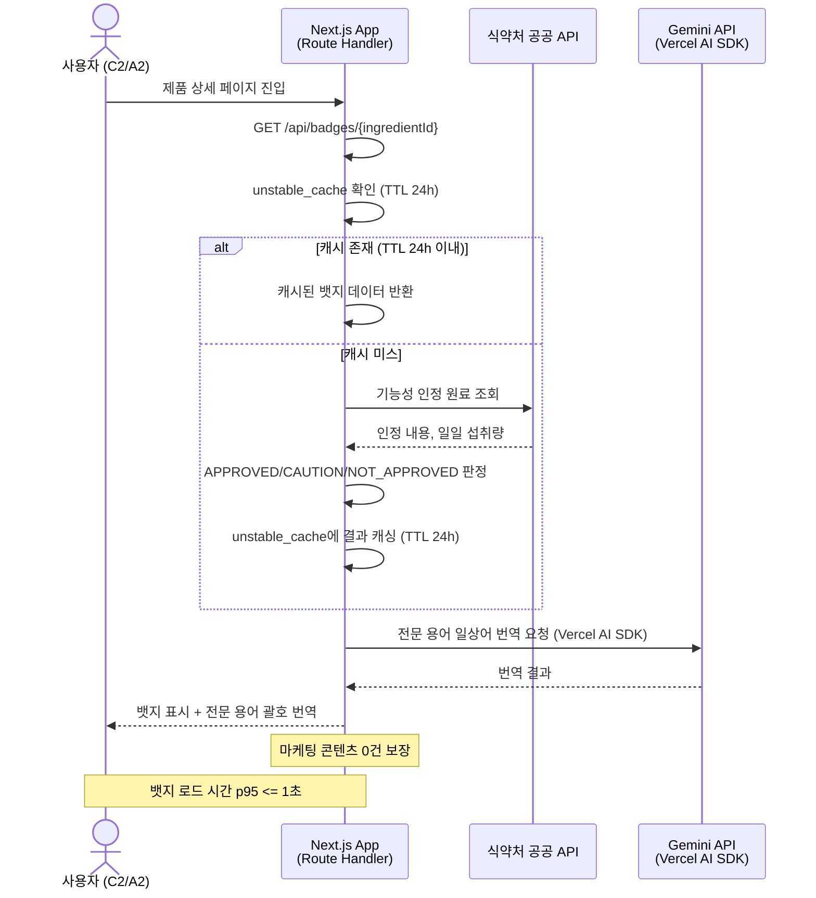
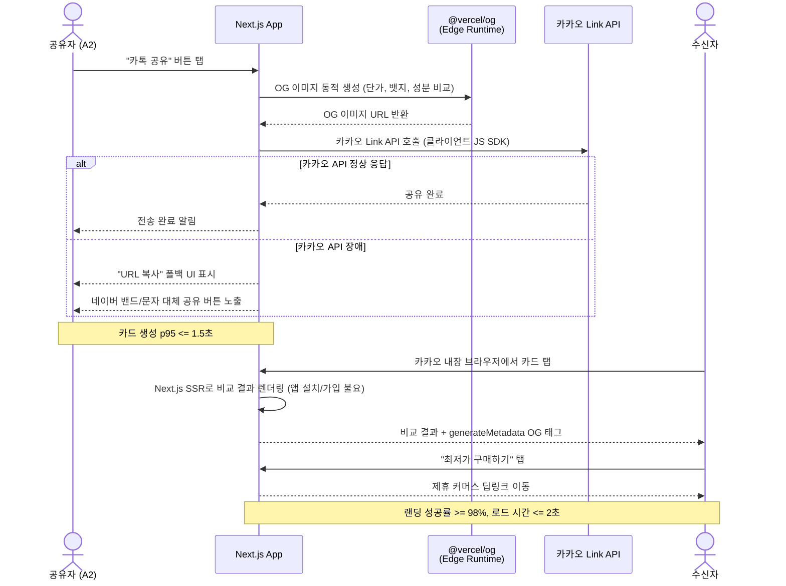
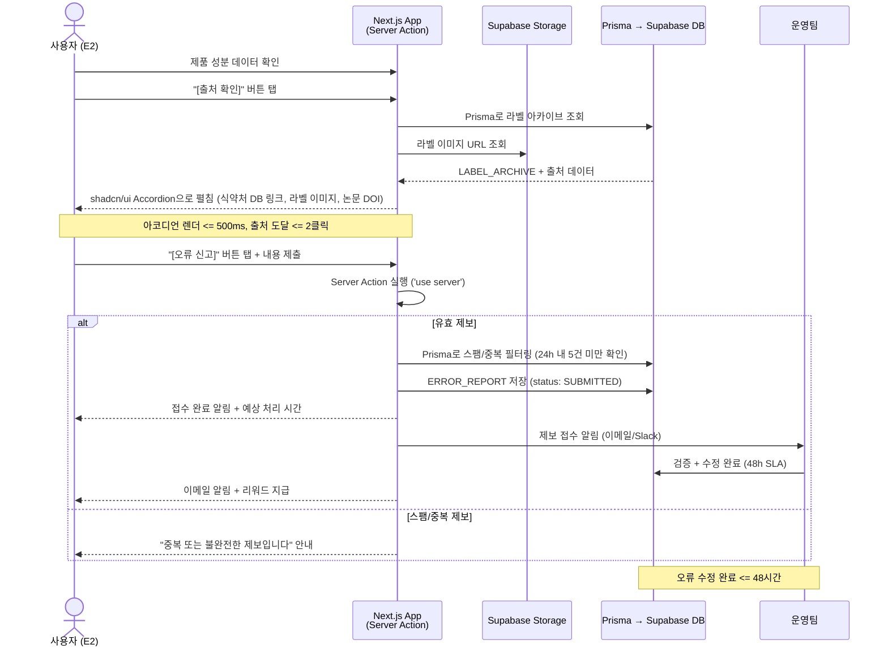
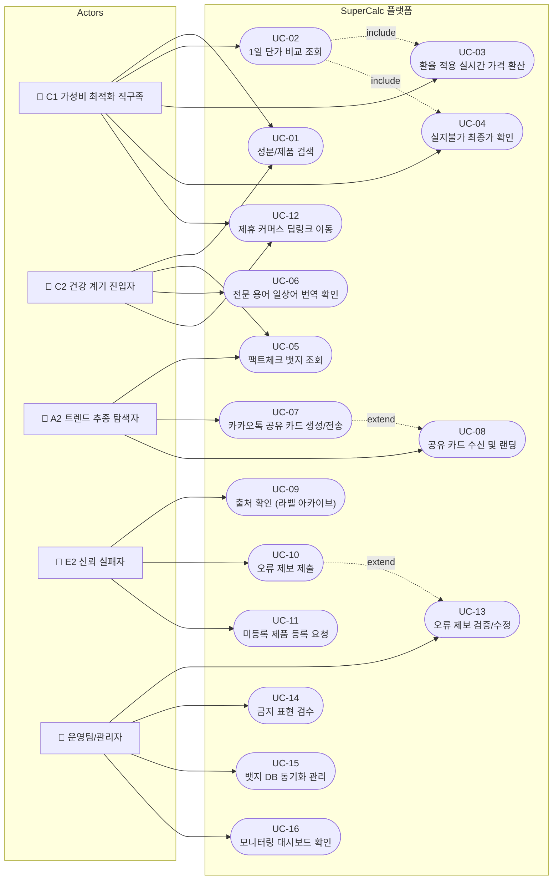
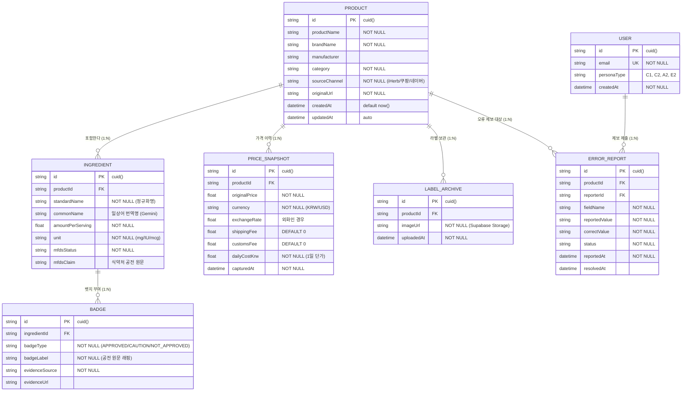
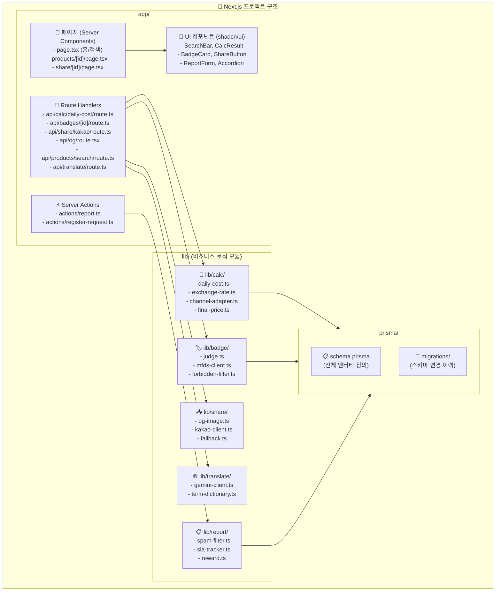

# Software Requirements Specification (SRS)

**Document ID:** SRS-001
**Revision:** 0.3
**Date:** 2026-04-16
**Standard:** ISO/IEC/IEEE 29148:2018

---

## 1. Introduction

### 1.1 Purpose

본 문서는 **건기식 성분·가격 비교 초자동화 플랫폼**(이하 "본 시스템" 또는 "SuperCalc 플랫폼")의 소프트웨어 요구사항 명세서(SRS)이다.

본 시스템은 국내 건강기능식품 시장(연 6조 원 규모)에서 발생하는 다음의 핵심 문제를 해결하기 위해 설계된다:

| 문제 영역 | 현 상태 (실패 KPI) |
|---|---|
| 채널 간 단가 비교 수동 작업 과부하 | 탐색·계산 소요 시간 >= 60분/건 |
| 성분 정보 해석 불가 — 비교 자체 불가 | 성분 비교 어려움 47.2%, 구매 여정 이탈률 55~75% |
| 광고성 콘텐츠 범람, 독립 신뢰 정보 부재 | 가격-품질 오인율 41.3%, 동일 성분 가격 차이 최대 8.2배 |
| 가격 적정성 판단 기준 부재 | 탐색 후 결론 실패 비율 >= 40% |
| 기존 비교 앱 데이터 오류 | 기존 앱 성분 DB 오류율 추정 >= 10%, 이탈 후 재방문율 < 5% |
| 인지 단계에서 광고 vs 독립 정보 구분 불가 | 오가닉 유입→가입 전환율 <= 15% |

**비전:** *"수동 엑셀 계산과 뒷광고 필터링에 지친 건기식 소비자들을 위한, 리얼-타임 1일 단가 계산 및 의학 팩트체크 플랫폼"*

본 SRS는 이해관계자, 개발팀, QA팀, 법률팀에게 시스템의 기능적·비기능적 요구사항을 명확하고 테스트 가능한 형태로 제공하며, 요구사항의 추적성을 보장한다.

### 1.2 Scope (In-Scope / Out-of-Scope)

#### 1.2.1 In-Scope (MVP)

| # | 범위 항목 |
|---|---|
| S1 | F1. 실시간 1일 단가 정규화 엔진 (iHerb, 쿠팡, 네이버 3채널) |
| S2 | F2. 식약처/논문 등급 배지 + 전문 용어 일상어 번역 |
| S3 | F3. 카카오톡 1-Tap 공유 (웹뷰 기반, 앱 설치 불요) |
| S4 | F4. 원본 라벨 아카이브 + 오류 제보 48h SLA |
| S5 | 상위 300~500개 영양제 제품 DB |
| S6 | 제휴 CPA 수익 모델 (iHerb, 쿠팡) |
| S7 | 모바일 웹 앱 (반응형, Next.js App Router 기반) |

#### 1.2.2 Out-of-Scope (명시적 배제)

| # | 배제 항목 | 배제 사유 |
|---|---|---|
| OS1 | AI 개인화 맞춤 추천 | 기술 부채, 초기 데이터 편향 위험 |
| OS2 | 커뮤니티/리뷰 게시판 | Anti-BS 포지셔닝 훼손 위험 |
| OS3 | 네이티브 앱 | MVP는 모바일 웹 퍼스트 전략 |
| OS4 | 복잡한 헬스케어 온보딩 (문진/건강 프로필) | MVP 범위 초과 |
| OS5 | 전체 건기식 시장 커버리지 (수만 SKU) | 단계적 확장 전략 |
| OS6 | 브랜드 스폰서 광고/배너 | 독립성 훼손 금지 원칙 |
| OS7 | 데스크톱 전용 대시보드 | 모바일 퍼스트 우선 |
| OS8 | 별도 Python/Java 백엔드 서버 | C-TEC-001 (단일 풀스택 원칙) |

#### 1.2.3 Constraints (제약사항)

| ID | 유형 | 제약 내용 | 근거 |
|---|---|---|---|
| CON-01 | 법적 | 뱃지 텍스트는 식약처 건강기능식품공전 고시 문구만 래핑하며, 질병 예방/치료 표현을 절대 금지한다 | 건강기능식품법, R2 리스크 |
| CON-02 | 기술 | 무단 크롤링을 배제하고, 공식 Affiliate API만 사용한다 | R1 리스크 (Critical, 점수 20) |
| CON-03 | 비용 | MVP 월 인프라 비용을 무료~최대 10만 원 이하로 유지한다 (프리 티어 적극 활용) | NFR 비용 기준, 에셋 라이트 원칙 |
| CON-04 | 기술 | 전 구간 TLS 1.2 이상을 적용한다 | 보안 요구사항 |
| CON-05 | 데이터 | B2B 데이터 제공 시 k-anonymity >= 5를 보장한다 | 개인정보 보호 요구사항 |
| CON-06 | 데이터 | 사용자 데이터 수집은 최소 수집 원칙을 따르며, MVP에서는 이메일·비교 이력만 수집한다 | 개인정보 최소 수집 원칙 |
| C-TEC-001 | 기술 | 모든 서비스는 Next.js (App Router) 기반의 단일 풀스택 프레임워크로 구현한다. 프론트엔드와 백엔드를 별도 분리하지 않는다 | 개발 복잡도 최소화 |
| C-TEC-002 | 기술 | 서버 측 로직(DB 접근, API 호출 등)은 Next.js의 Server Actions 또는 Route Handlers를 사용하여 별도의 백엔드 서버 없이 구현한다 | 인프라 단순화 |
| C-TEC-003 | 기술 | 데이터베이스는 Prisma + 로컬 SQLite(개발) / Supabase PostgreSQL(배포)을 사용한다 | 인프라 비용 최소화 |
| C-TEC-004 | 기술 | UI 및 스타일링은 Tailwind CSS + shadcn/ui를 사용한다 | AI 코드 생성 일관성 |
| C-TEC-005 | 기술 | LLM 오케스트레이션은 별도의 Python 서버 없이 Vercel AI SDK를 사용하여 Next.js 내부에서 직접 구현한다 | Python 서버 배제 |
| C-TEC-006 | 기술 | LLM 호출은 Google Gemini API를 기본으로 사용하며, 환경 변수 설정만으로 모델 교체가 가능하도록 SDK의 표준 인터페이스를 준수한다 | 모델 유연성 확보 |
| C-TEC-007 | 기술 | 배포 및 인프라 관리는 Vercel 플랫폼으로 단일화하며, CI/CD 설정 없이 Git Push만으로 배포를 자동화한다 | 운영 복잡도 제거 |

#### 1.2.4 Assumptions (가정)

| ID | 가정 내용 | 검증 방안 | 시한 |
|---|---|---|---|
| ASM-01 | iHerb/쿠팡 파트너스 API가 제품 성분 메타데이터까지 제공한다 | PoC(V3)에서 실제 API 응답 필드 확인 | MVP 착수 전 |
| ASM-02 | 건기식 구매 전 온라인 탐색 비율 72%가 모바일 웹에서도 동일하다 | Google Analytics 채널별 유입 분석 | 출시 후 1개월 |
| ASM-03 | 식약처 공공 데이터 API의 응답 속도가 서비스 요구사항(<= 1초)에 부합한다 | API 부하 테스트 + 캐시 전략 설계 | MVP 착수 전 |
| ASM-04 | Q1-A 세그먼트(C1 한정훈)의 제휴 링크 클릭→실구매 전환율이 6% 이상이다 | MVP 출시 후 3개월간 실측 (V6) | 출시 후 3개월 |
| ASM-05 | 환율 API(한국수출입은행 등)가 안정적으로 운영되며 15분 이내 갱신된다 | SLA 확인 + 폴백 환율 소스 확보 | MVP 착수 전 |
| ASM-06 | 카카오 Link API의 현 정책(외부 딥링크 허용)이 최소 6개월 유지된다 | 카카오 개발자 문서 변경 모니터링 | 지속 |
| ASM-07 | Vercel Serverless Function의 Edge Runtime이 외부 API 병렬 호출 시 p95 ≤ 2초를 충족한다 | MVP 착수 전 PoC에서 3채널 병렬 호출 벤치마크 실행 | MVP 착수 전 |
| ASM-08 | Supabase Free Tier (500MB DB, 1GB Storage)가 MVP 초기 300~500개 SKU를 충분히 수용한다 | Supabase Free Tier 용량 대비 예상 데이터 사이즈 산정 | MVP 착수 전 |
| ASM-09 | Vercel AI SDK + Gemini API의 전문 용어 일상어 번역 정확도가 >= 98%이다 | 식약처 기능성 원료 100건 대상 번역 품질 테스트 | MVP 착수 전 |

### 1.3 Definitions, Acronyms, Abbreviations

| 용어 | 정의 |
|---|---|
| **1일 단가** | 특정 건강기능식품 제품의 1일 권장 복용량을 기준으로 산출한 원화(KRW) 단가. 배송비·관세 포함 최종가 기준 |
| **AOS (Adjusted Opportunity Score)** | `Importance × (1 - Satisfaction/5)` 공식으로 산출한 기회 점수. 높을수록 미충족 니즈가 크며 혁신 기회가 높음 |
| **DOS (Discovered Opportunity Score)** | `AOS × Market Relevance`로 산출한 시장 연관 기회 점수 |
| **JTBD (Jobs to be Done)** | 사용자가 특정 상황에서 완수하려는 과업(Job)을 정의하는 프레임워크 |
| **CJM (Customer Journey Map)** | 고객 여정 지도. 소비자가 제품/서비스를 인지→고려→결정→사용하는 전 과정을 시각화한 도구 |
| **MoSCoW** | 우선순위 분류 체계. Must Have / Should Have / Could Have / Won't Have |
| **Anti-BS Dashboard** | 마케팅 콘텐츠(광고성 리뷰, 체험단 블로그 등)를 원천 차단하고, 식약처 인정 원료 DB와 의학 논문에 기반한 팩트체크 결과만 표시하는 대시보드 |
| **Super-Calc Engine** | iHerb/쿠팡/네이버 등 다채널의 건기식 가격을 1일 복용량 기준 원화 단가로 자동 환산·정렬하는 핵심 연산 엔진 |
| **Viral Engine** | 비교 결과를 카카오톡 공유 카드로 1-Tap 생성·전송하는 기능 모듈 |
| **Data Trust System** | 원본 라벨 아카이브, 출처 투명 공개, 오류 제보 및 보상 시스템의 총칭 |
| **뱃지 (Badge)** | 식약처 건강기능식품공전 기반으로 성분/원료의 인정 상태를 시각적으로 표현하는 라벨 (APPROVED / CAUTION / NOT_APPROVED) |
| **OG 이미지 (Open Graph Image)** | 소셜 미디어 공유 시 미리보기에 표시되는 대표 이미지 |
| **CPA (Cost Per Action)** | 제휴 마케팅에서 사용자의 특정 행동(구매 등) 발생 시 지급되는 수수료 방식 |
| **TTC (Time-To-Completion)** | 탐색 시작 후 결제 링크 클릭 또는 SNS 공유 완료까지의 소요 시간. North Star KPI |
| **LCP (Largest Contentful Paint)** | 웹 성능 지표. 페이지의 가장 큰 콘텐츠 요소가 렌더링 완료되는 시점 |
| **K-Factor** | 바이럴 계수. 기존 사용자 1명이 유입시키는 신규 사용자 수 |
| **p95** | 전체 요청 중 95번째 백분위 수의 응답 시간. 상위 5%를 제외한 최대 응답 시간 |
| **RPO (Recovery Point Objective)** | 장애 발생 시 허용 가능한 최대 데이터 손실 시간 |
| **RTO (Recovery Time Objective)** | 장애 발생 후 서비스 복구까지의 최대 허용 시간 |
| **SLA (Service Level Agreement)** | 서비스 수준 협약. 서비스 가용성·응답 시간 등의 보장 기준 |
| **RBAC (Role-Based Access Control)** | 역할 기반 접근 제어 |
| **MFDS** | 식품의약품안전처 (Ministry of Food and Drug Safety) |
| **Persona** | 사용자 유형을 대표하는 가상의 인물 모델 |
| **Validator** | 가설이나 가정을 검증하기 위한 실험 또는 측정 방법 |
| **SKU (Stock Keeping Unit)** | 재고 관리 단위. 개별 제품을 식별하는 고유 코드 |
| **Next.js App Router** | React 기반 풀스택 웹 프레임워크. 서버/클라이언트 컴포넌트를 나누어 렌더링하는 최신 라우팅 시스템 |
| **Server Action** | Next.js에서 서버에서만 실행되는 함수. 폼 제출, DB 쓰기 등에 사용하며 `'use server'` 지시어로 선언 |
| **Route Handler** | Next.js에서 API 엔드포인트를 만드는 방법 (`app/api/.../route.ts`). 기존 REST API와 유사 |
| **Prisma** | TypeScript/JavaScript용 ORM(데이터베이스 연결 도구). 스키마 정의로 자동 타입 생성 |
| **Supabase** | PostgreSQL 기반 오픈소스 BaaS(Backend-as-a-Service). 인증, DB, 스토리지 제공 |
| **Vercel AI SDK** | Vercel에서 제공하는 AI/LLM 통합 라이브러리. 스트리밍 응답, 멀티 모델 지원 |
| **shadcn/ui** | Tailwind CSS 기반의 복사-붙여넣기 가능한 UI 컴포넌트 라이브러리 |
| **Edge Runtime** | Vercel Edge Network에서 실행되는 경량 런타임. Cold Start가 거의 없어 빠른 응답 보장 |
| **@vercel/og** | Edge에서 동적 OG 이미지를 생성하는 Vercel 공식 라이브러리 (Satori 기반) |
| **ISR (Incremental Static Regeneration)** | 정적 페이지를 주기적으로 재생성하는 Next.js 기능. 캐싱과 최신성의 균형 |
| **unstable_cache** | Next.js의 서버 측 데이터 캐싱 함수. `revalidate` 옵션으로 TTL 설정 가능 |

### 1.4 References

| ID | 제목 | 유형 | 경로/출처 |
|---|---|---|---|
| REF-01 | PRD v0.1 — 건기식 성분·가격 비교 초자동화 플랫폼 | 내부 문서 | `PRD_v0.1.md` |
| REF-02 | 한국소비자원 시장 조사 (2022) | 외부 공개 보고서 | 한국소비자원 공식 발간 |
| REF-03 | 식약처 소비자 인식조사 (2021) | 외부 공개 보고서 | 식품의약품안전처 공식 발간 |
| REF-04 | 공정거래위원회 온라인 광고 실태조사 (2023) | 외부 공개 보고서 | 공정거래위원회 공식 발간 |
| REF-05 | 한국건강기능식품협회 소비자 실태 보고서 (2023) | 외부 공개 보고서 | 한국건강기능식품협회 공식 발간 |
| REF-06 | Nielsen Korea 건기식 구매 행태 분석 (2022) | 외부 공개 보고서 | Nielsen Korea 발간 |
| REF-07 | ISO/IEC/IEEE 29148:2018 | 국제 표준 | ISO 표준 문서 |
| REF-08 | Next.js App Router Documentation | 외부 기술 문서 | https://nextjs.org/docs/app |
| REF-09 | Vercel AI SDK Documentation | 외부 기술 문서 | https://sdk.vercel.ai/docs |
| REF-10 | Prisma Documentation | 외부 기술 문서 | https://www.prisma.io/docs |
| REF-11 | Supabase Documentation | 외부 기술 문서 | https://supabase.com/docs |

---

## 2. Stakeholders

| 역할 (Role) | 대표 페르소나 | 책임 (Responsibility) | 관심사 (Interest) |
|---|---|---|---|
| **가성비 최적화 직구족** | C1 한정훈 (36세, 개발자) | 다채널 가격 비교의 주 사용자, 수익 엔진의 55%를 차지하는 핵심 전환 사용자 | 5초 내 실시간 최저가 확인, 1일 단가 기준 정렬, 배송비·관세 포함 최종가 정확도 |
| **건강 계기 진입자** | C2 박소연 (43세, 인사팀 과장) | 건강 검진 후 첫 건기식 구매를 시도하는 입문자, 성장 엔진 역할 | 광고 배제 환경에서 30분 내 확신 있는 결정, 전문 용어 일상어 번역 |
| **트렌드 추종 탐색자** | A2 정수빈 (27세, 뷰티 마케터) | 트렌드 성분의 과학적 근거를 확인·공유하는 SEO 트래픽 유입 사용자 | 5초 팩트체크 + 1탭 카카오톡 공유, 비주얼 공유 카드 |
| **극단 — 신뢰 실패자** | E2 김도현 (29세, 데이터 분석가) | 기존 비교 앱 데이터 오류 경험자, 데이터 정확도 SLA 기준을 설정하는 역할 | 출처 2클릭 내 추적, 오류 제보 시 48h 내 수정 보장, 보상 체계 |
| **Product & Engineering팀** | (내부) | 시스템 설계, 개발, 배포, 운영 | 기술적 구현 가능성, 인프라 비용 무료~최대 10만 원/월 이하 (Vercel + Supabase 프리 티어 활용), 성능 SLA 충족 |
| **QA팀** | (내부) | 요구사항 검증, 테스트 수행, 금지 표현 검수 | 테스트 가능한 인수 기준, 뱃지 정확도, 데이터 정합성 |
| **법률/컴플라이언스** | (내부) | 건강기능식품법 준수 확인, 금지 표현 목록 관리 | 법적 리스크 최소화, 식약처 공전 원문 1:1 매칭 |
| **사업팀** | (내부) | 제휴 수수료 구조 관리, 수익 모델 운영 | CPA 월 수익 >= 500만 원 (Y1 말), 제휴 채널 다변화 |

> **배제 타겟 (Non-Stakeholder):**
> - **E1 나경아** — 디지털 소외 계층, 카카오톡 간접 접근만 허용
> - **N1 조미라 (58세, 경리)** — 브랜드 맹신 성향, DOS -0.60, 전환 유인 0%. MVP 마케팅/기획 자원 투입 **전면 금지**

---

## 3. System Context and Interfaces

### 3.1 External Systems

| # | 외부 시스템 | 유형 | 연동 목적 | 주요 제약 |
|---|---|---|---|---|
| EXT-01 | iHerb Affiliate API | REST API | 제품 가격(USD), 재고, 성분표, 딥링크 URL 조회 | Rate Limit: V3 PoC에서 확인. 수수료: 신규 10% / 기존 5% |
| EXT-02 | 쿠팡 파트너스 API | REST API | 가격(KRW), 딥링크 URL, 제품 메타데이터 조회 | Rate Limit: 일 10,000건 (추정). 수수료: 3% |
| EXT-03 | 식약처 건강기능식품 공공 데이터 API | 공공 API | 기능성 인정 내용, 일일 섭취량, 주의사항 조회 | 갱신 주기: 월 1회 |
| EXT-04 | 환율 API (한국수출입은행 등) | REST API | 매매기준율 조회 (USD/KRW 등) | 갱신 주기: 15분 |
| EXT-05 | 카카오 Link API | JS SDK | 카카오톡 공유 카드 생성 및 전송 | 일 발송 제한 확인 필요 |
| EXT-06 | Google Gemini API | REST API (Vercel AI SDK 경유) | 전문 용어 일상어 번역, 성분 설명 생성 | 무료 티어: 60 RPM. 유료 전환 시 환경변수로 모델 교체 가능 (C-TEC-006) |
| EXT-07 | Supabase | BaaS (PostgreSQL + Storage + Auth) | 메인 DB, 라벨 이미지 저장, 사용자 인증 | Free Tier: 500MB DB, 1GB Storage, 50K MAU Auth |

### 3.2 Client Applications

| # | 클라이언트 | 플랫폼 | 비고 |
|---|---|---|---|
| CL-01 | 모바일 웹 앱 | iOS/Android 모바일 브라우저 | MVP 1차 타겟. Next.js App Router 기반 반응형 웹 (Tailwind CSS + shadcn/ui) |
| CL-02 | 카카오 내장 브라우저 웹뷰 | 카카오톡 인앱 | 공유 카드 수신자 랜딩 환경. Next.js SSR로 OG 메타 태그 완벽 지원 |

### 3.3 API Overview

#### 3.3.1 내부 API (Next.js Route Handlers & Server Actions)

> 모든 내부 API는 Next.js App Router의 Route Handler 또는 Server Action으로 구현된다 (C-TEC-001, C-TEC-002). 별도의 API Gateway나 백엔드 서버를 두지 않는다.

| API 명 | 유형 | 엔드포인트 / 구현 위치 | 입력 | 출력 | 성능 기준 |
|---|---|---|---|---|---|
| Super-Calc API | Route Handler | `app/api/calc/daily-cost/route.ts` (Edge Runtime) | 성분명, 채널 리스트 | PRICE_SNAPSHOT 배열 (1일 단가 정렬) | p95 <= 2,000ms |
| Badge API | Route Handler | `app/api/badges/[ingredientId]/route.ts` | ingredientId | BADGE 배열 + 일상어 번역 | `unstable_cache` TTL: 24h |
| Error Report API | Server Action | `app/actions/report.ts` | 제품ID, 필드명, 신고값, 정정값 | 접수 확인 + 예상 처리 시간 | 접수 응답 <= 3초 |
| Label Archive API | Route Handler | `app/api/labels/[productId]/route.ts` | productId | Supabase Storage 라벨 이미지 URL 배열 | 아코디언 렌더 <= 500ms |
| Share Card API | Route Handler | `app/api/share/kakao/route.ts` + `app/api/og/route.tsx` | 비교 결과 데이터 | `@vercel/og` 동적 OG 이미지 + 공유 카드 | 생성 시간 <= 1,500ms |
| Product Search API | Route Handler | `app/api/products/search/route.ts` | 키워드, 성분명 | 제품 목록 (Prisma 풀텍스트 검색) | p95 <= 1,000ms |
| Translation API | Route Handler | `app/api/translate/route.ts` | 전문 용어 배열 | 일상어 번역 배열 (Vercel AI SDK + Gemini) | p95 <= 1,000ms |

#### 3.3.2 외부 API

| API 명 | 유형 | 입력 | 출력 | 제약 사항 |
|---|---|---|---|---|
| iHerb Affiliate API | 외부 REST | 제품 ID, 키워드 | 가격(USD), 재고, 성분표, 딥링크 URL | Rate Limit TBD (V3 PoC에서 확인), 수수료: 신규 10% / 기존 5% |
| 쿠팡 파트너스 API | 외부 REST | 키워드, 카테고리 | 가격(KRW), 딥링크 URL, 제품 메타 | Rate Limit: 일 10,000건 (추정), 수수료: 3% |
| 식약처 건강기능식품 공공 데이터 | 외부 공공 API | 원료명, 인증번호 | 기능성 인정 내용, 일일 섭취량, 주의사항 | 갱신 주기: 월 1회 |
| 환율 API | 외부 REST | 통화 코드 | 매매기준율 | 갱신 주기: 15분 |
| 카카오 Link API | 외부 JS SDK | 컨텐츠(OG image, title, desc), 딥링크 | 카카오톡 공유 메시지 | 일 발송 제한 확인 필요 |
| Google Gemini API | 외부 REST (Vercel AI SDK) | 전문 용어, 프롬프트 | 일상어 번역, 성분 설명 | 무료: 60 RPM, 환경변수로 모델 전환 가능 |

### 3.4 Interaction Sequences (핵심 시퀀스 다이어그램)

#### 3.4.1 핵심 흐름 1: 실시간 1일 단가 비교 (F1)

#### 3.4.2 핵심 흐름 2: 팩트체크 뱃지 조회 (F2)

#### 3.4.3 핵심 흐름 3: 1-Tap 카카오톡 공유 (F3)

#### 3.4.4 핵심 흐름 4: 오류 제보 및 출처 확인 (F4)

### 3.5 Use Case Diagram (유스케이스 다이어그램)

> 사용자(액터)가 본 시스템에서 수행할 수 있는 주요 기능을 한눈에 보여주는 전체 지도입니다.

| UC ID | 유스케이스 | 주요 액터 | 관련 REQ |
|---|---|---|---|
| UC-01 | 성분/제품 검색 | C1, C2 | REQ-FUNC-001, REQ-FUNC-008 |
| UC-02 | 1일 단가 비교 조회 | C1 | REQ-FUNC-001 ~ 003 |
| UC-03 | 환율 적용 실시간 가격 환산 | C1 | REQ-FUNC-004 |
| UC-04 | 실지불가 최종가 확인 | C1 | REQ-FUNC-005 |
| UC-05 | 팩트체크 뱃지 조회 | C2, A2 | REQ-FUNC-009 ~ 011, 013 |
| UC-06 | 전문 용어 일상어 번역 확인 | C2 | REQ-FUNC-012 |
| UC-07 | 카카오톡 공유 카드 생성/전송 | A2 | REQ-FUNC-014, 017 |
| UC-08 | 공유 카드 수신 및 랜딩 | (수신자) | REQ-FUNC-015 |
| UC-09 | 출처 확인 (라벨 아카이브) | E2 | REQ-FUNC-018 |
| UC-10 | 오류 제보 제출 | E2 | REQ-FUNC-019, 022 |
| UC-11 | 미등록 제품 등록 요청 | E2 | REQ-FUNC-008 |
| UC-12 | 제휴 커머스 딥링크 이동 | C1, C2, (수신자) | REQ-FUNC-016 |
| UC-13 | 오류 제보 검증/수정 | Admin | REQ-FUNC-020, 021 |
| UC-14 | 금지 표현 검수 | Admin | REQ-FUNC-011, REQ-NF-021 |
| UC-15 | 뱃지 DB 동기화 관리 | Admin | REQ-NF-029 |
| UC-16 | 모니터링 대시보드 확인 | Admin | REQ-NF-023, 024, 025 |

### 3.6 Component Diagram (컴포넌트 다이어그램)

> 시스템을 구성하는 큰 덩어리(컴포넌트)들이 블록처럼 어떻게 맞춰지는지 보여주는 전체 구조도입니다. C-TEC-001에 따라 Next.js 단일 풀스택 아키텍처로 설계됩니다.

```mermaid
flowchart TB
    subgraph Vercel["☁️ Vercel Platform (C-TEC-007)"]
        subgraph NextApp["⚡ Next.js App (App Router) — C-TEC-001"]
            subgraph ClientLayer["🖥️ 클라이언트 컴포넌트 ('use client')"]
                SearchUI["🔍 검색 UI\n(Tailwind + shadcn/ui)"]
                CalcResult["📊 단가 비교 결과 UI\n(정렬된 카드 리스트)"]
                BadgeUI["🏷️ 뱃지 + 번역 UI\n(shadcn Badge, Tooltip)"]
                ShareUI["📤 공유 UI\n(카카오 JS SDK 호출)"]
                ReportUI["📋 제보 UI\n(shadcn Form, Accordion)"]
            end

            subgraph ServerLayer["⚙️ 서버 로직 (Route Handlers + Server Actions) — C-TEC-002"]
                CalcHandler["🔢 /api/calc/daily-cost\n(Edge Runtime)\n- 3채널 병렬 조회\n- 환율 적용\n- 최종가 산출\n(p95 ≤ 2s)"]
                BadgeHandler["🏷️ /api/badges/[id]\n- MFDS 뱃지 판정\n- 공전 원문 매칭\n- 금지 표현 필터\n(unstable_cache 24h)"]
                ShareHandler["📤 /api/share/kakao\n+ /api/og (Edge)\n- @vercel/og 이미지 생성\n- 폴백 URL 처리\n(p95 ≤ 1.5s)"]
                TransHandler["🌐 /api/translate\n- Vercel AI SDK\n- Gemini 호출\n(커버리지 ≥ 95%)"]
                ReportAction["📋 Server Action\n- 오류 제보 접수\n- 스팸/중복 필터\n- SLA 48h 추적"]
                SearchHandler["🔍 /api/products/search\n- Prisma 풀텍스트\n- 미등록 안내"]
            end

            subgraph ORM["📦 Prisma ORM — C-TEC-003"]
                PrismaClient["Prisma Client\n(자동 타입 생성)"]
            end
        end

        subgraph VercelServices["🔧 Vercel 부가 서비스"]
            Analytics["📈 Vercel Analytics\n+ Speed Insights"]
            Logs["📊 Vercel Logs\n→ Slack Webhook"]
            Cron["⏰ Vercel Cron\n- 뱃지 동기화 (월 1회)\n- Warm 유지 (5분)"]
        end
    end

    subgraph Supabase["🗄️ Supabase — C-TEC-003"]
        DB[("🗄️ PostgreSQL\nPRODUCT, INGREDIENT,\nPRICE_SNAPSHOT,\nBADGE, USER,\nERROR_REPORT,\nLABEL_ARCHIVE")]
        SupaStorage[("📦 Supabase Storage\n- 라벨 이미지\n- OG 이미지")]
        SupaAuth["🔐 Supabase Auth\n(이메일 인증)"]
    end

    subgraph External["🌍 외부 시스템"]
        iHerb["🛒 iHerb Affiliate API\n(USD 가격, 성분표)"]
        Coupang["🛒 쿠팡 파트너스 API\n(KRW 가격, 딥링크)"]
        Naver["🛒 네이버 API\n(KRW 가격)"]
        MFDS["🏛️ 식약처 공공 API\n(기능성 인정 원료)"]
        FX["💱 환율 API\n(한국수출입은행)"]
        KakaoAPI["💬 카카오 Link API\n(JS SDK)"]
    end

    subgraph AI["🤖 AI — C-TEC-005, C-TEC-006"]
        Gemini["🤖 Google Gemini API\n(Vercel AI SDK 경유)\n- 전문 용어 번역\n- 모델 교체 가능"]
    end

    %% 클라이언트 → 서버
    SearchUI -->|fetch| SearchHandler
    CalcResult -->|fetch| CalcHandler
    BadgeUI -->|fetch| BadgeHandler
    ShareUI -->|fetch| ShareHandler
    ReportUI -->|Server Action| ReportAction

    %% 서버 → ORM
    CalcHandler --> PrismaClient
    BadgeHandler --> PrismaClient
    ReportAction --> PrismaClient
    SearchHandler --> PrismaClient

    %% ORM → Supabase
    PrismaClient --> DB

    %% 서버 → 외부
    CalcHandler --> iHerb
    CalcHandler --> Coupang
    CalcHandler --> Naver
    CalcHandler --> FX
    BadgeHandler --> MFDS
    ShareHandler --> SupaStorage
    TransHandler --> Gemini

    %% 서버 → Supabase Storage
    ReportAction --> SupaStorage

    %% 인증
    ReportAction --> SupaAuth

    %% 모니터링
    NextApp -.-> Analytics
    NextApp -.-> Logs
    Cron -.-> BadgeHandler
```

---

## 4. Specific Requirements

### 4.1 Functional Requirements

#### 4.1.1 F1: 실시간 1일 단가 정규화 엔진 (Super-Calc Engine)

| ID | 요구사항 | Source | Priority | Acceptance Criteria |
|---|---|---|---|---|
| **REQ-FUNC-001** | 시스템은 사용자가 특정 영양소(예: 비타민D 1000IU)를 검색하면, iHerb/쿠팡/네이버 3개 채널에서 해당 제품의 가격 데이터를 병렬로 조회한다. | Story 1, F1 | Must | **Given** 사용자가 특정 영양소를 검색한 상태, **When** "1일 단가 비교" 버튼을 탭하면, **Then** 등록된 3개 채널에 대해 병렬 API 조회가 실행된다. |
| **REQ-FUNC-002** | 시스템은 각 채널의 제품 가격을 1일 권장 복용량 기준 원화(KRW) 단가로 자동 환산한다. | Story 1 AC1, F1 | Must | **Given** 3개 채널의 원시 가격 데이터가 수집된 상태, **When** 단가 환산 처리가 실행되면, **Then** 모든 제품의 가격이 "1일 복용량 기준 원화 단가"로 통일 환산되어 PRICE_SNAPSHOT으로 저장된다. |
| **REQ-FUNC-003** | 시스템은 환산된 1일 단가를 최저가 순으로 정렬하여 사용자에게 표시한다. | Story 1 AC1, F1 | Must | **Given** 1일 단가 환산이 완료된 상태, **When** 결과 화면이 로드되면, **Then** 모든 등록 채널의 1일 복용 기준 원화 단가가 최저가 순으로 정렬되어 표시된다. 응답 시간 p95 <= 2초, 실패율 < 1.0%. |
| **REQ-FUNC-004** | 시스템은 iHerb(USD) 등 해외 채널 제품의 가격에 실시간 환율을 적용하고, 적용된 환율과 "환율 기준 시각"을 명시적으로 표시한다. | Story 1 AC2, F1 | Must | **Given** 사용자가 iHerb(USD) 제품과 쿠팡(KRW) 제품을 동시 비교할 때, **When** 결과 화면이 로드되면, **Then** 각 가격에 적용된 환율과 "환율 기준 시각"이 표시된다. 환율 갱신 주기 <= 15분, 표시 정확도 +/- 0.5% 이내. |
| **REQ-FUNC-005** | 시스템은 배송비·관세·할인코드를 포함한 "실지불가(최종가)"를 별도 컬럼으로 제공한다. | Story 1 AC3, F1 | Must | **Given** 배송비/관세/할인코드가 적용 가능한 제품이 있을 때, **When** 단가 랭킹이 표시되면, **Then** "실지불가(배송비+관세 포함 최종가)"가 별도 컬럼으로 제공된다. 최종가 오차율 <= 3%. |
| **REQ-FUNC-006** | 시스템은 오류가 신고된 최종가 데이터를 신고 접수 후 48시간 이내에 수정 완료한다. | Story 1 AC3, F1 | Must | **Given** 사용자가 최종가 오류를 신고한 상태, **When** 신고 접수 후 48시간이 경과하면, **Then** 해당 오류가 수정 완료되어 있다. |
| **REQ-FUNC-007** | 등록된 채널 중 1개 이상이 장애(타임아웃, 5xx) 상태일 때, 시스템은 정상 채널의 결과만 표시하고, 장애 채널에 대해 인라인 안내 메시지를 표시한다. | Story 1 AC4 (Sad Path), F1 | Must | **Given** 등록된 3개 채널 중 1개가 타임아웃 또는 5xx 오류를 반환하는 상태, **When** 사용자가 "1일 단가 비교"를 요청하면, **Then** 정상 응답 채널의 결과만 표시되고, 장애 채널에는 "현재 [채널명] 가격을 가져올 수 없습니다. 마지막 수집: HH:MM" 안내가 인라인으로 표시된다. 부분 결과 제공 성공률 >= 99%, 장애 안내 표시까지 <= 500ms. |
| **REQ-FUNC-008** | 사용자가 DB에 미등록된 성분을 검색한 경우, 시스템은 "해당 성분은 현재 데이터베이스에 미등록 상태입니다" 안내와 "[제품 등록 요청하기]" CTA 버튼을 표시한다. | Story 1 AC5 (Sad Path), F1 | Must | **Given** 사용자가 DB에 미등록된 성분(예: "NMN")을 검색한 상태, **When** 검색 결과 화면이 로드되면, **Then** 안내 메시지와 "[제품 등록 요청하기]" 버튼이 표시된다. CTA 노출까지 <= 300ms, 등록 요청 제출 성공률 >= 99%. |

#### 4.1.2 F2: 식약처/논문 등급 배지 시스템 (Anti-BS Dashboard)

| ID | 요구사항 | Source | Priority | Acceptance Criteria |
|---|---|---|---|---|
| **REQ-FUNC-009** | 시스템은 제품 상세 페이지에서 제휴 광고 배너, 유저 리뷰, 별점, 체험단 블로그 링크를 0건 표시한다 (마케팅 콘텐츠 원천 차단). | Story 2 AC1, F2 | Must | **Given** 사용자가 특정 제품 상세 페이지에 진입한 상태, **When** 페이지가 로드되면, **Then** 제휴 광고 배너, 유저 리뷰, 별점, 체험단 블로그 링크가 0건 표시된다. 마케팅 콘텐츠 노출 = 0건/페이지. |
| **REQ-FUNC-010** | 시스템은 식약처 건강기능식품공전에 등재된 기능성 인정 원료에 대해 APPROVED/CAUTION/NOT_APPROVED 뱃지를 식약처 공전 원문과 1:1 매칭하여 표시한다. | Story 2 AC2, F2 | Must | **Given** 식약처 건강기능식품공전에 등재된 기능성 인정 원료가 포함된 제품, **When** 뱃지 영역이 렌더링되면, **Then** APPROVED/CAUTION/NOT_APPROVED 뱃지가 식약처 공전 원문과 1:1 매칭되어 표시된다. 뱃지-원문 불일치율 < 0.5%, 뱃지 로드 시간 <= 1초. |
| **REQ-FUNC-011** | 시스템은 뱃지 텍스트에 질병 예방/치료를 암시하는 표현을 포함하지 않으며, 식약처 공전 고시 문구만 래핑한다. | F2, CON-01 | Must | **Given** 뱃지가 생성·표시되는 모든 경우, **When** 뱃지 텍스트를 금지 표현 목록과 대조하면, **Then** 금지 표현 매칭 건수가 0건이다. |
| **REQ-FUNC-012** | 시스템은 성분표에서 전문 용어(예: "콜레칼시페롤") 옆에 일상어 번역(예: "몸에 잘 흡수되는 비타민 D3")을 괄호 형태로 표시한다. Vercel AI SDK + Gemini API를 활용하여 번역한다 (C-TEC-005, C-TEC-006). | Story 2 AC3, F2 | Must | **Given** "콜레칼시페롤", "피리독신 염산염" 등 전문 용어가 포함된 제품, **When** 성분표가 표시되면, **Then** 전문 용어 옆에 일상어 번역이 괄호 형태로 표시된다. 번역 커버리지 >= 95% (식약처 등록 기능성 원료 기준), 번역 정확도 >= 98%. |
| **REQ-FUNC-013** | 시스템은 식약처 건강기능식품공전에 미등재된 원료에 대해 "식약처 미등재 원료 — 기능성 인정 정보 없음"을 별도 색상(회색)으로 표시하고, 뱃지 미부여 사유를 툴팁으로 제공한다. | Story 2 AC5 (Sad Path), F2 | Must | **Given** 제품에 포함된 성분이 식약처 공전에 미등재된 상태, **When** 뱃지 영역이 렌더링되면, **Then** 해당 성분에는 "식약처 미등재 원료 — 기능성 인정 정보 없음"이 회색으로 표시되며, 뱃지 미부여 사유가 툴팁으로 제공된다. 미등재 원료 식별 정확도 >= 99%, 미매칭 시 뱃지 오발급률 = 0%. |

#### 4.1.3 F3: 1-Tap 팩트 요약 카톡 공유 (Viral Engine)

| ID | 요구사항 | Source | Priority | Acceptance Criteria |
|---|---|---|---|---|
| **REQ-FUNC-014** | 시스템은 사용자가 "카톡 공유" 버튼을 탭하면, 비교 결과의 핵심 지표(1일 단가, 뱃지, 성분 비교)가 담긴 OG 이미지 포함 카카오톡 공유 카드를 자동 생성한다. OG 이미지는 `@vercel/og` 라이브러리로 Edge Runtime에서 동적 생성한다. | Story 3 AC1, F3 | Must | **Given** 사용자가 제품 비교 결과 화면에 있을 때, **When** "카톡 공유" 버튼을 탭하면, **Then** OG 이미지가 포함된 카카오톡 공유 카드가 생성되어 전송 준비 상태에 들어간다. 카드 생성 시간 <= 1.5초, 실패율 < 1%. |
| **REQ-FUNC-015** | 시스템은 카카오톡 공유 카드 수신자가 카드를 탭했을 때, 카카오 내장 브라우저에서 앱 설치/회원가입 요구 없이 비교 결과 웹뷰를 바로 로드한다. Next.js SSR + `generateMetadata`로 OG 태그를 완벽 지원한다. | Story 3 AC2, F3 | Must | **Given** 수신자가 카카오톡에서 공유 카드를 탭한 상태, **When** 링크가 열리면, **Then** 카카오 내장 브라우저에서 앱 설치/회원가입 요구 없이 비교 결과 웹뷰가 바로 로드된다. 랜딩 성공률 >= 98%, 페이지 로드 시간 <= 2초. |
| **REQ-FUNC-016** | 시스템은 공유 카드 랜딩 페이지에서 "최저가 구매하기" 버튼 탭 시 해당 제품의 제휴 커머스 결제 페이지로 딥링크 이동시킨다. | Story 3 AC3, F3 | Must | **Given** 수신자가 공유 카드 랜딩 페이지에 도착한 상태, **When** "최저가 구매하기" 버튼을 탭하면, **Then** 해당 제품의 제휴 커머스 결제 페이지로 딥링크 이동한다. |
| **REQ-FUNC-017** | 카카오 Link API가 장애 상태일 때, 시스템은 자동으로 "URL 복사" 폴백 UI를 표시하고, 복사 완료 시 토스트 알림과 대체 공유 버튼(네이버 밴드, 문자)을 노출한다. | Story 3 AC4 (Sad Path), F3 | Must | **Given** 카카오 Link API가 타임아웃 또는 오류를 반환하는 상태, **When** 사용자가 "카톡 공유" 버튼을 탭하면, **Then** "URL 복사" 폴백 UI가 자동 표시되고, 복사 완료 시 토스트 알림("링크가 복사되었습니다")이 뜨며, 네이버 밴드/문자 대체 공유 버튼이 노출된다. 폴백 전환 시간 <= 1초, 폴백 경로 공유 성공률 >= 95%. |

#### 4.1.4 F4: 라벨 원본 아카이브 + 오류 제보 (Data Trust System)

| ID | 요구사항 | Source | Priority | Acceptance Criteria |
|---|---|---|---|---|
| **REQ-FUNC-018** | 시스템은 사용자가 "[출처 확인]" 버튼을 탭하면, 해당 데이터의 원천(식약처 DB 링크, 제조사 라벨 이미지, 논문 DOI)을 아코디언 메뉴로 펼쳐 표시한다. shadcn/ui의 Accordion 컴포넌트를 사용한다. | Story 4 AC1, F4 | Must | **Given** 사용자가 특정 제품의 성분 데이터를 확인하는 상태, **When** "[출처 확인]" 버튼을 탭하면, **Then** 해당 데이터의 원천이 아코디언 메뉴로 펼쳐진다. 출처 도달 <= 2클릭, 아코디언 렌더 <= 500ms. |
| **REQ-FUNC-019** | 시스템은 사용자가 "[오류 신고]" 버튼을 탭하고 내용을 제출하면, 제보 접수 확인 알림과 예상 처리 시간을 즉시 표시한다. Server Action으로 구현한다 (C-TEC-002). | Story 4 AC2, F4 | Must | **Given** 사용자가 데이터 불일치를 발견한 상태, **When** "[오류 신고]" 버튼을 탭하고 내용을 제출하면, **Then** 제보 접수 확인 알림과 예상 처리 시간이 즉시 표시된다. 제보 접수 응답 <= 3초. |
| **REQ-FUNC-020** | 시스템은 접수된 오류 제보를 검증하고 48시간 이내에 수정 완료한다. | Story 4 AC2, F4 | Must | **Given** 유효한 오류 제보가 접수된 상태, **When** 48시간이 경과하면, **Then** 해당 오류가 검증 및 수정 완료되어 있다. 오류 수정 완료 <= 48시간. |
| **REQ-FUNC-021** | 시스템은 제보한 오류가 검증·수정 완료되면, 제보자에게 이메일 알림("귀하의 제보로 수정되었습니다")과 리워드(포인트/배지)를 지급한다. | Story 4 AC3, F4 | Must | **Given** 제보한 오류가 검증/수정 완료된 상태, **When** 수정이 반영되면, **Then** 제보자에게 이메일 알림과 리워드가 지급된다. 수정 후 알림 발송 <= 1시간, 제보자 만족도 >= 4.0/5점. |
| **REQ-FUNC-022** | 시스템은 동일 제품에 대해 24시간 내 5건 이상 반복 제보하거나 빈 문자열 제보를 차단하고, 기존 유효 제보에는 영향을 주지 않는다. | Story 4 AC4 (Sad Path), F4 | Must | **Given** 사용자가 동일 제품에 대해 24시간 내 5건 이상 반복 제보하거나 빈 문자열 제보를 시도하는 상태, **When** "[오류 신고]" 제출을 시도하면, **Then** "중복 또는 불완전한 제보입니다. 내용을 확인해 주세요." 안내와 함께 제출이 차단된다. 스팸 제보 차단 정확도 >= 95%, 유효 제보 오차단률(false positive) <= 2%. |

#### 4.1.5 F7~F12: Should Have / Could Have / Won't Have 기능

| ID | 요구사항 | Source | Priority | 비고 |
|---|---|---|---|---|
| **REQ-FUNC-023** | 시스템은 사용자의 비교 이력을 저장하고, 재방문 시 이전 비교 결과로의 연속성을 제공한다. | F7 | Should | 출시 후 3개월 내 구현 |
| **REQ-FUNC-024** | 시스템은 트렌드 성분에 대한 팩트체크 콘텐츠를 SEO에 최적화된 형태로 제공한다. Next.js ISR로 정적 페이지 생성. | F8 | Should | 출시 후 3개월 내 구현 |
| **REQ-FUNC-025** | 시스템은 사용자가 관심 등록한 제품의 가격이 하락하면 이메일 알림을 발송한다. | F9 | Should | 출시 후 3개월 내 구현 |
| **REQ-FUNC-026** | 시스템은 3탭 이내에 비교 결론에 도달할 수 있는 UX를 제공한다. | F10 | Could | Phase 2 |
| **REQ-FUNC-027** | 시스템은 B2B 마켓 인텔리전스 대시보드를 제공한다 (가격 동향, 소비자 WTP 분석 등). | F11 | Could | Phase 2 |
| **REQ-FUNC-028** | 시스템은 B2C 프리미엄 알림 구독 기능을 제공한다. | F12 | Could | Phase 2 |
| **REQ-FUNC-029** | 시스템은 유저 자율 리뷰/별점 게시판을 제공하지 않는다. | F5 | Won't | 광고 침투 위험으로 명시적 배제 |
| **REQ-FUNC-030** | 시스템은 AI 문진 기반 개인화 추천 기능을 제공하지 않는다. | F6 | Won't | 초기 데이터 편향 위험으로 명시적 배제 |

### 4.2 Non-Functional Requirements

#### 4.2.1 성능 (Performance)

| ID | 요구사항 | 측정 기준 | 측정 방법 | 근거 |
|---|---|---|---|---|
| **REQ-NF-001** | 단가 비교 API(Super-Calc)의 응답 시간은 p95 <= 2,000ms 이내여야 한다. | p95 응답 시간 <= 2,000ms | Vercel Analytics + Vercel Logs 모니터링 | Story 1 AC1, PRD 5-1 |
| **REQ-NF-002** | 뱃지 렌더링 시간은 p95 <= 1,000ms 이내여야 한다. | p95 렌더링 시간 <= 1,000ms | Vercel Speed Insights 프론트엔드 성능 모니터링 | Story 2 AC2, PRD 5-1 |
| **REQ-NF-003** | 카카오 공유 카드 생성 시간은 p95 <= 1,500ms 이내여야 한다. | p95 카드 생성 시간 <= 1,500ms | Vercel Logs 응답 시간 로깅 | Story 3 AC1, PRD 5-1 |
| **REQ-NF-004** | 출처 아코디언 펼침 시간은 p95 <= 500ms 이내여야 한다. | p95 렌더링 시간 <= 500ms | Vercel Speed Insights 프론트엔드 성능 모니터링 | Story 4 AC1, PRD 5-1 |
| **REQ-NF-005** | 전체 페이지 LCP는 모바일 웹 기준 <= 2,500ms 이내여야 한다. | LCP <= 2,500ms | Lighthouse + Vercel Speed Insights | PRD 5-1 |
| **REQ-NF-006** | 위 모든 성능 임계치는 동시 접속 200명(피크 시 500명) 부하 조건에서 보장되어야 한다. Vercel Serverless 자동 스케일링으로 대응한다. | 동시 접속 200명 기준 p95 충족, 피크 500명 기준 p95 충족 | k6 또는 Locust 부하 테스트 (동시 접속 200/500명 시나리오, 각 15분 실행) | PRD 5-1 |
| **REQ-NF-007** | 부하 테스트는 출시 전 1회 + 월 1회 주기로 실행하고, p95/p99/에러율을 기록한다. | 출시 전 1회 + 월 1회 | k6 또는 Locust. 결과 리포트 보관 | PRD 5-1 |
| **REQ-NF-008** | 탐색 시작 후 결제 링크 클릭 또는 SNS 공유 완료까지의 소요 시간(TTC)은 p50 <= 5분이어야 한다. | TTC p50 <= 5분, p95 추적 | Mixpanel 이벤트: `search_start` → `affiliate_click` or `share_complete` | North Star KPI |
| **REQ-NF-009** | 사용자의 결정 소요 시간은 p50 <= 10분, p95 <= 30분이어야 한다. | p50 <= 10분, p95 <= 30분 | Mixpanel 퍼널 분석 | Story 2 AC4 |

#### 4.2.2 가용성 및 신뢰성 (Availability & Reliability)

| ID | 요구사항 | 측정 기준 | 측정 방법 | 근거 |
|---|---|---|---|---|
| **REQ-NF-010** | 월간 서비스 가용성은 >= 99.5%이어야 한다 (월 다운타임 <= 3.6시간). | 월간 가용성 >= 99.5% | UptimeRobot 무료 모니터링 | PRD 5-2 |
| **REQ-NF-011** | API 오류율(5xx)은 <= 0.5% 이내여야 한다. | 5xx 비율 <= 0.5% | Vercel Logs 에러율 대시보드 | PRD 5-2 |
| **REQ-NF-012** | 성분 DB 오류율은 Phase 1에서 <= 5%, Phase 2에서 <= 2%여야 한다. | Phase 1: <= 5%, Phase 2: <= 2% | 월 1회 무작위 50건 샘플 검수 | PRD 5-2, Desired Outcome |
| **REQ-NF-013** | 오류 제보 처리 SLA는 접수 후 수정 완료까지 <= 48시간이어야 한다. | 수정 완료 <= 48시간 | Notion 또는 Linear SLA 보드 | PRD 5-2, Story 4 AC2 |
| **REQ-NF-014** | 데이터 백업 주기는 일 1회이며, RPO <= 24시간이어야 한다. Supabase 자동 백업 기능을 활용한다. | RPO <= 24h | Supabase Dashboard 백업 모니터링, 복구 테스트 (분기 1회) | PRD 5-2 |
| **REQ-NF-015** | 단가 비교 API의 실패율은 < 1.0%여야 한다. | 실패율 < 1.0% | Vercel Logs API 응답 코드 로깅 | Story 1 AC1 |
| **REQ-NF-016** | 카카오톡 공유 카드 생성 실패율은 < 1%여야 한다. | 실패율 < 1% | Vercel Logs 에러 로깅 | Story 3 AC1 |
| **REQ-NF-017** | 채널 장애 시 부분 결과 제공 성공률은 >= 99%여야 한다. | 부분 결과 성공률 >= 99% | Vercel Logs 응답 로깅 및 장애 시뮬레이션 테스트 | Story 1 AC4 |

#### 4.2.3 보안 (Security)

| ID | 요구사항 | 측정 기준 | 측정 방법 | 근거 |
|---|---|---|---|---|
| **REQ-NF-018** | 전 구간 TLS 1.2 이상을 적용한다. Vercel 플랫폼 기본 HTTPS 및 Supabase SSL 연결을 활용한다. | SSL Labs 등급 A 이상 | SSL Labs 스캔 (출시 전 1회 + 분기 1회) | PRD 5-3, CON-04 |
| **REQ-NF-019** | 사용자 데이터 수집은 최소 수집 원칙을 따르며, MVP에서는 이메일·비교 이력만 수집한다. Supabase Auth로 인증을 처리한다. | 수집 항목: 이메일, 비교 이력만 | 개인정보 수집 항목 감사 (출시 전 + 분기 1회) | PRD 5-3, CON-06 |
| **REQ-NF-020** | B2B 데이터 익명화 시 k-anonymity >= 5를 보장한다. | k-anonymity >= 5 | 익명화 파이프라인 단위 테스트 | PRD 5-3, CON-05 |
| **REQ-NF-021** | 뱃지 텍스트는 식약처 건강기능식품공전 고시 문구만 래핑하며, 질병 예방/치료 표현을 절대 포함하지 않는다. | 금지 표현 매칭 = 0건 | QA 체크리스트 "금지 표현 목록" 검수 (릴리스 전 매회) | PRD 5-3, CON-01 |

#### 4.2.4 비용 (Cost)

| ID | 요구사항 | 측정 기준 | 측정 방법 | 근거 |
|---|---|---|---|---|
| **REQ-NF-022** | MVP 월 인프라 비용은 무료~최대 10만 원 이하여야 한다 (프리 티어 적극 활용). | 월 비용 <= 10만 원 | Vercel Dashboard 사용량 + Supabase Dashboard 사용량 + Gemini API 사용량 합산. 초과 시 Slack `#infra-cost` 자동 알림. 매월 1일 경영진 공유 | PRD 5-3, CON-03 |

#### 4.2.5 운영/모니터링 (Operations & Monitoring)

| ID | 요구사항 | 측정 기준 | 측정 방법 | 근거 |
|---|---|---|---|---|
| **REQ-NF-023** | API 응답 시간, 에러 코드, 외부 API 호출 성공/실패 로그를 수집하고, p95 > 3초 또는 5xx > 1% 시 Slack 알림을 발송한다. | p95 > 3s 또는 5xx > 1% 시 알림 | Vercel Logs → Slack Webhook 연동 | PRD 5-4 |
| **REQ-NF-024** | 일간 MAU, 퍼널 전환율, CTR, K-Factor, DB 오류율 대시보드를 제공하고, 주간 리뷰한다. | 대시보드 갱신 주기: 일간, 리뷰 주기: 주간 | Mixpanel 대시보드 | PRD 5-4 |
| **REQ-NF-025** | 환율 API 장애, 제휴 API 연결 끊김, SLA 48h 초과 제보 발생 시 즉시 알림을 발송한다. | 알림 발송 지연 <= 1분 | Vercel Logs Alert → Slack `#alerts` 채널 | PRD 5-4 |
| **REQ-NF-026** | 성분 DB 오류 제보가 일 5건 초과 시 긴급 대응 프로세스를 가동한다. | 일 5건 초과 시 긴급 대응 | Notion/Linear 보드 자동 알림 | PRD 5-4 |

#### 4.2.6 확장성 (Scalability)

| ID | 요구사항 | 측정 기준 | 측정 방법 | 근거 |
|---|---|---|---|---|
| **REQ-NF-027** | 시스템은 MVP MAU 2,200명에서 시작하여, 트래픽 증가에 따라 자동 확장이 가능한 아키텍처를 채택한다. Vercel Serverless의 자동 스케일링으로 별도 설정 없이 대응한다. | 동시 접속 200명 → 500명 전환 시 p95 SLA 유지 | 부하 테스트 (피크 500명 시나리오) | PRD 5-1 부하 기준 |
| **REQ-NF-028** | 제품 DB는 초기 300~500개 SKU에서 시작하여, Prisma 스키마와 Supabase 인프라 변경 없이 5,000개 SKU까지 확장 가능해야 한다. | 5,000 SKU 조건에서 REQ-NF-001 SLA 유지 | Prisma 스키마 리뷰 + 5,000개 시드 데이터 부하 테스트 | MVP In-Scope (300~500개) + 확장 계획 |

#### 4.2.7 유지보수성 (Maintainability)

| ID | 요구사항 | 측정 기준 | 측정 방법 | 근거 |
|---|---|---|---|---|
| **REQ-NF-029** | 식약처 공공 데이터 API 갱신(월 1회) 시, 뱃지 DB 동기화가 자동으로 수행되며 수동 개입 없이 24시간 이내에 반영된다. Vercel Cron Jobs로 자동 트리거한다. | 동기화 완료 <= 24시간, 수동 개입 0건 | Vercel Cron 실행 로그 모니터링 | EXT-03 갱신 주기: 월 1회 |
| **REQ-NF-030** | 신규 채널(예: 아마존) 추가 시, 기존 Super-Calc Engine 코어 로직 변경 없이 채널 어댑터 함수만 추가하여 통합 가능한 구조여야 한다. | 신규 채널 통합 시 코어 코드 변경 0줄 | 코드 리뷰 + 아키텍처 문서 검증 | F1 3채널 이상 병렬 조회 구조 |

#### 4.2.8 배포 (Deployment)

| ID | 요구사항 | 측정 기준 | 측정 방법 | 근거 |
|---|---|---|---|---|
| **REQ-NF-037** | 배포는 Vercel 플랫폼으로 단일화하며, Git Push만으로 자동 배포가 완료되어야 한다 (C-TEC-007). 별도 CI/CD 파이프라인 설정이 불필요해야 한다. | Git Push → 배포 완료까지 <= 3분, 수동 설정 0건 | Vercel 배포 로그 확인 | C-TEC-007 |
| **REQ-NF-038** | Preview 배포를 통해 PR(Pull Request)별 독립 환경에서 기능 검증이 가능해야 한다. | PR 생성 시 자동 Preview URL 생성 | Vercel Preview Deployment 확인 | 개발 효율성 |

#### 4.2.9 KPI 관련 비기능 요구사항

| ID | 요구사항 | 측정 기준 | 측정 방법 | 근거 |
|---|---|---|---|---|
| **REQ-NF-031** | SEO 오가닉 월 방문자 수는 출시 후 6개월 이내에 >= 10,000명에 도달해야 한다. Next.js SSR/ISR의 SEO 장점을 활용한다. | 월 방문자 >= 10,000명 | Google Search Console `clicks` 합산 | 보조 KPI (획득) |
| **REQ-NF-032** | 메인→단가 산출/뱃지 화면 퍼널 전환율은 >= 60%여야 한다. | 전환율 >= 60% | Mixpanel Funnel: `page_view(main)` → `calc_result_view` | 보조 KPI (활성) |
| **REQ-NF-033** | 제휴사 구매 링크 CTR은 >= 15%여야 한다. | CTR >= 15% | Mixpanel: `affiliate_link_click` / `calc_result_view` × 100 | 보조 KPI (전환) |
| **REQ-NF-034** | 카카오톡 공유 카드 발송율(K-Factor)은 >= 10% (K >= 1.1)이어야 한다. | K-Factor >= 1.1 | Mixpanel: `kakao_share_send` / `session_start` × 100 | 보조 KPI (바이럴) |
| **REQ-NF-035** | D30~D60 재방문율은 >= 20%여야 한다. | D30~D60 재방문율 >= 20% | Mixpanel Retention: `session_start` 코호트 D30/D60 셀 | 보조 KPI (유지) |
| **REQ-NF-036** | 제휴 CPA 월 수익은 Y1 말 기준 >= 500만 원이어야 한다. | 월 수익 >= 500만 원 | iHerb 파트너스 대시보드 + 쿠팡 파트너스 정산 합산 | 보조 KPI (매출) |

---

## 5. Traceability Matrix

### 5.1 Story ↔ Requirement ID ↔ Test Case ID

| Story | Requirement ID | Test Case ID | Priority |
|---|---|---|---|
| Story 1 (실시간 채널 단가 비교) AC1 | REQ-FUNC-001, REQ-FUNC-002, REQ-FUNC-003 | TC-FUNC-001, TC-FUNC-002, TC-FUNC-003 | Must |
| Story 1 AC2 | REQ-FUNC-004 | TC-FUNC-004 | Must |
| Story 1 AC3 | REQ-FUNC-005, REQ-FUNC-006 | TC-FUNC-005, TC-FUNC-006 | Must |
| Story 1 AC4 (Sad Path) | REQ-FUNC-007 | TC-FUNC-007 | Must |
| Story 1 AC5 (Sad Path) | REQ-FUNC-008 | TC-FUNC-008 | Must |
| Story 2 (팩트체크 대시보드) AC1 | REQ-FUNC-009 | TC-FUNC-009 | Must |
| Story 2 AC2 | REQ-FUNC-010, REQ-FUNC-011 | TC-FUNC-010, TC-FUNC-011 | Must |
| Story 2 AC3 | REQ-FUNC-012 | TC-FUNC-012 | Must |
| Story 2 AC4 | REQ-NF-008, REQ-NF-009 | TC-NF-008, TC-NF-009 | Must |
| Story 2 AC5 (Sad Path) | REQ-FUNC-013 | TC-FUNC-013 | Must |
| Story 3 (1-Tap 카톡 공유) AC1 | REQ-FUNC-014 | TC-FUNC-014 | Must |
| Story 3 AC2 | REQ-FUNC-015 | TC-FUNC-015 | Must |
| Story 3 AC3 | REQ-FUNC-016 | TC-FUNC-016 | Must |
| Story 3 AC4 (Sad Path) | REQ-FUNC-017 | TC-FUNC-017 | Must |
| Story 4 (데이터 신뢰 시스템) AC1 | REQ-FUNC-018 | TC-FUNC-018 | Must |
| Story 4 AC2 | REQ-FUNC-019, REQ-FUNC-020 | TC-FUNC-019, TC-FUNC-020 | Must |
| Story 4 AC3 | REQ-FUNC-021 | TC-FUNC-021 | Must |
| Story 4 AC4 (Sad Path) | REQ-FUNC-022 | TC-FUNC-022 | Must |

### 5.2 Feature ↔ Requirement ID 매핑

| Feature | Requirement IDs |
|---|---|
| F1. Super-Calc Engine | REQ-FUNC-001 ~ REQ-FUNC-008, REQ-NF-001, REQ-NF-006, REQ-NF-015, REQ-NF-017 |
| F2. Anti-BS Dashboard | REQ-FUNC-009 ~ REQ-FUNC-013, REQ-NF-002, REQ-NF-009, REQ-NF-021 |
| F3. Viral Engine | REQ-FUNC-014 ~ REQ-FUNC-017, REQ-NF-003, REQ-NF-016, REQ-NF-034 |
| F4. Data Trust System | REQ-FUNC-018 ~ REQ-FUNC-022, REQ-NF-004, REQ-NF-012, REQ-NF-013, REQ-NF-026 |
| F7. 비교 이력 저장 | REQ-FUNC-023 |
| F8. 트렌드 팩트체크 | REQ-FUNC-024 |
| F9. 가격 하락 알림 | REQ-FUNC-025 |
| F10. 3탭 UX 고도화 | REQ-FUNC-026 |
| F11. B2B 대시보드 | REQ-FUNC-027 |
| F12. B2C 프리미엄 | REQ-FUNC-028 |

### 5.3 Pain ID ↔ Requirement ID 매핑

| Pain ID | 관련 Requirement ID |
|---|---|
| CORE-1 (단가 비교 수동 작업) | REQ-FUNC-001 ~ REQ-FUNC-008, REQ-NF-001, REQ-NF-008 |
| CORE-2 (성분 정보 해석 불가) | REQ-FUNC-010, REQ-FUNC-012, REQ-FUNC-013 |
| CORE-3 (광고성 콘텐츠 범람) | REQ-FUNC-009, REQ-FUNC-010, REQ-NF-021 |
| CORE-4 (가격 적정성 판단 기준 부재) | REQ-FUNC-005, REQ-NF-008, REQ-NF-009 |
| EXT-2 (기존 비교 앱 데이터 오류) | REQ-FUNC-018 ~ REQ-FUNC-022, REQ-NF-012, REQ-NF-013 |
| CJM-1 (광고 vs 독립 정보 구분 불가) | REQ-FUNC-009, REQ-NF-031 |

### 5.4 KPI ↔ Requirement ID 매핑

| KPI | 관련 Requirement ID |
|---|---|
| TTC (North Star) | REQ-NF-008 |
| SEO 오가닉 방문자 | REQ-NF-031 |
| 퍼널 전환율 | REQ-NF-032 |
| 제휴 CTR | REQ-NF-033 |
| K-Factor | REQ-NF-034, REQ-FUNC-014 ~ REQ-FUNC-017 |
| D30~D60 재방문율 | REQ-NF-035 |
| DB 오류율 | REQ-NF-012 |
| 제휴 CPA 월 수익 | REQ-NF-036 |

---

## 6. Appendix

### 6.1 API Endpoint List

| # | Method | Endpoint | 구현 위치 (Next.js) | 설명 | 인증 | Rate Limit | 응답 시간 SLA |
|---|---|---|---|---|---|---|---|
| 1 | POST | `/api/calc/daily-cost` | `app/api/calc/daily-cost/route.ts` (Edge Runtime) | 성분명 기준 다채널 1일 단가 산출·정렬 | 없음 | TBD | p95 <= 2,000ms |
| 2 | GET | `/api/badges/[ingredientId]` | `app/api/badges/[ingredientId]/route.ts` | 성분별 뱃지 조회 | 없음 | TBD | unstable_cache TTL 24h, p95 <= 1,000ms |
| 3 | POST | `/api/reports` | `app/actions/report.ts` (Server Action) | 오류 제보 접수 | Supabase Auth | 동일 제품 24h 내 5건 제한 | 접수 응답 <= 3초 |
| 4 | GET | `/api/labels/[productId]` | `app/api/labels/[productId]/route.ts` | 제품 원본 라벨 이미지 조회 (Supabase Storage) | 없음 | TBD | p95 <= 500ms |
| 5 | POST | `/api/share/kakao` | `app/api/share/kakao/route.ts` | 카카오톡 공유 카드 생성 | 사용자 세션 | TBD | p95 <= 1,500ms |
| 6 | GET | `/api/og` | `app/api/og/route.tsx` (Edge Runtime, @vercel/og) | 동적 OG 이미지 생성 | 없음 | TBD | p95 <= 500ms |
| 7 | GET | `/api/products/search` | `app/api/products/search/route.ts` | 제품 검색 (Prisma 풀텍스트) | 없음 | TBD | p95 <= 1,000ms |
| 8 | GET | `/api/products/[productId]` | `app/api/products/[productId]/route.ts` | 제품 상세 정보 조회 | 없음 | TBD | p95 <= 1,000ms |
| 9 | POST | — (Server Action) | `app/actions/register-request.ts` | 미등록 성분 등록 요청 | Supabase Auth | TBD | 제출 성공률 >= 99% |
| 10 | POST | `/api/translate` | `app/api/translate/route.ts` | 전문 용어 일상어 번역 (Vercel AI SDK + Gemini) | 없음 | 60 RPM (Gemini 무료) | p95 <= 1,000ms |

### 6.2 Entity & Data Model

> 모든 엔터티는 **Prisma ORM** (`prisma/schema.prisma`)으로 정의된다 (C-TEC-003). 로컬 개발 시 SQLite, 배포 시 Supabase PostgreSQL을 사용한다. ID는 Prisma의 `cuid()` 자동 생성을 기본으로 한다.

#### 6.2.1 PRODUCT (제품)

| 필드명 | Prisma 타입 | 제약 | 설명 |
|---|---|---|---|
| id | String | @id @default(cuid()) | 제품 고유 식별자 |
| productName | String | NOT NULL | 제품명 |
| brandName | String | NOT NULL | 브랜드명 |
| manufacturer | String? | | 제조사 |
| category | String | NOT NULL | 카테고리 (예: 비타민, 미네랄, 프로바이오틱스) |
| sourceChannel | String | NOT NULL | 수집 채널 (iHerb / 쿠팡 / 네이버) |
| originalUrl | String | NOT NULL | 원본 제품 페이지 URL |
| createdAt | DateTime | @default(now()) | 생성일 |
| updatedAt | DateTime | @updatedAt | 수정일 |

#### 6.2.2 INGREDIENT (성분)

| 필드명 | Prisma 타입 | 제약 | 설명 |
|---|---|---|---|
| id | String | @id @default(cuid()) | 성분 고유 식별자 |
| productId | String | FK → Product | 소속 제품 |
| standardName | String | NOT NULL | 표준 성분명 (정규화된 이름) |
| commonName | String? | | 일상어 번역명 (예: "몸에 잘 흡수되는 비타민 D3") |
| amountPerServing | Float | NOT NULL | 1회 복용량당 함량 |
| unit | String | NOT NULL | 단위 (예: mg, IU, mcg) |
| mfdsStatus | String | NOT NULL | 식약처 인정 상태 (APPROVED / CAUTION / NOT_APPROVED / NOT_LISTED) |
| mfdsClaim | String? | | 식약처 기능성 인정 내용 (공전 원문) |

#### 6.2.3 PRICE_SNAPSHOT (가격 스냅샷)

| 필드명 | Prisma 타입 | 제약 | 설명 |
|---|---|---|---|
| id | String | @id @default(cuid()) | 스냅샷 고유 식별자 |
| productId | String | FK → Product | 제품 참조 |
| originalPrice | Float | NOT NULL | 원래 가격 (원화 또는 외화) |
| currency | String | NOT NULL | 통화 코드 (KRW, USD 등) |
| exchangeRate | Float? | | 적용 환율 (외화인 경우) |
| shippingFee | Float | @default(0) | 배송비 |
| customsFee | Float | @default(0) | 관세 |
| dailyCostKrw | Float | NOT NULL | 1일 복용량 기준 원화 단가 (최종가) |
| capturedAt | DateTime | NOT NULL | 가격 수집 시점 |

#### 6.2.4 BADGE (뱃지)

| 필드명 | Prisma 타입 | 제약 | 설명 |
|---|---|---|---|
| id | String | @id @default(cuid()) | 뱃지 고유 식별자 |
| ingredientId | String | FK → Ingredient | 성분 참조 |
| badgeType | String | NOT NULL, ENUM(APPROVED, CAUTION, NOT_APPROVED) | 뱃지 유형 |
| badgeLabel | String | NOT NULL | 뱃지 표시 텍스트 (식약처 공전 원문 래핑) |
| evidenceSource | String | NOT NULL | 근거 출처명 (예: "식약처 건강기능식품공전") |
| evidenceUrl | String? | | 근거 출처 URL (식약처 DB 링크, 논문 DOI 등) |

#### 6.2.5 LABEL_ARCHIVE (라벨 아카이브)

| 필드명 | Prisma 타입 | 제약 | 설명 |
|---|---|---|---|
| id | String | @id @default(cuid()) | 라벨 고유 식별자 |
| productId | String | FK → Product | 제품 참조 |
| imageUrl | String | NOT NULL | Supabase Storage 라벨 이미지 URL |
| uploadedAt | DateTime | @default(now()) | 업로드 일시 |

#### 6.2.6 ERROR_REPORT (오류 제보)

| 필드명 | Prisma 타입 | 제약 | 설명 |
|---|---|---|---|
| id | String | @id @default(cuid()) | 제보 고유 식별자 |
| productId | String | FK → Product | 대상 제품 참조 |
| reporterId | String | FK → User | 제보자 참조 |
| fieldName | String | NOT NULL | 오류 필드명 (예: dailyCostKrw, mfdsStatus) |
| reportedValue | String | NOT NULL | 현재 표시 값 (오류 값) |
| correctValue | String | NOT NULL | 제보자가 주장하는 정정 값 |
| status | String | NOT NULL, ENUM(SUBMITTED, REVIEWING, RESOLVED, REJECTED, SPAM) | 처리 상태 |
| reportedAt | DateTime | @default(now()) | 제보 일시 |
| resolvedAt | DateTime? | | 수정 완료 일시 |

#### 6.2.7 USER (사용자)

| 필드명 | Prisma 타입 | 제약 | 설명 |
|---|---|---|---|
| id | String | @id @default(cuid()) | 사용자 고유 식별자 (Supabase Auth UID와 매핑) |
| email | String | @unique, NOT NULL | 이메일 주소 |
| personaType | String? | | 페르소나 유형 (C1, C2, A2, E2 등. 분석 목적) |
| createdAt | DateTime | @default(now()) | 계정 생성 일시 |

#### 6.2.8 엔터티 관계

| 관계 | 설명 | 다중성 |
|---|---|---|
| Product ↔ Ingredient | 제품은 여러 성분을 포함한다 | 1:N |
| Product ↔ PriceSnapshot | 제품은 여러 가격 스냅샷을 가진다 (시점별) | 1:N |
| Product ↔ LabelArchive | 제품은 여러 라벨 이미지를 가진다 | 1:N |
| Ingredient ↔ Badge | 성분은 여러 뱃지를 가진다 | 1:N |
| Product ↔ ErrorReport | 제품은 여러 오류 제보를 받을 수 있다 | 1:N |
| User ↔ ErrorReport | 사용자는 여러 오류 제보를 제출할 수 있다 | 1:N |

#### 6.2.9 ERD (Entity-Relationship Diagram)

> 위 표의 데이터들이 실제로 어떻게 서로 연결되는지를 선으로 이어놓은 설계도입니다.

#### 6.2.10 모듈 구조도 (Module Structure Diagram)

> C-TEC-001/002에 따라 별도 서비스 클래스 대신, Next.js 프로젝트 내의 **도메인 함수 모듈**로 비즈니스 로직을 구성합니다. 각 모듈은 독립적으로 테스트 가능한 순수 함수나 서버 전용 함수로 이루어집니다.

### 6.3 Validation Plan (검증 계획)

#### 6.3.1 실험 가설 및 성공 기준

| # | 실험 가설 | 실험 설계 | 측정 KPI | 성공 기준 |
|---|---|---|---|---|
| H1 | C1은 Super-Calc Engine이 수동 계산보다 빠르고 정확하다고 느낀다 | 시간 측정 실험 (n=30): 동일 제품 비교 과제를 (A) 수동 엑셀 vs (B) 플랫폼으로 수행 | 과제 완료 시간(초), 최종가 오차율(%), 만족도(5점 척도) | 완료 시간 90% 단축, 오차율 <= 3%, 만족도 >= 4.0/5 |
| H2 | C2/A2는 Anti-BS Dashboard로 기존 탐색 대비 더 높은 신뢰감을 느낀다 | Within-subject 사전/사후 설문 (n=70, power >= 0.80, alpha=0.05, d=0.5) | 결정 소요 시간(분), 결정 확신도(5점 척도), "광고 걱정 없음" 동의율(%) | 결정 시간 <= 30분(p50), 확신도 >= 4.0/5 (사전 대비 >= +1.0점 상승), 동의율 >= 70% |
| H3 | 카카오톡 공유 카드 수신자의 일정 비율이 구매 링크를 클릭한다 | 공유 전환 추적 (n=200 공유 건): (A) OG 이미지 포함 카드 vs (B) 텍스트 전용 링크 | 수신자 랜딩률(%), 구매 링크 클릭률(%), K-Factor | 랜딩률 >= 50%, 클릭률 >= 8%, K-Factor >= 1.1 |
| H4 | 오류 제보 및 48h 수정 SLA가 E2 타겟의 신뢰도를 유의미하게 높인다 | 제보 SLA 만족도 조사 (n=30 제보자) | 48h 내 수정 완료율(%), 제보자 만족도(5점 척도), D30 리텐션 | 수정 완료율 >= 90%, 만족도 >= 4.0/5, D30 리텐션 >= 25% |
| H5 | 구매 여정 이탈률(55~75% 추정)이 플랫폼에서 유의미하게 낮다 | 퍼널 분석 (Public Launch 후 4주, n >= 500 세션) | 단계별 이탈률(%), 전체 퍼널 완주율(%) | 전체 퍼널 완주율 >= 15% |

#### 6.3.2 베타 채널 설계

| 단계 | 대상 | 규모 | 목적 |
|---|---|---|---|
| Alpha (내부) | 팀 구성원 + 지인 | 10명 | 크리티컬 버그, UX 플로우 검증 |
| Closed Beta 1 | C1 타겟 — iHerb 파워유저, 건기식 커뮤니티 모집 | 30명 | F1(Super-Calc) 정확도/속도 검증, TTC 측정 |
| Closed Beta 2 | C2 타겟 — 건강검진 후 첫 구매 경험자 모집 | 20명 | F2(Anti-BS) 신뢰도/만족도, 결정 소요 시간 측정 |
| Public Launch | SEO 오가닉 + 건기식 커뮤니티 시딩 | 목표 MAU 2,200명 | 퍼널 전환율, K-Factor, 제휴 CTR 실측 |

#### 6.3.3 경쟁 대안 대비 벤치마크

| 비교 대상 | 비교 축 | 기대 결과 |
|---|---|---|
| 필라이즈 (AI 초개인화 추천) | 비교 정확도 vs 추천 다양성 | 본 플랫폼: "최저가 정확도" 우위 |
| 에누리 건강플러스 (국내 가격비교) | 채널 커버리지, 1일 단가 환산 여부 | 본 플랫폼: 3채널 커버리지 + 1일 단가 환산 유일 지원 |
| 수동 스프레드시트 (C1 현행 대안) | 소요 시간, 오류율 | 시간 720배 증가, 오류율 70% 감소 |
| 네이버 블로그/약사 유튜버 (C2 현행 대안) | 신뢰도, 광고 비율 | 광고 비율 72.3%+ → 0%, 신뢰도 2배 증가 |

---

*— End of Document —*
